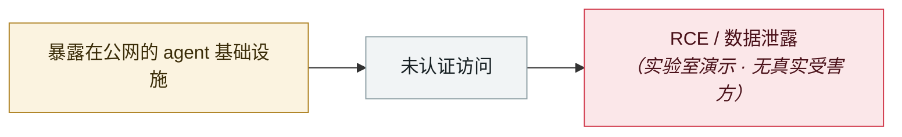

# AutoJack：AutoGen Studio 一个网页打穿宿主

AutoJack: one web page from AutoGen Studio to the host

     

## 概要

Microsoft 自查：三个弱点串联 —— ① Origin 判定只允许 127.0.0.1/localhost，但 **agent 的无头浏览器加载的 JS 就是 localhost**，直接放行 ② 认证中间件把 MCP 路径排除在外，而 WebSocket 侧本应自行认证却没实现 ③ URL 的 `server_params` base64 解码后直传启动参数，**无执行对象白名单**（`calc.exe` 或 shell 都能当 MCP server 启动）。main 分支 commit b047730 修复；公开版 0.4.2.2 不含该路径

## 攻击链

## 来源

| # | 来源 | 链接 |
|---|---|---|
| 1 | Microsoft | <https://www.microsoft.com/en-us/security/blog/2026/06/18/autojack-single-page-rce-host-running-ai-agent/> |

## 元数据

| 字段 | 值 |
|---|---|
| 日期 | `2026-06-18`（原文：2026-06-18，精度 `day`） |
| 性质 | 研究演示 `research` |
| 类型 | [`INFRA`](../../../../taxonomy/types.md#infra) agent 基础设施暴露 |
| 严重度 | **中** `medium` |
| 可信度 | **A** — 一手来源（厂商 / 受害方 / 执法 / 官方报告） |
| 真实伤害 | 否 |
| AI 参与 | 已确认 `confirmed` |
| 地区 | [全球](../../../../regions/global.md) |
| 档案编号 | `2026-06-18-autojack-autogen-studio` |

**判定依据**：研究机构或厂商的受控演示，`real_harm: false`；收录是为了标记攻击面何时被公开。 判 `medium`：受控演示、中等缺陷，或单用户 / 单机范围的事故。 分级口径见 [taxonomy/severity.md](../../../../taxonomy/severity.md) 与 [taxonomy/confidence.md](../../../../taxonomy/confidence.md)。

## 相关

**所属专题**：[agent 基础设施暴露](../../../../topics/agent-infra.md)

**同类条目**：

- `2026-06-08` [LiteLLM CVE-2026-42271 MCP 端点接管](../../../2026-06/2026-06-08-litellm-mcp-duan-dian-jie.md)   LiteLLM CVE-2026-42271 MCP endpoint takeover
- `2026-06-29` [DifyTap：4 个漏洞让 100 万+ AI 应用被跨租户窃听](../../../2026-06/2026-06-29-difytap-lou-dong-rang-wan.md)   DifyTap: four flaws leave 1M+ AI apps open to cross-tenant eavesdropping
- `2026-06-28` [Langflow CVE-2026-33017 被用于门罗币挖矿](../../../2026-06/2026-06-28-langflow-yong-yu-men-luo.md)   Langflow CVE-2026-33017 used for Monero mining
- `2026-06-17` [Vertex AI SDK 存储桶抢占 → 跨租户 RCE](../../../2026-06/2026-06-17-vertex-sdk-rce.md)   Vertex AI SDK bucket takeover leads to cross-tenant RCE

---

[← English original](../../../2026-06/2026-06-18-autojack-autogen-studio.md) · [2026-06 index](../../../2026-06/README.md) · [All records](../../../README.md) · [Home](../../../../README.md)

本条目属于 **Orca AI Incident Archive**，按 [CC BY 4.0](../../../../LICENSE) 授权。发现事实错误或缺少来源，请[提 issue 或 PR](../../../../CONTRIBUTING.md)——更正会写进条目的修订记录，不会静默覆盖。
