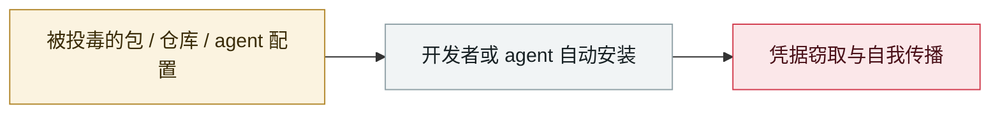

# ClickFix 恶意广告滥用 claude.ai 分享对话

ClickFix malvertising abuses claude.ai shared conversations

     

## 概要

TrendAI：2026-04-08 → 06-14，Google 广告冒充 Claude AI、Cursor IDE、ChatGPT Codex 等至少 6 个品牌；7 周 6 波、**106 个主机名**。起初用 GitLab Pages 假站，**05-06 起改用 claude.ai 的公开分享对话功能承载 ClickFix 步骤**，05-21 后全部活动都在该功能上。伪装成 Apple Support 诱导粘贴 base64 混淆命令；脚本**检测到俄语键盘布局即中止**，否则投放 MacSync 窃取凭据/Cookie/SSH 密钥/加密钱包。**受害流量 67.4% 在亚太，台湾单地占 30.5%**。Anthropic 接报后停用相关账号并禁用恶意分享对话

## 攻击链

## 来源

| # | 来源 | 链接 |
|---|---|---|
| 1 | Trend Micro | <https://www.trendmicro.com/en/research/26/f/claudeai-shared-chat-abused-in-malvertising.html> |

## 元数据

| 字段 | 值 |
|---|---|
| 日期 | `2026-06-18`（原文：2026-06-18，精度 `day`） |
| 性质 | 真实事故 `incident` |
| 类型 | [`SUPPLY`](../../../../taxonomy/types.md#supply) 供应链投毒 |
| 严重度 | **高** `high` |
| 可信度 | **A** — 一手来源（厂商 / 受害方 / 执法 / 官方报告） |
| 真实伤害 | 是 |
| AI 参与 | 已确认 `confirmed` |
| 地区 | [全球](../../../../regions/global.md) · [亚太](../../../../regions/apac.md) |
| 档案编号 | `2026-06-18-clickfix-claude-ai-e-yi-guang` |

**判定依据**：真实事故，有确认的受害方。 判 `high`：真实损害范围有限，或属 CVSS 9+ 的严重缺陷，或是有重要意义的能力实证。 分级口径见 [taxonomy/severity.md](../../../../taxonomy/severity.md) 与 [taxonomy/confidence.md](../../../../taxonomy/confidence.md)。

## 相关

**所属专题**：[agent 供应链投毒](../../../../topics/agent-supply-chain.md)

**同类条目**：

- `2026-06-01` [Miasma 蠕虫](../../../2026-06/2026-06-01-miasma-worm.md)   Miasma worm
- `2026-06-17` [Sapphire Sleet 88 分钟投毒 Mastra AI 全 scope](../../../2026-06/2026-06-17-sapphire-sleet-mastra-88-minutes.md)   Sapphire Sleet poisons every Mastra AI scope in 88 minutes
- `2026-06-15` [无害外观的 GitHub 仓库让 agent 执行反弹 shell](../../../2026-06/2026-06-15-github-agent-shell.md)   Innocuous-looking GitHub repos make agents open a reverse shell
- `2026-05-19` [TrapDoor：跨三个生态投毒，专门污染 AI 助手配置](../../../2026-05/2026-05-19-trapdoor-poisons-agent-configs.md)   TrapDoor: poisoning three ecosystems to corrupt AI assistant configs

---

[← English original](../../../2026-06/2026-06-18-clickfix-claude-ai-e-yi-guang.md) · [2026-06 index](../../../2026-06/README.md) · [All records](../../../README.md) · [Home](../../../../README.md)

本条目属于 **Orca AI Incident Archive**，按 [CC BY 4.0](../../../../LICENSE) 授权。发现事实错误或缺少来源，请[提 issue 或 PR](../../../../CONTRIBUTING.md)——更正会写进条目的修订记录，不会静默覆盖。
