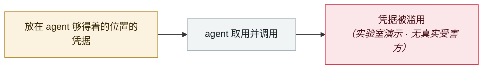

# SiderAI(1,000 万) / MaxAI(100 万) Chrome 扩展漏洞

Flaws in the SiderAI (10M) and MaxAI (1M) Chrome extensions

     

## 概要

Rebora Security：两者 content-script 均不校验网页消息来源。**MaXSS** 让任意网站调用本应仅限扩展的权限（列标签页、截屏、隐藏标签页打开任意站点，替换脚本 + 删 CSP 头达成任意源代码执行）；**Spyder** 组合解除嵌入限制的内部 API 与伪造点击/输入，把任意站点塞进不可见 iframe 操作（实证：向受害者的 Gemini 下指令并带走会话分享 URL）。CVSS3 自评 10.0。**两家厂商均未回应，报告时公开版仍未修复**

## 攻击链

## 来源

| # | 来源 | 链接 |
|---|---|---|
| 1 | Rebora Security | <https://rebora.io/blog/spyder-and-maxss-chrome-extension-vulnerabilities-put-millions-at-risk> |

## 元数据

| 字段 | 值 |
|---|---|
| 日期 | `2026-06-19`（原文：2026-06-19，精度 `day`） |
| 性质 | 研究演示 `research` |
| 类型 | [`CRED`](../../../../taxonomy/types.md#cred) 凭据滥用 |
| 严重度 | **高** `high` |
| 可信度 | **A** — 一手来源（厂商 / 受害方 / 执法 / 官方报告） |
| 真实伤害 | 是 |
| AI 参与 | 已确认 `confirmed` |
| 地区 | [全球](../../../../regions/global.md) |
| 档案编号 | `2026-06-19-siderai-maxai-chrome` |

**判定依据**：研究机构或厂商的受控演示，`real_harm: false`；收录是为了标记攻击面何时被公开。 判 `high`：真实损害范围有限，或属 CVSS 9+ 的严重缺陷，或是有重要意义的能力实证。 分级口径见 [taxonomy/severity.md](../../../../taxonomy/severity.md) 与 [taxonomy/confidence.md](../../../../taxonomy/confidence.md)。

## 相关

**同类条目**：

- `2026-06-01` [Miasma 蠕虫](../../../2026-06/2026-06-01-miasma-worm.md)   Miasma worm
- `2026-06-01` [黑客直接「请求」Meta AI 客服机器人交出 Instagram 账号](../../../2026-06/2026-06-01-meta-ai-support-bot-hands-over-instagram.md)   Attackers simply ask Meta's AI support bot for Instagram accounts
- `2026-06-17` [Sapphire Sleet 88 分钟投毒 Mastra AI 全 scope](../../../2026-06/2026-06-17-sapphire-sleet-mastra-88-minutes.md)   Sapphire Sleet poisons every Mastra AI scope in 88 minutes
- `2026-06-04` [Claude Oceanus-v1-p 被非法分发](../../../2026-06/2026-06-04-claude-oceanus-fei-fa-fen.md)   Claude Oceanus-v1-p illegally redistributed

---

[← English original](../../../2026-06/2026-06-19-siderai-maxai-chrome.md) · [2026-06 index](../../../2026-06/README.md) · [All records](../../../README.md) · [Home](../../../../README.md)

本条目属于 **Orca AI Incident Archive**，按 [CC BY 4.0](../../../../LICENSE) 授权。发现事实错误或缺少来源，请[提 issue 或 PR](../../../../CONTRIBUTING.md)——更正会写进条目的修订记录，不会静默覆盖。
