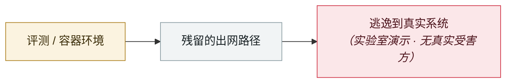

# GuardFall：11 个开源 agent 中 10 个可绕过 shell 边界

GuardFall: 10 of 11 open-source agents can be pushed past their shell boundary

     

## 概要

Adversa：根因是护栏比对**原始命令字符串**，而 bash 执行前会做引号去除、展开、命令替换 —— **检查的字符串和实际执行的指令不是同一个东西**。5 类绕过：`r''m`、`$IFS`、命令替换、base64 管道给 sh、`find -delete`。**只有 Continue 在默认 IDE 模式下从结构上堵住大部分**。⚠️ 实验室实证，非在野；且需满足「间接提示注入让 LLM 误判」+「自动执行模式开启或沙箱为 local」两个前提

## 攻击链

## 来源

| # | 来源 | 链接 |
|---|---|---|
| 1 | Adversa | <https://adversa.ai/blog/opensource-ai-coding-agents-shell-injection-vulnerability/> |

## 元数据

| 字段 | 值 |
|---|---|
| 日期 | `2026-06-30`（原文：2026-06-30，精度 `day`） |
| 性质 | 研究演示 `research` |
| 类型 | [`SANDBOX`](../../../../taxonomy/types.md#sandbox) 沙箱逃逸 |
| 严重度 | **高** `high` |
| 可信度 | **A** — 一手来源（厂商 / 受害方 / 执法 / 官方报告） |
| 真实伤害 | 否 |
| AI 参与 | 已确认 `confirmed` |
| 地区 | [全球](../../../../regions/global.md) |
| 档案编号 | `2026-06-30-guardfall-agent-shell` |

**判定依据**：研究机构或厂商的受控演示，`real_harm: false`；收录是为了标记攻击面何时被公开。 判 `high`：真实损害范围有限，或属 CVSS 9+ 的严重缺陷，或是有重要意义的能力实证。 分级口径见 [taxonomy/severity.md](../../../../taxonomy/severity.md) 与 [taxonomy/confidence.md](../../../../taxonomy/confidence.md)。

## 相关

**所属专题**：[前沿模型自主越界](../../../../topics/eval-escapes.md)

**同类条目**：

- `2026-05-08` [Cline Kanban 跨源 WebSocket 劫持（CVE-2026-44211）](../../../2026-05/2026-05-08-cline-kanban-websocket.md)   Cline Kanban cross-origin WebSocket hijack (CVE-2026-44211)
- `2026-07-01` [DuneSlide：Cursor 零点击沙箱逃逸](../../../2026-07/2026-07-01-duneslide-cursor-ling-dian-ji.md)   DuneSlide: zero-click sandbox escape in Cursor
- `2026-07-09` [GhostApproval：6 款 AI 编码助手共有的审批绕过](../../../2026-07/2026-07-09-ghostapproval-kuan-bian-ma-zhu.md)   GhostApproval: an approval bypass shared by six AI coding assistants
- `2026-07-01` [AWS Kiro：让它总结一个网页，就能拿到 RCE（CVE-2026-10591）](../../../2026-07/2026-07-01-aws-kiro-rce.md)   AWS Kiro: ask it to summarise a web page, get RCE (CVE-2026-10591)

---

[← English original](../../../2026-06/2026-06-30-guardfall-agent-shell.md) · [2026-06 index](../../../2026-06/README.md) · [All records](../../../README.md) · [Home](../../../../README.md)

本条目属于 **Orca AI Incident Archive**，按 [CC BY 4.0](../../../../LICENSE) 授权。发现事实错误或缺少来源，请[提 issue 或 PR](../../../../CONTRIBUTING.md)——更正会写进条目的修订记录，不会静默覆盖。
