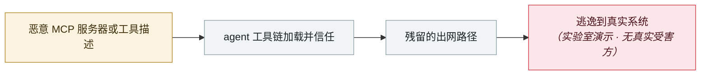

# AWS Kiro：让它总结一个网页，就能拿到 RCE（CVE-2026-10591）

AWS Kiro: ask it to summarise a web page, get RCE (CVE-2026-10591)

      

## 概要

Intezer 与 Kodem Security。Kiro 抓取或搜索外部内容时，命中带隐藏指令的页面 → 指令让 Kiro **用自己的文件写入工具把攻击者内容写进 `~/.kiro/settings/mcp.json`，且无需用户批准** → Kiro 重载配置并启动那个恶意 MCP server → 以开发者权限执行攻击者代码。

研究者的原话是：**「一个像『帮我总结这个页面』一样普通的请求，就能以远程代码执行收场。」** 0.11.130 修复

## 攻击链

## 来源

| # | 来源 | 链接 |
|---|---|---|
| 1 | THN | <https://thehackernews.com/2026/07/aws-kiro-flaw-let-poisoned-web-page.html> |
| 2 | Kodem | <https://www.kodemsecurity.com/resources/aws-kiro-agentic-ide-rce-prompt-injection-mcp-config-vulnerability> |

## 元数据

| 字段 | 值 |
|---|---|
| 日期 | `2026-07-01`（原文：2026-07，精度 `month`） |
| 性质 | 研究演示 `research` |
| 类型 | [`MCP`](../../../../taxonomy/types.md#mcp) MCP / 工具链 · [`SANDBOX`](../../../../taxonomy/types.md#sandbox) 沙箱逃逸 |
| 严重度 | **高** `high` |
| 可信度 | **A** — 一手来源（厂商 / 受害方 / 执法 / 官方报告） |
| 真实伤害 | 否 |
| AI 参与 | 已确认 `confirmed` |
| 地区 | [全球](../../../../regions/global.md) |
| 档案编号 | `2026-07-01-aws-kiro-rce` |

**判定依据**：研究机构或厂商的受控演示，`real_harm: false`；收录是为了标记攻击面何时被公开。 判 `high`：真实损害范围有限，或属 CVSS 9+ 的严重缺陷，或是有重要意义的能力实证。 分级口径见 [taxonomy/severity.md](../../../../taxonomy/severity.md) 与 [taxonomy/confidence.md](../../../../taxonomy/confidence.md)。

## 相关

**所属专题**：[agent 供应链投毒](../../../../topics/agent-supply-chain.md) · [前沿模型自主越界](../../../../topics/eval-escapes.md)

**同类条目**：

- `2026-07-01` [DuneSlide：Cursor 零点击沙箱逃逸](../../../2026-07/2026-07-01-duneslide-cursor-ling-dian-ji.md)   DuneSlide: zero-click sandbox escape in Cursor
- `2026-07-09` [GhostApproval：6 款 AI 编码助手共有的审批绕过](../../../2026-07/2026-07-09-ghostapproval-kuan-bian-ma-zhu.md)   GhostApproval: an approval bypass shared by six AI coding assistants
- `2026-07-30` [RufRoot（CVE-2026-59726）：CVSS 满分，可召唤流氓 AI 蜂群](../../../2026-07/2026-07-30-rufroot-man-fen-zhao-huan.md)   RufRoot (CVE-2026-59726): perfect CVSS, summons a rogue AI swarm
- `2026-07-20` [一周内 4 款编码 agent 爆 6 个沙箱逃逸](../../../2026-07/2026-07-20-agent-yi-nei-kuan-bian.md)   Six sandbox escapes across four coding agents in one week

---

[← English original](../../../2026-07/2026-07-01-aws-kiro-rce.md) · [2026-07 index](../../../2026-07/README.md) · [All records](../../../README.md) · [Home](../../../../README.md)

本条目属于 **Orca AI Incident Archive**，按 [CC BY 4.0](../../../../LICENSE) 授权。发现事实错误或缺少来源，请[提 issue 或 PR](../../../../CONTRIBUTING.md)——更正会写进条目的修订记录，不会静默覆盖。
