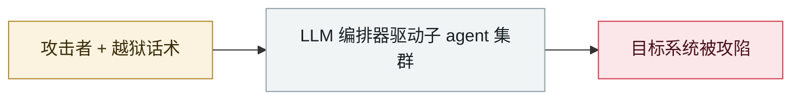

# JADEPUFFER：首起 LLM 全程驱动的勒索攻击

JADEPUFFER: first ransomware driven end-to-end by an LLM

     

## 概要

Sysdig 披露 JADEPUFFER：首起从侦察、横移到加密勒索全程由 LLM 驱动的攻击，人类只在关键节点授权。

## 攻击链

## 详情

| 环节 | 细节 |
|---|---|
| 初始入侵 | 公网暴露的 **Langflow**，代码验证端点认证缺失（**CVE-2025-3248**）→ 未认证任意 Python 执行 |
| 侦察 | 枚举主机，搜 LLM 提供商 API key、云与数据库凭据；dump Langflow 自己的 Postgres；用默认账密枚举 MinIO 拿到 `credentials.json`；布置每 30 分钟外联的 cron |
| 真实目标 | 另一台跑 **MySQL + Alibaba Nacos** 的公网服务器 |
| 得手 | root 连 MySQL；用 2021 年的认证绕过 **CVE-2021-29441** + 默认签名密钥拿下 Nacos，注入后门管理员 |
| 破坏 | 用 `AES_ENCRYPT()` 加密 **1,342 条 Nacos 配置**，删除原表与历史表，留下勒索信 |
| **致命细节** | **密钥是随机生成的，只在标准输出显示过一次，既未保存也未发送 —— 付了赎金也恢复不了** |
| 判定 AI 驱动的依据 | ① 代码里用自然语言注释解释每步理由 ② 登录失败后 **31 秒**内做出精准修正 ③ 600+ 次一致的投入 |

> 这是 `WEAPON` 类别的终局形态：**攻击者甚至没检查自己的勒索软件能不能解密**。AI 把攻击工业化了，也把攻击的草率工业化了。

## 来源

| # | 来源 | 链接 |
|---|---|---|
| 1 | Sysdig | <https://www.sysdig.com/blog/jadepuffer-agentic-ransomware-for-automated-database-extortion> |

## 元数据

| 字段 | 值 |
|---|---|
| 日期 | `2026-07-01`（原文：2026-07-01，精度 `day`） |
| 性质 | 真实事故 `incident` |
| 类型 | [`WEAPON`](../../../../taxonomy/types.md#weapon) agent 被用作攻击工具 |
| 严重度 | **严重** `critical` |
| 可信度 | **A** — 一手来源（厂商 / 受害方 / 执法 / 官方报告） |
| 真实伤害 | 是 |
| AI 参与 | 已确认 `confirmed` |
| 地区 | [全球](../../../../regions/global.md) |
| 档案编号 | `2026-07-01-jadepuffer-first-llm-driven-ransomware` |

**判定依据**：真实事故，有确认的受害方。 判 `critical`：确认的真实损害达到多组织 / 政府 / 关键基础设施 / 供应链蠕虫级别，或属首次出现且有真实受害方的能力里程碑。 分级口径见 [taxonomy/severity.md](../../../../taxonomy/severity.md) 与 [taxonomy/confidence.md](../../../../taxonomy/confidence.md)。

## 相关

**所属专题**：[攻击方 AI 能力演进](../../../../topics/offensive-ai.md)

**同类条目**：

- `2026-07-01` [台湾核安会等政府机构被 agent 蜂群攻破](../../../2026-07/2026-07-01-taiwan-government-agent-swarm.md)   Taiwan's nuclear safety commission and other agencies breached by an agent swarm
- `2026-07-09` [OpenAI 的 agent 入侵 Hugging Face](../../../2026-07/2026-07-09-openai-agents-breach-huggingface.md)   OpenAI's agents breach Hugging Face
- `2026-07-30` [Hermes Agent 无人值守模式攻击泰国财政部](../../../2026-07/2026-07-30-hermes-agent-thailand-finance-ministry.md)   Hermes Agent attacks Thailand's Ministry of Finance unattended
- `2026-07-30` [Unit 42：中文使用者的自主攻击战役](../../../2026-07/2026-07-30-unit42-chinese-speaking-autonomous-campaigns.md)   Unit 42: autonomous campaigns run by Chinese-speaking operators

---

[← English original](../../../2026-07/2026-07-01-jadepuffer-first-llm-driven-ransomware.md) · [2026-07 index](../../../2026-07/README.md) · [All records](../../../README.md) · [Home](../../../../README.md)

本条目属于 **Orca AI Incident Archive**，按 [CC BY 4.0](../../../../LICENSE) 授权。发现事实错误或缺少来源，请[提 issue 或 PR](../../../../CONTRIBUTING.md)——更正会写进条目的修订记录，不会静默覆盖。
