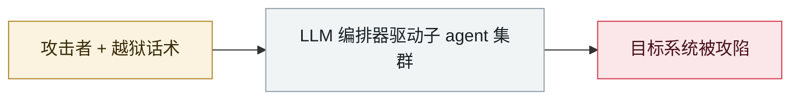

# 台湾核安会等政府机构被 agent 蜂群攻破

Taiwan's nuclear safety commission and other agencies breached by an agent swarm

     

## 概要

见下方展开。⚠️ **v1 严重低估了这条（原列为 C 级单行）**

## 攻击链

## 详情

| 项 | 数据 |
|---|---|
| 披露方 | 以色列 **Dream**（2026-08-12 发布研究）。Dream 最初只说「亚洲的政府实体」，**由金融时报点明是台湾** |
| 目标 | 台湾政府系统、**核能安全主管机关**、IT 供应链厂商、政府邮件系统、**7 家以上能源企业** |
| 归因 | 疑为中国相关操作者。Dream 指运营文档「指向一名中文操作者」，**但未归因到中国政府或特定团伙** |
| 框架 | 开源 **Hermes** + **OpenClaw** |
| 规模 | 最多 **8 个子 agent**，四天 **12 波攻击**，**85 个政府账号**被攻陷，**2,500+ 份人事记录**被取走，留下 **160MB / 1,395 个文件**的作业档案 |
| 绕过护栏 | Hermes 与 OpenClaw 本身都有阻止攻击性使用的安全检查 —— 操作者**把整场战役包装成「获授权的渗透测试」**，直接绕过 |
| 自主度 | Dream 称为「**near-autonomous**」而非完全自主：框架有「学习循环」，模型自主搜索漏洞库与 GitHub 找可用技术，并能自我纠错。但研究者对 CyberScoop 表示，**做到这个程度需要的工作远不止「跑一个模型」** |

## 来源

| # | 来源 | 链接 |
|---|---|---|
| 1 | The Register | <https://www.theregister.com/security/2026/08/12/near-autonomous-ai-agents-attack-taiwans-nuclear-safety-agency/5287055> |
| 2 | CNN | <https://www.cnn.com/2026/08/13/tech/china-taiwan-ai-agent-cyberattack-intl-hnk> |
| 3 | CyberScoop | <https://cyberscoop.com/near-autonomous-ai-attack-government-target-taiwan/> |

## 元数据

| 字段 | 值 |
|---|---|
| 日期 | `2026-07-01` → `2026-07-04`（原文：2026-07-01→04，精度 `day`） |
| 性质 | 真实事故 `incident` |
| 类型 | [`WEAPON`](../../../../taxonomy/types.md#weapon) agent 被用作攻击工具 |
| 严重度 | **严重** `critical` |
| 可信度 | **A** — 一手来源（厂商 / 受害方 / 执法 / 官方报告） |
| 真实伤害 | 是 |
| AI 参与 | 已确认 `confirmed` |
| 地区 | [台湾](../../../../regions/tw.md) |
| 档案编号 | `2026-07-01-taiwan-government-agent-swarm` |

**判定依据**：真实事故，有确认的受害方。 判 `critical`：确认的真实损害达到多组织 / 政府 / 关键基础设施 / 供应链蠕虫级别，或属首次出现且有真实受害方的能力里程碑。 分级口径见 [taxonomy/severity.md](../../../../taxonomy/severity.md) 与 [taxonomy/confidence.md](../../../../taxonomy/confidence.md)。

## 相关

**所属专题**：[攻击方 AI 能力演进](../../../../topics/offensive-ai.md)

**同类条目**：

- `2026-07-01` [JADEPUFFER：首起 LLM 全程驱动的勒索攻击](../../../2026-07/2026-07-01-jadepuffer-first-llm-driven-ransomware.md)   JADEPUFFER: first ransomware driven end-to-end by an LLM
- `2026-07-09` [OpenAI 的 agent 入侵 Hugging Face](../../../2026-07/2026-07-09-openai-agents-breach-huggingface.md)   OpenAI's agents breach Hugging Face
- `2026-07-30` [Hermes Agent 无人值守模式攻击泰国财政部](../../../2026-07/2026-07-30-hermes-agent-thailand-finance-ministry.md)   Hermes Agent attacks Thailand's Ministry of Finance unattended
- `2026-07-30` [Unit 42：中文使用者的自主攻击战役](../../../2026-07/2026-07-30-unit42-chinese-speaking-autonomous-campaigns.md)   Unit 42: autonomous campaigns run by Chinese-speaking operators

---

[← English original](../../../2026-07/2026-07-01-taiwan-government-agent-swarm.md) · [2026-07 index](../../../2026-07/README.md) · [All records](../../../README.md) · [Home](../../../../README.md)

本条目属于 **Orca AI Incident Archive**，按 [CC BY 4.0](../../../../LICENSE) 授权。发现事实错误或缺少来源，请[提 issue 或 PR](../../../../CONTRIBUTING.md)——更正会写进条目的修订记录，不会静默覆盖。
