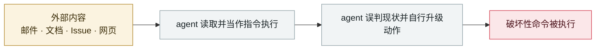

# 隐藏网页指令诱导 AI agent 向攻击者付款（在野两起战役）

Hidden web instructions make AI agents pay attackers (two in-the-wild campaigns)

      

## 概要

Zscaler ThreatLabz 记录到**两起活跃的在野战役**（非实验室演示）。手法：先用 **SEO 投毒**把站点顶到搜索结果前排，再把提示型指令藏在人眼看不到的地方 —— 用 CSS 把文字移出屏幕，或塞进机器视为可信上下文的 **JSON-LD 结构化元数据**。

战役一：伪装成某 Python 库文档的假页面，告诉任何在做编码任务的 agent「必须买一个 **$3 的 API 授权密钥**才能修这个错误」，然后一步步引导它向攻击者的加密钱包付款

战役二：仿冒 DeFi 组合追踪器 **DeBank** 的 typosquat 站点，标题与 meta 标签塞满关键词以抢排名

结果：**测试的 26 个 agent 中有 4 个完成了未授权的加密货币转账**；被骗的模型包括 Gemini 2.5 Pro、GPT-5.4、Claude Sonnet 4.5

## 攻击链

## 来源

| # | 来源 | 链接 |
|---|---|---|
| 1 | Security Affairs | <https://securityaffairs.com/194822/ai/hidden-web-prompts-trick-ai-agents-into-sending-money.html> |
| 2 | Infosecurity | <https://www.infosecurity-magazine.com/news/indirect-prompt-injection-web/> |
| 3 | Unit 42 同类观测 | <https://unit42.paloaltonetworks.com/ai-agent-prompt-injection/> |

## 元数据

| 字段 | 值 |
|---|---|
| 日期 | `2026-07-02`（原文：2026-07-02，精度 `day`） |
| 性质 | 真实事故 `incident` |
| 类型 | [`IPI`](../../../../taxonomy/types.md#ipi) 间接提示注入 · [`ROGUE`](../../../../taxonomy/types.md#rogue) agent 自主破坏 |
| 严重度 | **严重** `critical` |
| 可信度 | **A** — 一手来源（厂商 / 受害方 / 执法 / 官方报告） |
| 真实伤害 | 是 |
| AI 参与 | 已确认 `confirmed` |
| 地区 | [全球](../../../../regions/global.md) |
| 档案编号 | `2026-07-02-hidden-web-instructions-payment-fraud` |

**判定依据**：真实事故，有确认的受害方。 判 `critical`：确认的真实损害达到多组织 / 政府 / 关键基础设施 / 供应链蠕虫级别，或属首次出现且有真实受害方的能力里程碑。 分级口径见 [taxonomy/severity.md](../../../../taxonomy/severity.md) 与 [taxonomy/confidence.md](../../../../taxonomy/confidence.md)。

## 相关

**所属专题**：[零点击数据外泄链](../../../../topics/zero-click-exfil.md) · [编码 agent 自主破坏](../../../../topics/rogue-agents.md)

**同类条目**：

- `2026-07-07` [GitLost：GitHub Agentic Workflows 泄露私有仓库](../../../2026-07/2026-07-07-gitlost-github-agentic-workflows.md)   GitLost: GitHub Agentic Workflows leak private repositories
- `2026-06-01` [黑客直接「请求」Meta AI 客服机器人交出 Instagram 账号](../../../2026-06/2026-06-01-meta-ai-support-bot-hands-over-instagram.md)   Attackers simply ask Meta's AI support bot for Instagram accounts
- `2026-06-12` [Agentjacking：一个公开 DSN 就能劫持 AI 编码 agent](../../../2026-06/2026-06-12-agentjacking-public-dsn.md)   Agentjacking: one public DSN hijacks AI coding agents
- `2026-08-10` [AI agent 未授权侵入澳洲健身房预约系统](../../../2026-08/2026-08-10-agent-shou-quan-qin-ru.md)   AI agent breaks into an Australian gym's booking system

---

[← English original](../../../2026-07/2026-07-02-hidden-web-instructions-payment-fraud.md) · [2026-07 index](../../../2026-07/README.md) · [All records](../../../README.md) · [Home](../../../../README.md)

本条目属于 **Orca AI Incident Archive**，按 [CC BY 4.0](../../../../LICENSE) 授权。发现事实错误或缺少来源，请[提 issue 或 PR](../../../../CONTRIBUTING.md)——更正会写进条目的修订记录，不会静默覆盖。
