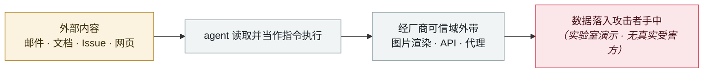

# GitLost：GitHub Agentic Workflows 泄露私有仓库

GitLost: GitHub Agentic Workflows leak private repositories

      

## 概要

Noma Labs：攻击者只需在同组织的**公开**仓库开一个伪装成业务需求的 Issue，正文里写明文指令 —— **不需要代码知识、凭据或权限**。agent 照做，把私有仓库 README 内容作为公开评论发出。成立条件：该工作流由 Issue 指派触发、同时具备跨仓读取与评论权限。GitHub 的护栏加一个 "**Additionally**" 就被绕过（变成改写输出而非拒绝）。⚠️ 验证环境复现，**非真实受害**

## 攻击链

## 来源

| # | 来源 | 链接 |
|---|---|---|
| 1 | Noma Labs | <https://noma.security/blog/gitlost-how-we-tricked-githubs-ai-agent-into-leaking-private-repos/> |
| 2 | GitHub 功能公告 | <https://github.blog/changelog/2026-02-13-github-agentic-workflows-are-now-in-technical-preview/> |

## 元数据

| 字段 | 值 |
|---|---|
| 日期 | `2026-07-07`（原文：2026-07-07，精度 `day`） |
| 性质 | 研究演示 `research` |
| 类型 | [`IPI`](../../../../taxonomy/types.md#ipi) 间接提示注入 · [`EXFIL`](../../../../taxonomy/types.md#exfil) 数据外泄 |
| 严重度 | **中** `medium` |
| 可信度 | **A** — 一手来源（厂商 / 受害方 / 执法 / 官方报告） |
| 真实伤害 | 否 |
| AI 参与 | 已确认 `confirmed` |
| 地区 | [全球](../../../../regions/global.md) |
| 档案编号 | `2026-07-07-gitlost-github-agentic-workflows` |

**判定依据**：研究机构或厂商的受控演示，`real_harm: false`；收录是为了标记攻击面何时被公开。 判 `medium`：受控演示、中等缺陷，或单用户 / 单机范围的事故。 分级口径见 [taxonomy/severity.md](../../../../taxonomy/severity.md) 与 [taxonomy/confidence.md](../../../../taxonomy/confidence.md)。

## 相关

**所属专题**：[零点击数据外泄链](../../../../topics/zero-click-exfil.md)

**同类条目**：

- `2026-07-02` [隐藏网页指令诱导 AI agent 向攻击者付款（在野两起战役）](../../../2026-07/2026-07-02-hidden-web-instructions-payment-fraud.md)   Hidden web instructions make AI agents pay attackers (two in-the-wild campaigns)
- `2026-06-01` [黑客直接「请求」Meta AI 客服机器人交出 Instagram 账号](../../../2026-06/2026-06-01-meta-ai-support-bot-hands-over-instagram.md)   Attackers simply ask Meta's AI support bot for Instagram accounts
- `2026-06-12` [Agentjacking：一个公开 DSN 就能劫持 AI 编码 agent](../../../2026-06/2026-06-12-agentjacking-public-dsn.md)   Agentjacking: one public DSN hijacks AI coding agents
- `2026-08-19` [Grok「密码学上下文注入」：加密的指令，明文的数据](../../../2026-08/2026-08-19-grok-mi-ma-xue-wen.md)   Grok "cryptographic context injection": encrypted instructions, plaintext data

---

[← English original](../../../2026-07/2026-07-07-gitlost-github-agentic-workflows.md) · [2026-07 index](../../../2026-07/README.md) · [All records](../../../README.md) · [Home](../../../../README.md)

本条目属于 **Orca AI Incident Archive**，按 [CC BY 4.0](../../../../LICENSE) 授权。发现事实错误或缺少来源，请[提 issue 或 PR](../../../../CONTRIBUTING.md)——更正会写进条目的修订记录，不会静默覆盖。
