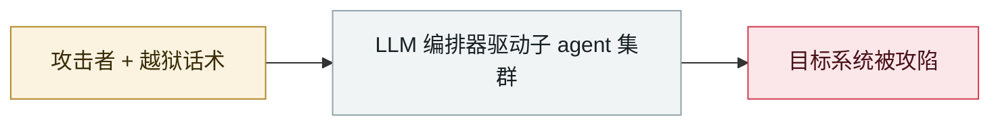

# Sygnia：AI 辅助下 72 小时打穿 AWS 环境

Sygnia: AI-assisted attackers own an AWS environment in 72 hours

     

## 概要

**单人**从初始入侵到大范围云环境沦陷约 **72 小时**。利用公网应用漏洞取 access key → 从 ECS/EC2 环境变量、CI/CD runner、S3 明文、Secrets Manager 收集密钥 → 加 IAM 用户与 access key、反弹 shell、改部署文件。从 RDS 外带数据，多数破坏（阻断 S3、ECS 容量归零）是**可逆的施压手段**。判定 AI 参与的依据：攻击者自制脚本 + **同一源 IP 和 UA 在 1 秒内并行使用 4 个账号的 access key**。**未使用新型恶意软件或零日**

## 攻击链

## 来源

| # | 来源 | 链接 |
|---|---|---|
| 1 | Sygnia | <https://www.sygnia.co/blog/inside-an-ai-assisted-cloud-attack/> |

## 元数据

| 字段 | 值 |
|---|---|
| 日期 | `2026-07-08`（原文：2026-07-08，精度 `day`） |
| 性质 | 真实事故 `incident` |
| 类型 | [`WEAPON`](../../../../taxonomy/types.md#weapon) agent 被用作攻击工具 |
| 严重度 | **高** `high` |
| 可信度 | **A** — 一手来源（厂商 / 受害方 / 执法 / 官方报告） |
| 真实伤害 | 是 |
| AI 参与 | 已确认 `confirmed` |
| 地区 | [全球](../../../../regions/global.md) |
| 档案编号 | `2026-07-08-sygnia-aws-fu-zhu-shi` |

**判定依据**：真实事故，有确认的受害方。 判 `high`：真实损害范围有限，或属 CVSS 9+ 的严重缺陷，或是有重要意义的能力实证。 分级口径见 [taxonomy/severity.md](../../../../taxonomy/severity.md) 与 [taxonomy/confidence.md](../../../../taxonomy/confidence.md)。

## 相关

**所属专题**：[攻击方 AI 能力演进](../../../../topics/offensive-ai.md)

**同类条目**：

- `2026-07-01` [台湾核安会等政府机构被 agent 蜂群攻破](../../../2026-07/2026-07-01-taiwan-government-agent-swarm.md)   Taiwan's nuclear safety commission and other agencies breached by an agent swarm
- `2026-07-01` [JADEPUFFER：首起 LLM 全程驱动的勒索攻击](../../../2026-07/2026-07-01-jadepuffer-first-llm-driven-ransomware.md)   JADEPUFFER: first ransomware driven end-to-end by an LLM
- `2026-07-09` [OpenAI 的 agent 入侵 Hugging Face](../../../2026-07/2026-07-09-openai-agents-breach-huggingface.md)   OpenAI's agents breach Hugging Face
- `2026-07-30` [Hermes Agent 无人值守模式攻击泰国财政部](../../../2026-07/2026-07-30-hermes-agent-thailand-finance-ministry.md)   Hermes Agent attacks Thailand's Ministry of Finance unattended

---

[← English original](../../../2026-07/2026-07-08-sygnia-aws-fu-zhu-shi.md) · [2026-07 index](../../../2026-07/README.md) · [All records](../../../README.md) · [Home](../../../../README.md)

本条目属于 **Orca AI Incident Archive**，按 [CC BY 4.0](../../../../LICENSE) 授权。发现事实错误或缺少来源，请[提 issue 或 PR](../../../../CONTRIBUTING.md)——更正会写进条目的修订记录，不会静默覆盖。
