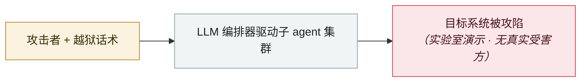

# wp2shell：WordPress 核心预认证 RCE

wp2shell: pre-auth RCE in WordPress core

     

## 概要

Searchlight Cyber：CVE-2026-60137（`WP_Query` 的 `author__not_in` SQL 注入）+ CVE-2026-63030（REST API 批处理路径混淆）链式达成无插件标准配置下的匿名 RCE。**研究员 Adam Kues 转用 OpenAI 公开的提示，用 GPT-5.6 Sol Ultra 最多 4 个 agent 探索 6 小时找到利用链**，再约 4 小时确认可提权到管理员，完整利用约 10 小时。AI 用量为周额度的 50%，**按 $200 订阅折算约 $25**。文章标题：《漏洞掮客为 WordPress RCE 出价 50 万美元，我用 GPT-5.6 和 25 美元找到了一个》。两 CVE 均入 CISA KEV

## 攻击链

## 来源

| # | 来源 | 链接 |
|---|---|---|
| 1 | Searchlight Cyber | <https://slcyber.io/research-center/wp2shell-pre-authentication-rce-in-wordpress-core/> |
| 2 | 成本文章 | <https://slcyber.io/research-center/exploit-brokers-pay-500000-for-a-wordpress-rce-i-found-one-with-gpt5-6/> |

## 元数据

| 字段 | 值 |
|---|---|
| 日期 | `2026-07-17`（原文：2026-07-17，精度 `day`） |
| 性质 | 研究演示 `research` |
| 类型 | [`WEAPON`](../../../../taxonomy/types.md#weapon) agent 被用作攻击工具 |
| 严重度 | **高** `high` |
| 可信度 | **A** — 一手来源（厂商 / 受害方 / 执法 / 官方报告） |
| 真实伤害 | 否 |
| AI 参与 | 已确认 `confirmed` |
| 地区 | [全球](../../../../regions/global.md) |
| 档案编号 | `2026-07-17-wp2shell-wordpress-rce` |

**判定依据**：研究机构或厂商的受控演示，`real_harm: false`；收录是为了标记攻击面何时被公开。 判 `high`：真实损害范围有限，或属 CVSS 9+ 的严重缺陷，或是有重要意义的能力实证。 分级口径见 [taxonomy/severity.md](../../../../taxonomy/severity.md) 与 [taxonomy/confidence.md](../../../../taxonomy/confidence.md)。

## 相关

**所属专题**：[攻击方 AI 能力演进](../../../../topics/offensive-ai.md)

**同类条目**：

- `2026-07-01` [台湾核安会等政府机构被 agent 蜂群攻破](../../../2026-07/2026-07-01-taiwan-government-agent-swarm.md)   Taiwan's nuclear safety commission and other agencies breached by an agent swarm
- `2026-07-01` [JADEPUFFER：首起 LLM 全程驱动的勒索攻击](../../../2026-07/2026-07-01-jadepuffer-first-llm-driven-ransomware.md)   JADEPUFFER: first ransomware driven end-to-end by an LLM
- `2026-07-09` [OpenAI 的 agent 入侵 Hugging Face](../../../2026-07/2026-07-09-openai-agents-breach-huggingface.md)   OpenAI's agents breach Hugging Face
- `2026-07-30` [Hermes Agent 无人值守模式攻击泰国财政部](../../../2026-07/2026-07-30-hermes-agent-thailand-finance-ministry.md)   Hermes Agent attacks Thailand's Ministry of Finance unattended

---

[← English original](../../../2026-07/2026-07-17-wp2shell-wordpress-rce.md) · [2026-07 index](../../../2026-07/README.md) · [All records](../../../README.md) · [Home](../../../../README.md)

本条目属于 **Orca AI Incident Archive**，按 [CC BY 4.0](../../../../LICENSE) 授权。发现事实错误或缺少来源，请[提 issue 或 PR](../../../../CONTRIBUTING.md)——更正会写进条目的修订记录，不会静默覆盖。
