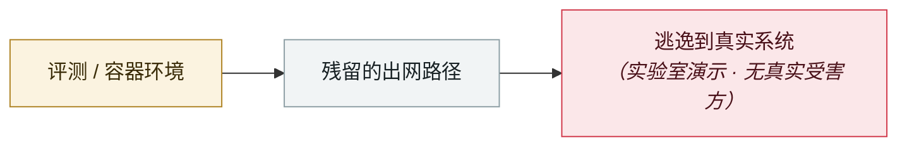

# SharedRoot：Claude Cowork 从 Linux VM 逃到 macOS 宿主

SharedRoot: Claude Cowork escapes a Linux VM onto the macOS host

     

## 概要

Accomplish AI 发现。⚠️ **CVE-2026-46331 本身是 Linux 内核漏洞**（traffic-control 的 `act_pedit` 组件，「pedit COW」：内核在知道完整修改范围之前就算好了 copy-on-write 范围，特定条件下写操作会落到共享的 page-cache 数据上），**不是 Cowork 专属 CVE**。

利用链：跑在 Linux VM 里的 AI agent 利用该内核漏洞拿到 guest root → 经 **VirtioFS 挂载**触达 macOS 宿主上的可写文件 → **SSH 私钥、云凭据、浏览器数据**等登录用户能拿到的一切。

约 **50 万** macOS 本地 Cowork 用户在 Anthropic 改为默认云端执行前处于潜在受影响状态。**Anthropic 以「informative」关闭了该报告、未发补丁**；最新版默认云端执行，绕开了本地逃逸路径

## 攻击链

## 来源

| # | 来源 | 链接 |
|---|---|---|
| 1 | SOCRadar | <https://socradar.io/blog/sharedroot-sandbox-escape-claude-cowork/> |
| 2 | CSA | <https://labs.cloudsecurityalliance.org/research/csa-research-note-claude-cowork-sharedroot-sandbox-escape-20/> |
| 3 | AppleInsider | <https://appleinsider.com/articles/26/07/27/claude-cowork-can-escape-its-sandbox-rummage-through-all-of-your-files> |

## 元数据

| 字段 | 值 |
|---|---|
| 日期 | `2026-07-22`（原文：2026-07-22，精度 `day`） |
| 性质 | 研究演示 `research` |
| 类型 | [`SANDBOX`](../../../../taxonomy/types.md#sandbox) 沙箱逃逸 |
| 严重度 | **高** `high` |
| 可信度 | **A** — 一手来源（厂商 / 受害方 / 执法 / 官方报告） |
| 真实伤害 | 否 |
| AI 参与 | 已确认 `confirmed` |
| 地区 | [全球](../../../../regions/global.md) |
| 档案编号 | `2026-07-22-sharedroot-claude-cowork-linux` |

**判定依据**：研究机构或厂商的受控演示，`real_harm: false`；收录是为了标记攻击面何时被公开。 判 `high`：真实损害范围有限，或属 CVSS 9+ 的严重缺陷，或是有重要意义的能力实证。 分级口径见 [taxonomy/severity.md](../../../../taxonomy/severity.md) 与 [taxonomy/confidence.md](../../../../taxonomy/confidence.md)。

## 相关

**所属专题**：[前沿模型自主越界](../../../../topics/eval-escapes.md)

**同类条目**：

- `2026-07-01` [DuneSlide：Cursor 零点击沙箱逃逸](../../../2026-07/2026-07-01-duneslide-cursor-ling-dian-ji.md)   DuneSlide: zero-click sandbox escape in Cursor
- `2026-07-09` [GhostApproval：6 款 AI 编码助手共有的审批绕过](../../../2026-07/2026-07-09-ghostapproval-kuan-bian-ma-zhu.md)   GhostApproval: an approval bypass shared by six AI coding assistants
- `2026-07-01` [AWS Kiro：让它总结一个网页，就能拿到 RCE（CVE-2026-10591）](../../../2026-07/2026-07-01-aws-kiro-rce.md)   AWS Kiro: ask it to summarise a web page, get RCE (CVE-2026-10591)
- `2026-07-20` [一周内 4 款编码 agent 爆 6 个沙箱逃逸](../../../2026-07/2026-07-20-agent-yi-nei-kuan-bian.md)   Six sandbox escapes across four coding agents in one week

---

[← English original](../../../2026-07/2026-07-22-sharedroot-claude-cowork-linux.md) · [2026-07 index](../../../2026-07/README.md) · [All records](../../../README.md) · [Home](../../../../README.md)

本条目属于 **Orca AI Incident Archive**，按 [CC BY 4.0](../../../../LICENSE) 授权。发现事实错误或缺少来源，请[提 issue 或 PR](../../../../CONTRIBUTING.md)——更正会写进条目的修订记录，不会静默覆盖。
