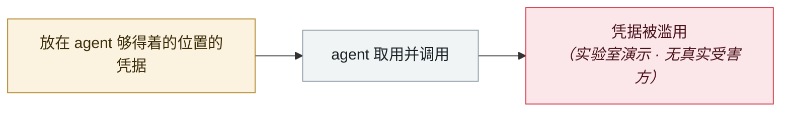

# Elastic：coding agent 的隧道流量和 C2 签到几乎一模一样

Elastic: coding-agent tunnel traffic looks almost exactly like C2 beacons

     

## 概要

Elastic Security Labs 在复盘 2026-07 的端点遥测时，两条独立的狩猎路径在 07-23 命中同一台主机：**由 agent 派生的反向隧道**（localhost.run / lhr.life、Cloudflare Quick Tunnels、ngrok）与 **macOS LaunchAgent 持久化**、以及带凭据的 HTTP 外发，出现在同一个会话窗口内。

结构性问题：**agentic 编码工具天然同时具备「攻击者需要的一切访问权」（私有环境变量、凭据、API key、本地配置）与「持续摄入不可信内容」（仓库、文档、错误信息）**。Elastic 的建议很具体：**不要因为进程树里出现了 coding agent 就自动关闭这类告警**

## 攻击链

## 来源

| # | 来源 | 链接 |
|---|---|---|
| 1 | Elastic Security Labs | <https://www.elastic.co/security-labs/coding-agent-launchagent-tunnel-detection> |

## 元数据

| 字段 | 值 |
|---|---|
| 日期 | `2026-07-23`（原文：2026-07-23，精度 `day`） |
| 性质 | 研究演示 `research` |
| 类型 | [`CRED`](../../../../taxonomy/types.md#cred) 凭据滥用 |
| 严重度 | **中** `medium` |
| 可信度 | **A** — 一手来源（厂商 / 受害方 / 执法 / 官方报告） |
| 真实伤害 | 否 |
| AI 参与 | 已确认 `confirmed` |
| 地区 | [全球](../../../../regions/global.md) |
| 档案编号 | `2026-07-23-elastic-coding-agent-c2` |

**判定依据**：研究机构或厂商的受控演示，`real_harm: false`；收录是为了标记攻击面何时被公开。 判 `medium`：受控演示、中等缺陷，或单用户 / 单机范围的事故。 分级口径见 [taxonomy/severity.md](../../../../taxonomy/severity.md) 与 [taxonomy/confidence.md](../../../../taxonomy/confidence.md)。

## 相关

**同类条目**：

- `2026-06-01` [Miasma 蠕虫](../../../2026-06/2026-06-01-miasma-worm.md)   Miasma worm
- `2026-06-01` [黑客直接「请求」Meta AI 客服机器人交出 Instagram 账号](../../../2026-06/2026-06-01-meta-ai-support-bot-hands-over-instagram.md)   Attackers simply ask Meta's AI support bot for Instagram accounts
- `2026-06-17` [Sapphire Sleet 88 分钟投毒 Mastra AI 全 scope](../../../2026-06/2026-06-17-sapphire-sleet-mastra-88-minutes.md)   Sapphire Sleet poisons every Mastra AI scope in 88 minutes
- `2026-08-04` [CHAINDROP npm 蠕虫](../../../2026-08/2026-08-04-chaindrop-npm-ru-chong.md)   CHAINDROP npm worm

---

[← English original](../../../2026-07/2026-07-23-elastic-coding-agent-c2.md) · [2026-07 index](../../../2026-07/README.md) · [All records](../../../README.md) · [Home](../../../../README.md)

本条目属于 **Orca AI Incident Archive**，按 [CC BY 4.0](../../../../LICENSE) 授权。发现事实错误或缺少来源，请[提 issue 或 PR](../../../../CONTRIBUTING.md)——更正会写进条目的修订记录，不会静默覆盖。
