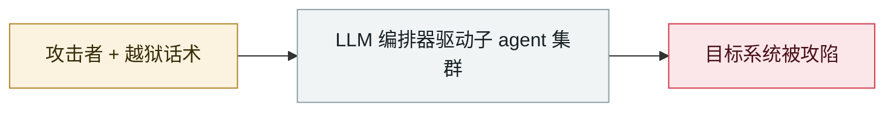

# Hermes Agent 无人值守模式攻击泰国财政部

Hermes Agent attacks Thailand's Ministry of Finance unattended

     

## 概要

Hunt.io（与 Bob Diachenko 合作）：香港主机上暴露的目录显示，运营者以 **YOLO（免人工批准）模式**运行 Hermes Agent，委派 LinPEAS 提权评估与常务次长办公室 Web 根目录枚举；另有针对 Hadoop 的脚本和未公开的 Go 植入体 **Hades**。**无文件被带走的证据，初始入侵路径未查明**。已通知泰国 CERT 与 NCSA；财政部本身未公开说明

## 攻击链

## 来源

| # | 来源 | 链接 |
|---|---|---|
| 1 | Hunt.io | <https://hunt.io/blog/thailand-ministry-finance-targeted-with-hermes-ai-agent> |

## 元数据

| 字段 | 值 |
|---|---|
| 日期 | `2026-07-30`（原文：2026-07-30，精度 `day`） |
| 性质 | 真实事故 `incident` |
| 类型 | [`WEAPON`](../../../../taxonomy/types.md#weapon) agent 被用作攻击工具 |
| 严重度 | **严重** `critical` |
| 可信度 | **A** — 一手来源（厂商 / 受害方 / 执法 / 官方报告） |
| 真实伤害 | 是 |
| AI 参与 | 已确认 `confirmed` |
| 地区 | [东南亚](../../../../regions/sea.md) |
| 档案编号 | `2026-07-30-hermes-agent-thailand-finance-ministry` |

**判定依据**：真实事故，有确认的受害方。 判 `critical`：确认的真实损害达到多组织 / 政府 / 关键基础设施 / 供应链蠕虫级别，或属首次出现且有真实受害方的能力里程碑。 分级口径见 [taxonomy/severity.md](../../../../taxonomy/severity.md) 与 [taxonomy/confidence.md](../../../../taxonomy/confidence.md)。

## 相关

**所属专题**：[攻击方 AI 能力演进](../../../../topics/offensive-ai.md)

**同类条目**：

- `2026-09-22` [Gambit：三个 AI harness 从在线零售商窃取 60 万条信用卡记录](../../../2026-09/2026-09-22-gambit-ai-agent-retail-card-theft.md)   同一个开源 Hermes 框架，两个月后运行整场活动
- `2026-07-01` [台湾核安会等政府机构被 agent 蜂群攻破](../../../2026-07/2026-07-01-taiwan-government-agent-swarm.md)   Taiwan's nuclear safety commission and other agencies breached by an agent swarm
- `2026-07-01` [JADEPUFFER：首起 LLM 全程驱动的勒索攻击](../../../2026-07/2026-07-01-jadepuffer-first-llm-driven-ransomware.md)   JADEPUFFER: first ransomware driven end-to-end by an LLM
- `2026-07-09` [OpenAI 的 agent 入侵 Hugging Face](../../../2026-07/2026-07-09-openai-agents-breach-huggingface.md)   OpenAI's agents breach Hugging Face
- `2026-07-30` [Unit 42：中文使用者的自主攻击战役](../../../2026-07/2026-07-30-unit42-chinese-speaking-autonomous-campaigns.md)   Unit 42: autonomous campaigns run by Chinese-speaking operators

---

[← English original](../../../2026-07/2026-07-30-hermes-agent-thailand-finance-ministry.md) · [2026-07 index](../../../2026-07/README.md) · [All records](../../../README.md) · [Home](../../../../README.md)

本条目属于 **Orca AI Incident Archive**，按 [CC BY 4.0](../../../../LICENSE) 授权。发现事实错误或缺少来源，请[提 issue 或 PR](../../../../CONTRIBUTING.md)——更正会写进条目的修订记录，不会静默覆盖。
