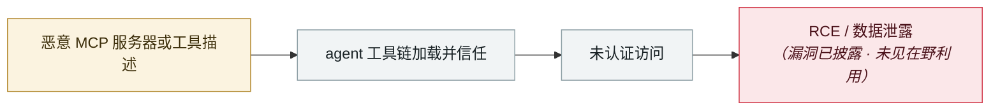

# RufRoot（CVE-2026-59726）：CVSS 满分，可召唤流氓 AI 蜂群

RufRoot (CVE-2026-59726): perfect CVSS, summons a rogue AI swarm

      

## 概要

Noma Security 命名，**CVSS 10.0**，影响 Ruflo < 3.16.3 全部版本。**默认 docker-compose 部署把 MCP bridge 的 `POST /mcp` 与 `POST /mcp/:group` 端点无认证暴露** —— 未认证的网络攻击者直接 `tools/call` 调 `terminal_execute`，在 bridge 容器内以 `node` 身份拿 shell、读取提供方 API key、**用受害者的密钥召唤 agent 蜂群**，并**向 AgentDB 学习库注入投毒模式，从而篡改所有用户的 AI 输出**

## 攻击链

## 来源

| # | 来源 | 链接 |
|---|---|---|
| 1 | THN | <https://thehackernews.com/2026/07/ruflo-mcp-flaw-lets-unauthenticated.html> |
| 2 | SecurityWeek | <https://www.securityweek.com/critical-ruflo-flaw-lets-attackers-spawn-rogue-ai-swarms/amp/> |

## 元数据

| 字段 | 值 |
|---|---|
| 日期 | `2026-07-30`（原文：2026-07-30，精度 `day`） |
| 性质 | 漏洞披露 `vulnerability` |
| 类型 | [`MCP`](../../../../taxonomy/types.md#mcp) MCP / 工具链 · [`INFRA`](../../../../taxonomy/types.md#infra) agent 基础设施暴露 |
| 严重度 | **高** `high` |
| 可信度 | **A** — 一手来源（厂商 / 受害方 / 执法 / 官方报告） |
| 真实伤害 | 否 |
| AI 参与 | 已确认 `confirmed` |
| 地区 | [全球](../../../../regions/global.md) |
| 档案编号 | `2026-07-30-rufroot-man-fen-zhao-huan` |

**判定依据**：漏洞披露，截至归档未见在野利用证据，故 `real_harm: false`。 判 `high`：真实损害范围有限，或属 CVSS 9+ 的严重缺陷，或是有重要意义的能力实证。 分级口径见 [taxonomy/severity.md](../../../../taxonomy/severity.md) 与 [taxonomy/confidence.md](../../../../taxonomy/confidence.md)。

## 相关

**所属专题**：[agent 供应链投毒](../../../../topics/agent-supply-chain.md) · [agent 基础设施暴露](../../../../topics/agent-infra.md)

**同类条目**：

- `2026-07-01` [AWS Kiro：让它总结一个网页，就能拿到 RCE（CVE-2026-10591）](../../../2026-07/2026-07-01-aws-kiro-rce.md)   AWS Kiro: ask it to summarise a web page, get RCE (CVE-2026-10591)
- `2026-07-27` [JFrog 发布 Artifactory 九个 CVE 补丁](../../../2026-07/2026-07-27-jfrog-artifactory-fa-bu-jiu.md)   JFrog patches nine Artifactory CVEs
- `2026-08-06` [Langflow 未认证 RCE 进 CISA KEV](../../../2026-08/2026-08-06-langflow-rce-cisa-kev.md)   Unauthenticated Langflow RCE added to CISA KEV
- `2026-06-08` [LiteLLM CVE-2026-42271 MCP 端点接管](../../../2026-06/2026-06-08-litellm-mcp-duan-dian-jie.md)   LiteLLM CVE-2026-42271 MCP endpoint takeover

---

[← English original](../../../2026-07/2026-07-30-rufroot-man-fen-zhao-huan.md) · [2026-07 index](../../../2026-07/README.md) · [All records](../../../README.md) · [Home](../../../../README.md)

本条目属于 **Orca AI Incident Archive**，按 [CC BY 4.0](../../../../LICENSE) 授权。发现事实错误或缺少来源，请[提 issue 或 PR](../../../../CONTRIBUTING.md)——更正会写进条目的修订记录，不会静默覆盖。
