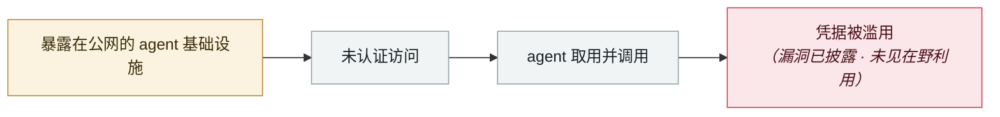

# Azure SRE Agent 越权（CVE-2026-62830）

Azure SRE Agent privilege escalation (CVE-2026-62830)

      

## 概要

**CVSS 9.9**，授权缺失。利用 **Scope-Changed OBO（代表用户）流程的失效**，攻击者可**继承该 agent 的托管身份**，进而修改 runbook、遥测与基础设施。爆炸半径不止 agent 本身，而是**其托管身份能触达的每一个基础设施资源** —— runbook、遥测、事件处理工具及其涉及的全部 Azure 资源。微软做的是**服务端修复（客户无需打补丁）**，并建议审计托管身份分配、复查 RBAC、监控异常提权

## 攻击链

## 来源

| # | 来源 | 链接 |
|---|---|---|
| 1 | MSRC/OpenCVE | <https://app.opencve.io/cve/CVE-2026-62830> |
| 2 | Talos Patch Tuesday | <https://blog.talosintelligence.com/microsoft-patch-tuesday-for-august-2026/> |

## 元数据

| 字段 | 值 |
|---|---|
| 日期 | `2026-08-01`（原文：2026-08，精度 `month`） |
| 性质 | 漏洞披露 `vulnerability` |
| 类型 | [`INFRA`](../../../../taxonomy/types.md#infra) agent 基础设施暴露 · [`CRED`](../../../../taxonomy/types.md#cred) 凭据滥用 |
| 严重度 | **高** `high` |
| 可信度 | **A** — 一手来源（厂商 / 受害方 / 执法 / 官方报告） |
| 真实伤害 | 否 |
| AI 参与 | 已确认 `confirmed` |
| 地区 | [全球](../../../../regions/global.md) |
| 档案编号 | `2026-08-01-azure-sre-agent` |

**判定依据**：漏洞披露，截至归档未见在野利用证据，故 `real_harm: false`。 判 `high`：真实损害范围有限，或属 CVSS 9+ 的严重缺陷，或是有重要意义的能力实证。 分级口径见 [taxonomy/severity.md](../../../../taxonomy/severity.md) 与 [taxonomy/confidence.md](../../../../taxonomy/confidence.md)。

## 相关

**所属专题**：[agent 基础设施暴露](../../../../topics/agent-infra.md)

**同类条目**：

- `2026-08-04` [CHAINDROP npm 蠕虫](../../../2026-08/2026-08-04-chaindrop-npm-ru-chong.md)   CHAINDROP npm worm
- `2026-08-06` [Langflow 未认证 RCE 进 CISA KEV](../../../2026-08/2026-08-06-langflow-rce-cisa-kev.md)   Unauthenticated Langflow RCE added to CISA KEV
- `2026-08-25` [NemoClaw（CVE-2026-65105）：DNS 重绑定改掉模型的聊天模板](../../../2026-08/2026-08-25-nemoclaw-dns-zhong-bang-ding.md)   NemoClaw (CVE-2026-65105): DNS rebinding rewrites the model's chat template
- `2026-08-17` [AI 找到了 AI 参与写的漏洞：Snowflake 的 Jira 令牌](../../../2026-08/2026-08-17-snowflake-jira-zhao-dao-can.md)   AI finds a flaw AI helped write: Snowflake's Jira token

---

[← English original](../../../2026-08/2026-08-01-azure-sre-agent.md) · [2026-08 index](../../../2026-08/README.md) · [All records](../../../README.md) · [Home](../../../../README.md)

本条目属于 **Orca AI Incident Archive**，按 [CC BY 4.0](../../../../LICENSE) 授权。发现事实错误或缺少来源，请[提 issue 或 PR](../../../../CONTRIBUTING.md)——更正会写进条目的修订记录，不会静默覆盖。
