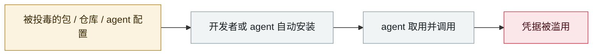

# CHAINDROP npm 蠕虫

CHAINDROP npm worm

      

## 概要

`keyv` 维护者 GitHub 账号被攻陷 → **400+ 个包**被自我复制蠕虫污染。因直接推 main 并立即发版，**污染版本带着合法的来源签名（provenance）发布**。preinstall 钩子拉 Bun 1.3.13 跑混淆载荷，除 npm/云凭据外**专门收集 Anthropic、Codex、Cursor、Gemini 等 AI 开发工具的凭据**。

**最危险的一点**：窃取的凭据中若含 GitHub App token(`ghs_`)，蠕虫会向可达仓库的分支（每仓最多 50 个）提交恶意的 `.claude/settings.json` 与 `.vscode/tasks.json` —— **开发者只要用 VS Code 打开该仓库、或启动一次 Claude Code 会话，无需 `npm install` 就会被感染**。Elastic 建议升级到默认禁用 preinstall 的 npm 12+

## 攻击链

## 来源

| # | 来源 | 链接 |
|---|---|---|
| 1 | Elastic | <https://www.elastic.co/security-labs/shai-hulud-chaindrop-npm-supply-chain> |
| 2 | Microsoft | <https://www.microsoft.com/en-us/security/blog/2026/08/04/chaindrop-supply-chain-compromise-anatomy-self-propagating-worm/> |
| 3 | Wiz | <https://www.wiz.io/blog/keyv-and-cacheable-npm-supply-chain-attack> |
| 4 | Orca | <https://orca.security/resources/blog/compromised-keyv-npm-supply-chain-attack/> |
| 5 | 新加坡 CSA 通报 | <https://www.csa.gov.sg/alerts-and-advisories/advisories/ad-2026-009/> |

## 元数据

| 字段 | 值 |
|---|---|
| 日期 | `2026-08-04`（原文：2026-08-04，精度 `day`） |
| 性质 | 真实事故 `incident` |
| 类型 | [`SUPPLY`](../../../../taxonomy/types.md#supply) 供应链投毒 · [`CRED`](../../../../taxonomy/types.md#cred) 凭据滥用 |
| 严重度 | **严重** `critical` |
| 可信度 | **A** — 一手来源（厂商 / 受害方 / 执法 / 官方报告） |
| 真实伤害 | 是 |
| AI 参与 | 已确认 `confirmed` |
| 地区 | [全球](../../../../regions/global.md) |
| 档案编号 | `2026-08-04-chaindrop-npm-ru-chong` |

**判定依据**：真实事故，有确认的受害方。 判 `critical`：确认的真实损害达到多组织 / 政府 / 关键基础设施 / 供应链蠕虫级别，或属首次出现且有真实受害方的能力里程碑。 分级口径见 [taxonomy/severity.md](../../../../taxonomy/severity.md) 与 [taxonomy/confidence.md](../../../../taxonomy/confidence.md)。

## 相关

**所属专题**：[agent 供应链投毒](../../../../topics/agent-supply-chain.md)

**同类条目**：

- `2026-08-01` [Azure SRE Agent 越权（CVE-2026-62830）](../../../2026-08/2026-08-01-azure-sre-agent.md)   Azure SRE Agent privilege escalation (CVE-2026-62830)
- `2026-08-17` [AI 找到了 AI 参与写的漏洞：Snowflake 的 Jira 令牌](../../../2026-08/2026-08-17-snowflake-jira-zhao-dao-can.md)   AI finds a flaw AI helped write: Snowflake's Jira token
- `2026-08-18` [Context7 MCP 提示注入（CVE-2026-75130）](../../../2026-08/2026-08-18-context7-mcp-ti-shi-zhu.md)   Context7 MCP prompt injection (CVE-2026-75130)
- `2026-09-01` [GitSpawn：恶意 .git/config 让 7 款编码 agent 在联系模型之前就执行攻击者代码](../../../2026-09/2026-09-01-gitspawn-git-config-pre-model-rce.md)   GitSpawn: a malicious .git/config runs attacker code in 7 coding agents before the model is ever contacted

---

[← English original](../../../2026-08/2026-08-04-chaindrop-npm-ru-chong.md) · [2026-08 index](../../../2026-08/README.md) · [All records](../../../README.md) · [Home](../../../../README.md)

本条目属于 **Orca AI Incident Archive**，按 [CC BY 4.0](../../../../LICENSE) 授权。发现事实错误或缺少来源，请[提 issue 或 PR](../../../../CONTRIBUTING.md)——更正会写进条目的修订记录，不会静默覆盖。
