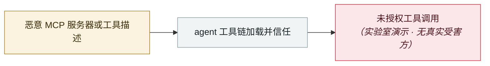

# AWS Transform MCP 任意文件写

AWS Transform MCP arbitrary file write

     

## 概要

CVE-2026-18953，**CVSS 8.6（High）**。`awslabs.aws-transform-mcp-server` 的 `get_resource` 存在路径穿越，可在上下文相关条件下任意写文件。AWS 安全公告 2026-075

## 攻击链

## 来源

| # | 来源 | 链接 |
|---|---|---|
| 1 | AWS 安全公告 | <https://aws.amazon.com/security/security-bulletins/2026-075-aws/> |

## 元数据

| 字段 | 值 |
|---|---|
| 日期 | `2026-08-05`（原文：2026-08-05，精度 `day`） |
| 性质 | 研究演示 `research` |
| 类型 | [`MCP`](../../../../taxonomy/types.md#mcp) MCP / 工具链 |
| 严重度 | **高** `high` |
| 可信度 | **A** — 一手来源（厂商 / 受害方 / 执法 / 官方报告） |
| 真实伤害 | 否 |
| AI 参与 | 已确认 `confirmed` |
| 地区 | [全球](../../../../regions/global.md) |
| 档案编号 | `2026-08-05-aws-transform-mcp` |

**判定依据**：研究机构或厂商的受控演示，`real_harm: false`；收录是为了标记攻击面何时被公开。 判 `high`：真实损害范围有限，或属 CVSS 9+ 的严重缺陷，或是有重要意义的能力实证。 分级口径见 [taxonomy/severity.md](../../../../taxonomy/severity.md) 与 [taxonomy/confidence.md](../../../../taxonomy/confidence.md)。

## 相关

**所属专题**：[agent 供应链投毒](../../../../topics/agent-supply-chain.md)

**同类条目**：

- `2026-08-18` [Context7 MCP 提示注入（CVE-2026-75130）](../../../2026-08/2026-08-18-context7-mcp-ti-shi-zhu.md)   Context7 MCP prompt injection (CVE-2026-75130)
- `2026-07-01` [AWS Kiro：让它总结一个网页，就能拿到 RCE（CVE-2026-10591）](../../../2026-07/2026-07-01-aws-kiro-rce.md)   AWS Kiro: ask it to summarise a web page, get RCE (CVE-2026-10591)
- `2026-07-30` [RufRoot（CVE-2026-59726）：CVSS 满分，可召唤流氓 AI 蜂群](../../../2026-07/2026-07-30-rufroot-man-fen-zhao-huan.md)   RufRoot (CVE-2026-59726): perfect CVSS, summons a rogue AI swarm
- `2026-06-12` [Agentjacking：一个公开 DSN 就能劫持 AI 编码 agent](../../../2026-06/2026-06-12-agentjacking-public-dsn.md)   Agentjacking: one public DSN hijacks AI coding agents

---

[← English original](../../../2026-08/2026-08-05-aws-transform-mcp.md) · [2026-08 index](../../../2026-08/README.md) · [All records](../../../README.md) · [Home](../../../../README.md)

本条目属于 **Orca AI Incident Archive**，按 [CC BY 4.0](../../../../LICENSE) 授权。发现事实错误或缺少来源，请[提 issue 或 PR](../../../../CONTRIBUTING.md)——更正会写进条目的修订记录，不会静默覆盖。
