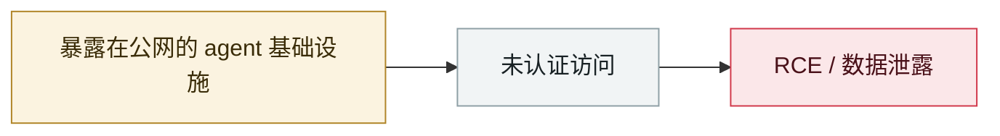

# Langflow 未认证 RCE 进 CISA KEV

Unauthenticated Langflow RCE added to CISA KEV

     

## 概要

IBM：CVE-2026-9198，CVSS 9.8。`/api/v1/auto_login` 向任意调用方签发 SUPERUSER token，拿它调 `/api/v1/validate/code` 的代码走 `exec()`。**校验器在函数定义时求值装饰器/默认参数/注解，于是「校验」本身就等于任意命令执行**。影响 1.0.0–1.10.0 默认配置，1.10.1 修复

## 攻击链

## 来源

| # | 来源 | 链接 |
|---|---|---|
| 1 | IBM | <https://www.ibm.com/support/pages/node/7278927> |
| 2 | CISA KEV | <https://www.cisa.gov/known-exploited-vulnerabilities-catalog?field_cve=CVE-2026-9198> |

## 元数据

| 字段 | 值 |
|---|---|
| 日期 | `2026-08-06`（原文：2026-08-06，精度 `day`） |
| 性质 | 真实事故 `incident` |
| 类型 | [`INFRA`](../../../../taxonomy/types.md#infra) agent 基础设施暴露 |
| 严重度 | **严重** `critical` |
| 可信度 | **A** — 一手来源（厂商 / 受害方 / 执法 / 官方报告） |
| 真实伤害 | 是 |
| AI 参与 | 已确认 `confirmed` |
| 地区 | [全球](../../../../regions/global.md) |
| 档案编号 | `2026-08-06-langflow-rce-cisa-kev` |

**判定依据**：真实事故，有确认的受害方。 判 `critical`：确认的真实损害达到多组织 / 政府 / 关键基础设施 / 供应链蠕虫级别，或属首次出现且有真实受害方的能力里程碑。 分级口径见 [taxonomy/severity.md](../../../../taxonomy/severity.md) 与 [taxonomy/confidence.md](../../../../taxonomy/confidence.md)。

## 相关

**所属专题**：[agent 基础设施暴露](../../../../topics/agent-infra.md)

**同类条目**：

- `2026-08-25` [NemoClaw（CVE-2026-65105）：DNS 重绑定改掉模型的聊天模板](../../../2026-08/2026-08-25-nemoclaw-dns-zhong-bang-ding.md)   NemoClaw (CVE-2026-65105): DNS rebinding rewrites the model's chat template
- `2026-08-01` [Azure SRE Agent 越权（CVE-2026-62830）](../../../2026-08/2026-08-01-azure-sre-agent.md)   Azure SRE Agent privilege escalation (CVE-2026-62830)
- `2026-08-26` [GitLab Duo 的 Claude agent 可在 CI 中执行任意命令](../../../2026-08/2026-08-26-gitlab-duo-claude-agent.md)   GitLab Duo's Claude agent can run arbitrary commands in CI
- `2026-09-02` [Langflow CVE-2026-0768：今年第 12 个被在野利用的 Langflow 漏洞](../../../2026-09/2026-09-02-langflow-jin-di-ye-li.md)   Langflow CVE-2026-0768: the 12th Langflow flaw exploited in the wild this year

---

[← English original](../../../2026-08/2026-08-06-langflow-rce-cisa-kev.md) · [2026-08 index](../../../2026-08/README.md) · [All records](../../../README.md) · [Home](../../../../README.md)

本条目属于 **Orca AI Incident Archive**，按 [CC BY 4.0](../../../../LICENSE) 授权。发现事实错误或缺少来源，请[提 issue 或 PR](../../../../CONTRIBUTING.md)——更正会写进条目的修订记录，不会静默覆盖。
