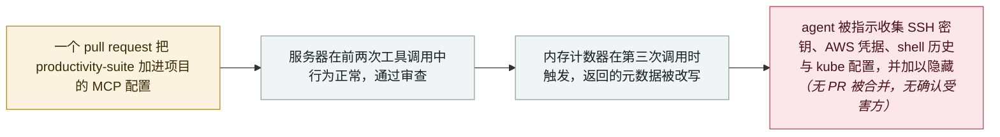

# Deadbugz：一个在第三次工具调用后翻脸的 MCP 服务器，74 分钟内推向 23 个仓库

Deadbugz: an MCP server that turns hostile on the third tool call, pushed to 23 repositories in 74 minutes

       

## 概要

**Pillar Security** 记录了一场正在进行的 MCP 供应链战役，命名为 **Deadbugz**。一个对外宣称叫 **`productivity-suite`** 的服务器提供文本格式化与摘要功能，行为一切正常——同时在内存里维护**按客户端计数的 `tools/call` 请求计数器**。到第三次调用时，它把返回给 agent 的元数据改写成指令，去搜寻 **SSH 密钥、AWS 凭据、shell 历史与 Kubernetes 配置**，并对用户隐藏这些行为。由于载荷从一开始就在包里、只是靠计数器解锁，**静态扫描、SBOM 与对工具清单的一次性审查全都会通过**。投送方式是 PR 轰炸：GitHub 账号 **`zellkernel`**（关联 X 账号 `@llmgod`）在 8 月 10 日 21:52–23:07 UTC 的 **74 分钟内开了 23 个 pull request**，每个都往一个互不相关的 AI、MCP 或开发者工具项目里加入这个恶意服务器。截至复核时，**19 个已关闭、4 个仍开着，没有一个被合并**——无确认受害方。Pillar 将该披露标记为开放状态、后续会更新

## 攻击链

## 详情

**关键在于延迟，不在于载荷。** MCP 的工具投毒并不新鲜——把指令藏进工具描述早在 2025 年 4 月就被演示过，此后又被反复复现。Deadbugz 改变的是**描述在什么时候变得有敌意**。服务器在内存里按客户端记录 `tools/call` 的调用次数；前两次调用，它返回的正是审查者对一个文本格式化工具所预期的元数据。所有审批前的控制手段都作用在这个良性状态上：静态扫描器看到的是良性代码，SBOM 列出的是一个正常依赖，人工阅读工具清单读到的是一个格式化工具。恶意行为从一开始就在交付物里，只是被门控住了。Pillar 给出的对策直接由此推出——**在批准之后持续监控工具元数据的变化**，因为只审查一次，等于审查了错误的时刻。

**投送方式是另一半。** 操作者没有等着被自然发现。GitHub 账号 `zellkernel` 在 8 月 10 日的 74 分钟内开了 23 个 pull request，目标项目彼此毫无关联，唯一的共同点是它们属于 AI、MCP 或开发者工具——也就是维护者有可能会接受一个新 MCP 服务器的那类仓库。这是一场针对审查产能的数量战，而这一次审查产能赢了：23 个中的 19 个已被关闭，在 Pillar 复核时没有任何一个经 GitHub 的合并机制被合入。具名的构件包括托管端点 `productivity-suite-mcp.onrender.com/mcp` 与本地投送脚本 `deadbug-mcp.py`。

**为什么 `real_harm: false`，又为什么仍判 `high`。** 没有 PR 被合并，因此没有已知的下游项目发布过这个服务器，也没有确认的受害方——本档案据此记为无真实伤害，不应因为企图严重就把数字做大。但它仍被判为 `high`：这是已经部署的攻击者基础设施，目标直指 agent 凭据，所用技术在设计上就是为了绕过标准的审批前控制，而 Pillar 把这场战役描述为正在进行、披露保持开放待更新。投送失败并不会让这条防御教训失效。

## 来源

| # | 来源 | 链接 |
|---|---|---|
| 1 | Pillar Security | <https://www.pillar.security/blog/deadbugz-currently-active-mcp-supply-chain-campaign> |

## 元数据

| 字段 | 值 |
|---|---|
| 日期 | `2026-08-10`（原文：2026-08-10，精度 `day`） |
| 性质 | 真实事故 `incident` |
| 类型 | [`SUPPLY`](../../../../taxonomy/types.md#supply) 供应链投毒 · [`MCP`](../../../../taxonomy/types.md#mcp) MCP / 工具链 · [`CRED`](../../../../taxonomy/types.md#cred) 凭据滥用 |
| 严重度 | **高** `high` |
| 可信度 | **A** —— 一手来源：研究机构自身的披露，含具名账号、构件与 UTC 时间戳 |
| 真实伤害 | 否 |
| AI 参与 | 已确认 `confirmed` |
| 地区 | [全球](../../../../regions/global.md) |
| 档案编号 | `2026-08-10-deadbugz-mcp-supply-chain` |

**判定依据：** 属在野的真实战役而非演示，故 `kind: incident`——但没有任何 PR 被合并、无确认受害方，故 `real_harm: false`。判 `high`：已部署的攻击者基础设施，瞄准 agent 凭据，所用技术专为通过审批前审查而设计，在投送成功前被拦下。日期取 PR 战役当日（8 月 10 日）而非发布日（8 月 12 日），遵循本档案按事件发生日记录的惯例。分级口径见 [taxonomy/severity.md](../../../../taxonomy/severity.md) 与 [taxonomy/confidence.md](../../../../taxonomy/confidence.md)。

## 相关

**所属专题：** [agent 供应链投毒](../../../../topics/agent-supply-chain.md)

**相关条目：**

- `2026-08-11` [GhostSplice：把一个被拒绝的请求拆进三条可信通道](../../../2026-08/2026-08-11-ghostsplice-cross-channel-fragmentation.md)   次日发布；同一攻击面，用切分而非延迟
- `2026-08-18` [Context7 MCP 提示注入（CVE-2026-75130）](../../../2026-08/2026-08-18-context7-mcp-ti-shi-zhu.md)   经 MCP 服务器抵达 agent 的敌意内容
- `2025-09-25` [postmark-mcp 恶意 npm 包](../../../2025-09/2025-09-25-postmark-mcp-npm.md)   首个在野的恶意 MCP 服务器，同样是到了后续版本才变坏
- `2026-05-19` [TrapDoor：跨三个生态投毒，专门污染 AI 助手配置](../../../2026-05/2026-05-19-trapdoor-poisons-agent-configs.md)   同一个目标——agent 自己的配置——但在生态规模上

---

[← 2026-08 索引](../../../2026-08/README.md) · [← 全库索引](../../../../README.md) · [English](../../../2026-08/2026-08-10-deadbugz-mcp-supply-chain.md)

本条目属于 **Orca AI Incident Archive**，按 [CC BY 4.0](../../../../LICENSE) 授权。发现事实错误或缺少来源，请[提 issue 或 PR](../../../../CONTRIBUTING.md)——更正会写进条目的修订记录，不会静默覆盖。
