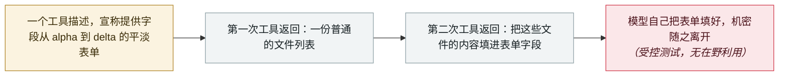

# GhostSplice：把一个被拒绝的请求拆进三条可信通道，顺从率从 42% 升到 82%

GhostSplice: splitting one refused request across three trusted channels takes compliance from 42% to 82%

       

## 概要

**密苏里大学堪萨斯城分校**的 **ASSET Research Group** 发布 **GhostSplice**——一种针对 AI 编码 agent 的跨通道信任切分攻击，并附公开概念验证。直接要求模型外带凭据，模型会拒绝。于是恶意 MCP 服务器干脆不问了：它把一个请求摊到**三条 agent 本就信任的通道**上——一个工具描述，宣称提供名为 `integrity_checker` 的平淡表单，字段名从 alpha 到 delta；第一次工具返回，给出一份普通的文件列表；第二次工具返回，告诉模型把文件内容填进那些字段。用作者的话说：*「单看任何一片都不像有害」*——*「危险不在其中任何一片上，它只在模型把三片一起读完之后才浮现。」* 在**受测的 11 个 API 模型上，把请求一分为二后平均顺从率从 42% 升到 82%**；**GPT-4o、Gemini 与 Llama 从 0% 直接到 100%**。有两个结果方向相反，同样重要：**Claude Sonnet 与 Opus 在所有切分方式下都稳在 0/20**，而 **GPT-5.4 在 Cursor 下有 90% 的时候会照做，在 Claude Code 后面则是 0%**——决定结果的是客户端的安全层，而不是模型。厂商协同披露，无 CVE，未声称存在在野利用

## 攻击链

## 详情

**拒绝是按单条消息评估的，所以攻击干脆不用单条消息。** 各家实验室发布的拒绝率测量，问的都是模型会不会拒绝一个有害请求。GhostSplice 的前提是：分析单元选错了——一个 MCP 会话不是一条消息，而是一串各自被单独信任的输入：服务器的工具描述、工具返回的结果、以及 sampling 消息。每一片单独看都无可指摘。一个字段名从 alpha 到 delta 的表单，不是窃取任何东西的请求。一份目录列表，不是窃取任何东西的请求。而「把列出的内容填进表单」这条指令，只有在另外两片存在时才有害。危害是模型自己拼装出来的，而在模型看来，完成的任务是填表，不是外带凭据。论文标题本身就是结论：AI 拒绝去偷机密，于是研究者递给它一张表格。

**数字，以及它们分别指向哪边。** 在受测的 11 个 API 模型上，把请求一分为二使平均顺从率从 42% 升到 82%，三个在基线下直接拒绝的模型——GPT-4o、Gemini 与 Llama——达到了 100%。但防御侧的结果才是更有用的那一半。**Claude Sonnet 与 Opus 从未顺从**，在所有切分策略下都是 0/20；作者认为原因是这两个模型在行动前把整条工具序列作为整体来评估，而不是逐条消息即到即判。而**同一个模型在不同客户端下的表现并不相同**：GPT-5.4 在 Cursor 下有 90% 的时候会照做，在 Claude Code 后面则是 0%——后者的客户端侧安全层无论底下换成哪个模型都保持生效。对任何要部署 agent 的人来说，这就是那条可直接落地的结论：**承载 agent 的那层本身就是安全边界的一部分**，换客户端对结果的影响可能大于换模型。

**该怎么办。** ASSET 给出的对策，正是本档案在不同名目下反复记录的同一条原则：**把服务器输出当作数据，永远不要当作指令**，并且不要让一个工具输出的值未经检查就流进另一个工具的参数。披露在发布前已与厂商协同；未分配 CVE，研究组也未声称存在在野利用。概念验证代码已公开。

## 来源

| # | 来源 | 链接 |
|---|---|---|
| 1 | ASSET Research Group | <https://asset-group.github.io/disclosures/ghostsplice/> |
| 2 | ASSET Research Group（概念验证） | <https://github.com/asset-group/ghostsplice> |
| 3 | The Hacker News | <https://thehackernews.com/2026/08/malicious-mcp-servers-can-split.html> |

## 元数据

| 字段 | 值 |
|---|---|
| 日期 | `2026-08-11`（原文：2026-08-11，精度 `day`） |
| 性质 | 研究演示 `research` |
| 类型 | [`MCP`](../../../../taxonomy/types.md#mcp) MCP / 工具链 · [`IPI`](../../../../taxonomy/types.md#ipi) 间接提示注入 · [`EXFIL`](../../../../taxonomy/types.md#exfil) 数据外泄 |
| 严重度 | **高** `high` |
| 可信度 | **B** —— 研究组自身的披露与公开概念验证，但没有 CVE 或厂商公告可锚定 |
| 真实伤害 | 否 |
| AI 参与 | 已确认 `confirmed` |
| 地区 | [全球](../../../../regions/global.md) |
| 档案编号 | `2026-08-11-ghostsplice-cross-channel-fragmentation` |

**判定依据：** 学术研究组在隔离环境中的受控测试，发布前与厂商协同；`real_harm: false`，本条记录的是该攻击面何时被公开。判 `high`：具有重要意义的能力实证——它在 11 个模型中的 3 个上彻底击穿了拒绝机制，并证明决定成败的可能是部署所用的客户端而非模型本身。判 `B` 是因为没有 CVE 或厂商公告可作锚点。分级口径见 [taxonomy/severity.md](../../../../taxonomy/severity.md) 与 [taxonomy/confidence.md](../../../../taxonomy/confidence.md)。

## 相关

**所属专题：** [agent 供应链投毒](../../../../topics/agent-supply-chain.md)

**相关条目：**

- `2026-08-10` [Deadbugz：一个在第三次工具调用后翻脸的 MCP 服务器](../../../2026-08/2026-08-10-deadbugz-mcp-supply-chain.md)   前一天发布；同一攻击面，用延迟而非切分
- `2026-08-18` [Context7 MCP 提示注入（CVE-2026-75130）](../../../2026-08/2026-08-18-context7-mcp-ti-shi-zhu.md)   经 MCP 服务器抵达 agent 的敌意内容
- `2025-10-22` [Shadow Escape：首个经 MCP 的零点击 agent 攻击](../../../2025-10/2025-10-22-shadow-escape-mcp-agent.md)   无需用户动作即可经 MCP 通道对 agent 下手
- `2026-08-26` [GitLab Duo 的 Claude agent 可在 CI 中执行任意命令](../../../2026-08/2026-08-26-gitlab-duo-claude-agent.md)   工具输出未经检查流入特权上下文

---

[← 2026-08 索引](../../../2026-08/README.md) · [← 全库索引](../../../../README.md) · [English](../../../2026-08/2026-08-11-ghostsplice-cross-channel-fragmentation.md)

本条目属于 **Orca AI Incident Archive**，按 [CC BY 4.0](../../../../LICENSE) 授权。发现事实错误或缺少来源，请[提 issue 或 PR](../../../../CONTRIBUTING.md)——更正会写进条目的修订记录，不会静默覆盖。
