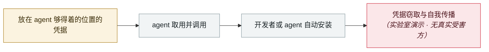

# AI 找到了 AI 参与写的漏洞：Snowflake 的 Jira 令牌

AI finds a flaw AI helped write: Snowflake's Jira token

      

## 概要

`snowflakedb/snowflake-connector-net` 的一个 GitHub Actions 工作流（开 issue 时自动建 Jira 工单）中，**2026-06-18 一次标注为「Copilot Autofix powered by AI」共同署名的变更**引入了脚本注入缺陷 —— issue 标题被直接展开进 shell 命令而非经环境变量传递，可用于外带 Jira 凭据。

发现方是 **Wiz 的自主「Red Agent」**（2026-06-23 报告），Snowflake 当天修复并轮换令牌，确认 5 天暴露窗口内除 Wiz 外无第三方访问。Wiz 2026-08-17 发布完整分析。

⚠️ **GitHub 对定性提出异议**：有问题的工作流逻辑可追溯到 **2025 年 8 月一名 Snowflake 人类工程师的提交**，Autofix 的「共同作者」标签是在 2026-06-18 的 squash 合并中才被附上的。**入库须并列两种说法**

## 攻击链

## 来源

| # | 来源 | 链接 |
|---|---|---|
| 1 | Wiz | <https://www.wiz.io/blog/red-agent-snowflake-copilot-cicd-bug> |
| 2 | THN | <https://thehackernews.com/2026/08/snowflake-github-actions-flaw-lets_0330881554.html> |

## 元数据

| 字段 | 值 |
|---|---|
| 日期 | `2026-08-17`（原文：2026-08-17，精度 `day`） |
| 性质 | 研究演示 `research` |
| 类型 | [`CRED`](../../../../taxonomy/types.md#cred) 凭据滥用 · [`SUPPLY`](../../../../taxonomy/types.md#supply) 供应链投毒 |
| 严重度 | **高** `high` |
| 可信度 | **A** — 一手来源（厂商 / 受害方 / 执法 / 官方报告） |
| 真实伤害 | 是 |
| AI 参与 | 已确认 `confirmed` |
| 地区 | [全球](../../../../regions/global.md) |
| 档案编号 | `2026-08-17-snowflake-jira-zhao-dao-can` |

**判定依据**：研究机构或厂商的受控演示，`real_harm: false`；收录是为了标记攻击面何时被公开。 判 `high`：真实损害范围有限，或属 CVSS 9+ 的严重缺陷，或是有重要意义的能力实证。 分级口径见 [taxonomy/severity.md](../../../../taxonomy/severity.md) 与 [taxonomy/confidence.md](../../../../taxonomy/confidence.md)。

## 相关

**所属专题**：[agent 供应链投毒](../../../../topics/agent-supply-chain.md)

**同类条目**：

- `2026-08-04` [CHAINDROP npm 蠕虫](../../../2026-08/2026-08-04-chaindrop-npm-ru-chong.md)   CHAINDROP npm worm
- `2026-08-01` [Azure SRE Agent 越权（CVE-2026-62830）](../../../2026-08/2026-08-01-azure-sre-agent.md)   Azure SRE Agent privilege escalation (CVE-2026-62830)
- `2026-08-18` [Context7 MCP 提示注入（CVE-2026-75130）](../../../2026-08/2026-08-18-context7-mcp-ti-shi-zhu.md)   Context7 MCP prompt injection (CVE-2026-75130)
- `2026-09-01` [GitSpawn：恶意 .git/config 让 7 款编码 agent 在联系模型之前就执行攻击者代码](../../../2026-09/2026-09-01-gitspawn-git-config-pre-model-rce.md)   GitSpawn: a malicious .git/config runs attacker code in 7 coding agents before the model is ever contacted

---

[← English original](../../../2026-08/2026-08-17-snowflake-jira-zhao-dao-can.md) · [2026-08 index](../../../2026-08/README.md) · [All records](../../../README.md) · [Home](../../../../README.md)

本条目属于 **Orca AI Incident Archive**，按 [CC BY 4.0](../../../../LICENSE) 授权。发现事实错误或缺少来源，请[提 issue 或 PR](../../../../CONTRIBUTING.md)——更正会写进条目的修订记录，不会静默覆盖。
