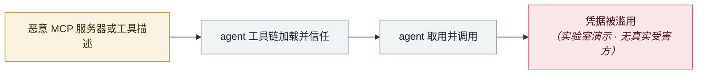

# Context7 MCP 提示注入（CVE-2026-75130）

Context7 MCP prompt injection (CVE-2026-75130)

      

## 概要

Context7 ≤ 2.1.2：经 MCP 提供的 **Custom AI Instructions 功能**未净化内容，攻击者投毒自定义指令后，**agent 只要做一次例行的库文档查询**，就会把 `.env` 里的凭据外带到攻击者服务，并在受害者机器上执行破坏性文件删除。CVSS 3.1 **9.0**（CVSS 4.0 为 6.4）。⚠️ **截至披露日该版本区间无公开修复**

## 攻击链

## 来源

| # | 来源 | 链接 |
|---|---|---|
| 1 | OpenCVE | <https://app.opencve.io/cve/CVE-2026-75130> |
| 2 | 分析 | <https://www.digitalapplied.com/blog/context7-mcp-prompt-injection-cve-2026-75130> |

## 元数据

| 字段 | 值 |
|---|---|
| 日期 | `2026-08-18`（原文：2026-08-18，精度 `day`） |
| 性质 | 研究演示 `research` |
| 类型 | [`MCP`](../../../../taxonomy/types.md#mcp) MCP / 工具链 · [`CRED`](../../../../taxonomy/types.md#cred) 凭据滥用 |
| 严重度 | **高** `high` |
| 可信度 | **A** — 一手来源（厂商 / 受害方 / 执法 / 官方报告） |
| 真实伤害 | 否 |
| AI 参与 | 已确认 `confirmed` |
| 地区 | [全球](../../../../regions/global.md) |
| 档案编号 | `2026-08-18-context7-mcp-ti-shi-zhu` |

**判定依据**：研究机构或厂商的受控演示，`real_harm: false`；收录是为了标记攻击面何时被公开。 判 `high`：真实损害范围有限，或属 CVSS 9+ 的严重缺陷，或是有重要意义的能力实证。 分级口径见 [taxonomy/severity.md](../../../../taxonomy/severity.md) 与 [taxonomy/confidence.md](../../../../taxonomy/confidence.md)。

## 相关

**所属专题**：[agent 供应链投毒](../../../../topics/agent-supply-chain.md)

**同类条目**：

- `2026-08-04` [CHAINDROP npm 蠕虫](../../../2026-08/2026-08-04-chaindrop-npm-ru-chong.md)   CHAINDROP npm worm
- `2026-08-05` [AWS Transform MCP 任意文件写](../../../2026-08/2026-08-05-aws-transform-mcp.md)   AWS Transform MCP arbitrary file write
- `2026-08-01` [Azure SRE Agent 越权（CVE-2026-62830）](../../../2026-08/2026-08-01-azure-sre-agent.md)   Azure SRE Agent privilege escalation (CVE-2026-62830)
- `2026-08-17` [AI 找到了 AI 参与写的漏洞：Snowflake 的 Jira 令牌](../../../2026-08/2026-08-17-snowflake-jira-zhao-dao-can.md)   AI finds a flaw AI helped write: Snowflake's Jira token

---

[← English original](../../../2026-08/2026-08-18-context7-mcp-ti-shi-zhu.md) · [2026-08 index](../../../2026-08/README.md) · [All records](../../../README.md) · [Home](../../../../README.md)

本条目属于 **Orca AI Incident Archive**，按 [CC BY 4.0](../../../../LICENSE) 授权。发现事实错误或缺少来源，请[提 issue 或 PR](../../../../CONTRIBUTING.md)——更正会写进条目的修订记录，不会静默覆盖。
