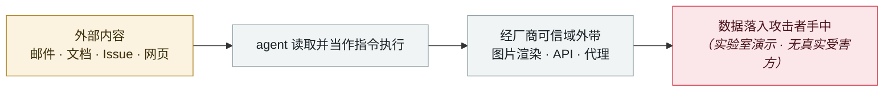

# Grok「密码学上下文注入」：加密的指令，明文的数据

Grok "cryptographic context injection": encrypted instructions, plaintext data

      

## 概要

Adversa AI。攻击页面嵌入**加密后的指令 —— Grok 能自行解密并执行**。载荷让模型「生成一个解密密钥」，而**那个所谓的密钥其实是一个模板，里面填的是用户的隐私数据**（姓名、位置、订阅等级、聊天历史）；Grok 随后在打开攻击者网站时把它当作 URL 参数带了出去。零点击。

⚠️ **2026-06-03 已通过 HackerOne 报告 xAI；截至 2026-08-19 在生产环境仍可复现**

## 攻击链

## 来源

| # | 来源 | 链接 |
|---|---|---|
| 1 | Adversa AI | <https://adversa.ai/blog/cryptographic-context-injection-grok-data-theft/> |
| 2 | THN | <https://thehackernews.com/2026/08/new-cryptographic-context-injection.html> |

## 元数据

| 字段 | 值 |
|---|---|
| 日期 | `2026-08-19`（原文：2026-08-19，精度 `day`） |
| 性质 | 研究演示 `research` |
| 类型 | [`IPI`](../../../../taxonomy/types.md#ipi) 间接提示注入 · [`EXFIL`](../../../../taxonomy/types.md#exfil) 数据外泄 |
| 严重度 | **高** `high` |
| 可信度 | **A** — 一手来源（厂商 / 受害方 / 执法 / 官方报告） |
| 真实伤害 | 否 |
| AI 参与 | 已确认 `confirmed` |
| 地区 | [全球](../../../../regions/global.md) |
| 档案编号 | `2026-08-19-grok-mi-ma-xue-wen` |

**判定依据**：研究机构或厂商的受控演示，`real_harm: false`；收录是为了标记攻击面何时被公开。 判 `high`：真实损害范围有限，或属 CVSS 9+ 的严重缺陷，或是有重要意义的能力实证。 分级口径见 [taxonomy/severity.md](../../../../taxonomy/severity.md) 与 [taxonomy/confidence.md](../../../../taxonomy/confidence.md)。

## 相关

**所属专题**：[零点击数据外泄链](../../../../topics/zero-click-exfil.md)

**同类条目**：

- `2026-08-18` [CoSnitch（CVE-2026-24301）](../../../2026-08/2026-08-18-cosnitch.md)   CoSnitch (CVE-2026-24301)
- `2026-07-02` [隐藏网页指令诱导 AI agent 向攻击者付款（在野两起战役）](../../../2026-07/2026-07-02-hidden-web-instructions-payment-fraud.md)   Hidden web instructions make AI agents pay attackers (two in-the-wild campaigns)
- `2026-09-08` [ChatGPT 沙箱缺陷让受害者的 Gmail 数据流进攻击者账号](../../../2026-09/2026-09-08-chatgpt-gmail-sha-xiang-que.md)   ChatGPT sandbox flaw pipes a victim's Gmail data into the attacker's account
- `2026-07-07` [GitLost：GitHub Agentic Workflows 泄露私有仓库](../../../2026-07/2026-07-07-gitlost-github-agentic-workflows.md)   GitLost: GitHub Agentic Workflows leak private repositories

---

[← English original](../../../2026-08/2026-08-19-grok-mi-ma-xue-wen.md) · [2026-08 index](../../../2026-08/README.md) · [All records](../../../README.md) · [Home](../../../../README.md)

本条目属于 **Orca AI Incident Archive**，按 [CC BY 4.0](../../../../LICENSE) 授权。发现事实错误或缺少来源，请[提 issue 或 PR](../../../../CONTRIBUTING.md)——更正会写进条目的修订记录，不会静默覆盖。
