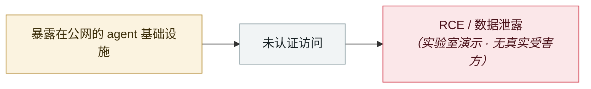

# NemoClaw（CVE-2026-65105）：DNS 重绑定改掉模型的聊天模板

NemoClaw (CVE-2026-65105): DNS rebinding rewrites the model's chat template

     

## 概要

Oasis 研究团队演示：**DNS 重绑定**让浏览器 JavaScript 在脆弱配置下触达 Ollama，再用 `/api/create` 端点**修改模型的 chat template**（决定消息在推理前如何被格式化）。**植入的指令在之后的对话中持续存在，即使 agent 另行提供了系统提示也依然生效** —— 这是模型层面的持久投毒。NVIDIA 于 08-25 修复

## 攻击链

## 来源

| # | 来源 | 链接 |
|---|---|---|
| 1 | eSecurity Planet | <https://www.esecurityplanet.com/vulnerabilities/news-nvidia-nemoclaw-cve-2026-65105/> |

## 元数据

| 字段 | 值 |
|---|---|
| 日期 | `2026-08-25`（原文：2026-08-25，精度 `day`） |
| 性质 | 研究演示 `research` |
| 类型 | [`INFRA`](../../../../taxonomy/types.md#infra) agent 基础设施暴露 |
| 严重度 | **高** `high` |
| 可信度 | **A** — 一手来源（厂商 / 受害方 / 执法 / 官方报告） |
| 真实伤害 | 否 |
| AI 参与 | 已确认 `confirmed` |
| 地区 | [全球](../../../../regions/global.md) |
| 档案编号 | `2026-08-25-nemoclaw-dns-zhong-bang-ding` |

**判定依据**：研究机构或厂商的受控演示，`real_harm: false`；收录是为了标记攻击面何时被公开。 判 `high`：真实损害范围有限，或属 CVSS 9+ 的严重缺陷，或是有重要意义的能力实证。 分级口径见 [taxonomy/severity.md](../../../../taxonomy/severity.md) 与 [taxonomy/confidence.md](../../../../taxonomy/confidence.md)。

## 相关

**所属专题**：[agent 基础设施暴露](../../../../topics/agent-infra.md)

**同类条目**：

- `2026-08-06` [Langflow 未认证 RCE 进 CISA KEV](../../../2026-08/2026-08-06-langflow-rce-cisa-kev.md)   Unauthenticated Langflow RCE added to CISA KEV
- `2026-08-01` [Azure SRE Agent 越权（CVE-2026-62830）](../../../2026-08/2026-08-01-azure-sre-agent.md)   Azure SRE Agent privilege escalation (CVE-2026-62830)
- `2026-08-26` [GitLab Duo 的 Claude agent 可在 CI 中执行任意命令](../../../2026-08/2026-08-26-gitlab-duo-claude-agent.md)   GitLab Duo's Claude agent can run arbitrary commands in CI
- `2026-09-02` [Langflow CVE-2026-0768：今年第 12 个被在野利用的 Langflow 漏洞](../../../2026-09/2026-09-02-langflow-jin-di-ye-li.md)   Langflow CVE-2026-0768: the 12th Langflow flaw exploited in the wild this year

---

[← English original](../../../2026-08/2026-08-25-nemoclaw-dns-zhong-bang-ding.md) · [2026-08 index](../../../2026-08/README.md) · [All records](../../../README.md) · [Home](../../../../README.md)

本条目属于 **Orca AI Incident Archive**，按 [CC BY 4.0](../../../../LICENSE) 授权。发现事实错误或缺少来源，请[提 issue 或 PR](../../../../CONTRIBUTING.md)——更正会写进条目的修订记录，不会静默覆盖。
