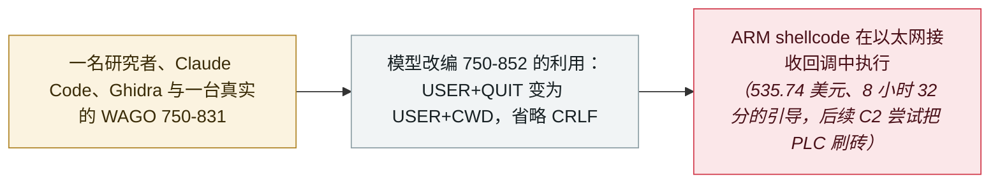

# Forescout 用 Claude Code 移植 WAGO PLC 漏洞利用：535.74 美元、8 小时 32 分、一台被刷砖的控制器

Forescout ports a WAGO PLC exploit with Claude Code: $535.74, 8h32m, one bricked controller

     

## 概要

**Forescout Research（Vedere Labs）**借助 **Claude Code** 把一款 **WAGO PLC** 上可用的免认证 RCE 漏洞利用移植到另一型号，并在真实硬件上执行了攻击者提供的 ARM shellcode。目标是 **CVE-2021-31886**——Nucleus FTP 服务器处理 `USER` 命令时的栈缓冲区溢出，CVSS 9.8，无需凭据即可经 TCP 21 端口触达，受影响控制器没有可用的固件更新。在真实的 750-831 上，模型改编了针对 750-852 的现成利用——把 `USER`+`QUIT` 序列改为 `USER`+`CWD`，并省略 CRLF 终止符——代码执行建立后，它用 **12 分钟**就从空操作 shellcode 推进到两个可用的网络载荷。但整个移植需要研究者持续引导；仅最后阶段就消耗了 **535.74 美元** API 费用（输入 2.6k、输出 1.3M token），会话历时 **8 小时 32 分**、横跨数日；后续把利用扩展为 C2 植入的尝试**把 PLC 刷成了砖**。Forescout 自己的结论：今天门槛仍然很高，但趋势线已经清晰

## 攻击链

## 详情

**移植了什么，怎么做到的。** Forescout 此前已为 **WAGO 750-852** 做出可用的 RCE 利用；这次实验要验证 AI 能否把它移植到型号相近、运行固件 V01.04.16 的 **750-831**。研究者提供了现成的利用、新机型的固件二进制，以及作为真实目标的实体控制器；整个工作以交互式会话进行，**Claude Code** 可以使用终端、逆向工具 **Ghidra** 和 PLC 本身。最初使用 Claude **Sonnet 4.6**；早期尝试受阻后改用 **Opus 4.6**：在 750-831 上，正常的 FTP 处理会把攻击者控制的缓冲区清零 256 字节，注入的 shellcode 还没运行就被覆盖。模型把针对 750-852 有效的 `USER`+`QUIT` 序列改编为 `USER`+`CWD`，并省略 CRLF 终止符，从而*「阻止了相关处理路径按常规方式完成」*——缓冲区存活的时间足够载荷执行。Forescout 称，代码执行建立后，模型用 **12 分钟**就从可用的空操作 shellcode 推进到两个可用载荷：一个向攻击者控制的系统发送 ICMP 回显请求，另一个发送包含字符串 `PWNED` 的 UDP 包。该利用在以太网接收回调上下文中运行，展示的能力止步于发送网络数据包。

**代价，以及它说明了什么。** 最醒目的数字是最后 RCE 开发阶段的价格：**535.74 美元** API 费用，对应 2.6k 输入与 **1.3M 输出 token**，会话时长 **8 小时 32 分**、横跨数日——只为单个目标上的单个利用。其中大部分时间用于定位缓冲区的存续问题。整个过程还需要持续的人工判断：*「引导 AI 走出死胡同、提供反汇编上下文、纠正错误方向」*。而后续一次试图把利用扩展为命令与控制植入的会话，写入了一块 flash 映射的内存区域，**把 PLC 永久刷砖**。Forescout 没有粉饰：*「也可以说，同一位研究者不使用 AI，本可以在更短时间内、以更低成本完成最初的 RCE 移植，而且不会把 PLC 弄死。」* 它的评估是：今天门槛仍然很高——这是一个没有源代码、无法在目标上调试的受限嵌入式系统——但降低高层软件漏洞利用门槛的那条演进曲线，已经开始触及底层嵌入式系统。

**为什么收录。** 这是本档案第一条「AI 被用于**工控（OT）漏洞利用开发**」的记录，收录的理由不是已展示的自主性，而是方向本身：研究者全程引导、昂贵、不完整——但在真实硬件上成功了。Forescout 把它放进这样一条脉络：从通用模型在开源软件中发现漏洞，到谷歌所称的首个已知「AI 生成的零日利用被用于真实攻击」（2026 年 5 月），再到 Mythos、GPT-5.5-Cyber 这类前沿模型*「正在规模化地发现漏洞」*。本档案采用与 Forescout 相同的限定：这里没有任何证据表明 agent 自己决定去攻击一台控制器；它描述的更直接的风险，是被授权的 agent 在物理系统上做错动作，而那里的失败有真实的运营后果。

## 来源

| # | 来源 | 链接 |
|---|---|---|
| 1 | Forescout Research（Vedere Labs） | <https://www.forescout.com/blog/can-ai-create-plc-attacks-yes-but-it%E2%80%99s-not-that-easy-yet/> |
| 2 | The Hacker News | <https://thehackernews.com/2026/09/researchers-use-claude-to-port-pre-auth.html> |
| 3 | Cloud Security Alliance | <https://labs.cloudsecurityalliance.org/research/csa-research-note-ai-assisted-plc-exploit-porting-20260902-c/> |

## 元数据

| 字段 | 值 |
|---|---|
| 日期 | `2026-09-01`（原文：2026-09-01，精度 `day`） |
| 性质 | 研究演示 `research` |
| 类型 | [`WEAPON`](../../../../taxonomy/types.md#weapon) agent 被用作攻击工具 |
| 严重度 | **中** `medium` |
| 可信度 | **A** —— 一手来源：Forescout 自己的实验报告，The Hacker News 与 CSA 独立转述 |
| 真实伤害 | 否 |
| AI 参与 | 已确认 `confirmed` |
| 地区 | [全球](../../../../regions/global.md) |
| 档案编号 | `2026-09-01-forescout-ai-plc-exploit-port` |

**判定依据：** 这是一次真实硬件上的演示，研究者指挥 AI 对真实 OT 目标开发漏洞利用；判为 `research` / `WEAPON` / `medium`、`real_harm: false`，因为实验由研究者驱动、展示的能力止于发送网络数据包、且未声称有在野使用。日期取 Forescout 的博文（2026 年 9 月 1 日）；The Hacker News 与 CSA 于 9 月 2 日跟进。分级口径见 [taxonomy/severity.md](../../../../taxonomy/severity.md) 与 [taxonomy/confidence.md](../../../../taxonomy/confidence.md)。

## 相关

**所属专题：** [攻击方 AI 能力演进](../../../../topics/offensive-ai.md)

**相关条目：**

- `2026-09-08` [GTIG AI 威胁追踪：从提示到自主](../../../2026-09/2026-09-08-gtig-prompting-to-autonomy.md)   同一周发布的攻击性 AI 演进综述，从提示到 agent 化工作流
- `2026-05-12` [GTIG AI 威胁追踪（2026 版）](../../../2026-05/2026-05-12-gtig-wei-xie-zhui-zong.md)   这些行为演进自的 5 月基线
- `2025-11-13` [GTG-1002：首起 AI 自主编排的网络间谍行动](../../../2025-11/2025-11-13-gtg-1002-first-ai-orchestrated-espionage.md)   攻击行动中 agent 自主性最早被记录的案例

---

[← 2026-09 索引](../../../2026-09/README.md) · [← 全库索引](../../../../README.md) · [English](../../../2026-09/2026-09-01-forescout-ai-plc-exploit-port.md)

本条目属于 **Orca AI Incident Archive**，按 [CC BY 4.0](../../../../LICENSE) 授权。发现事实错误或缺少来源，请[提 issue 或 PR](../../../../CONTRIBUTING.md)——更正会写进条目的修订记录，不会静默覆盖。
