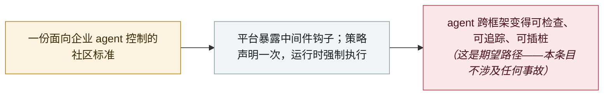

# OWASP 发布 Agent Control Standard，并正式公布 2026 版 LLM Top 10

OWASP publishes the Agent Control Standard and formally announces the 2026 LLM Top 10

     

## 概要

**OWASP GenAI Security Project** 于 9 月 1 日发布 **Agent Control Standard（ACS）**——一个面向企业 agent 控制的开源基础，项目方称 agent 必须*「可检查、可追踪、可插桩」*：能看清它们是什么、能访问什么、做了什么以及为什么。ACS 定义了 agent 平台如何暴露**中间件钩子（middleware hooks）**、安全策略又如何通过这些钩子强制执行，从而提供**声明式、可跨 agent 框架移植、在运行时生效的控制**。它与正式公布 **2026 版 OWASP GenAI LLM Top 10** 的九月发布批次同期——后者由数百名 AI 安全专家共同开发、以数千起真实事件为依据，并把风险映射到 NIST、MITRE ATLAS、CWE 和 OWASP Agentic Applications Top 10；其资源页其实早在 **8 月 3 日**就已上线。收录它是作为治理层的标记：agent 的控制层正在被标准化，而今年的 agent 事故仍在累积；本档案将其视为政策类条目而非事故

## 攻击链

## 详情

**这份标准提出了什么。** ACS 从信任论证出发：*「AI agent 的大规模采用取决于信任，而信任需要透明与控制。企业无法依赖在云端、SaaS、本地与终端环境中运行的黑盒 agent。」* 它标准化的机制是一层中间件——agent 平台暴露的钩子，安全策略可以挂接到 agent 的动作上并在其运行期间强制执行，而不只是在部署前做一次审查。这些控制是**声明式**的（以策略形式表达，而不是把代码写进每个集成里），并且**可跨 agent 框架移植**——这正是 agent 工具生态碎片化之下企业一直缺少的部分：*「透明与标准化控制相结合，为大规模可信 agent 奠定了基础。」* 项目方注明，该标准现已成为 OWASP GenAI Security Project 的一部分。CSA 对该发布的复核补充了 ACS 的更多细节：它是一份**捐赠**而来的规范，当前为 **0.1 版**，围绕 Agent Control System（带「guardian agent」执行点）、使用 OpenTelemetry 与 OCSF 的可观测层，以及以 CycloneDX、SWID、SPDX 格式表达的 **Agent Bill of Materials（AgBOM）** 构建——插桩样例与更多协议支持将在此后版本中提供。

**同期发布了什么。** 同一个 9 月 1 日批次还包括 **GenAI Security Industry Framework Crosswalk**，把四个来源清单中的 51 个 GenAI 漏洞映射到既有的治理与合规框架。该批次还正式公布 **2026 版 OWASP GenAI LLM Top 10**——*「更新的排名、扩展的威胁覆盖，以及基于数千起真实 AI 安全事件的新研究」*，由数百名专家开发，并映射到 NIST、MITRE ATLAS、CWE 与 OWASP Agentic Applications Top 10。一处精确性说明：Top 10 的资源页自 **8 月 3 日**起就已在线；发布批次中的九月日期指正式发布，本条日期取 ACS 的发布日。

**怎么读它。** 这是一次框架发布而非事故：`kind: policy`、`severity: info`、`real_harm: null`，与本档案其他政策类条目一样不计入事故数。收录它，是因为它标记了今年核心教训的防守面——agent 的失效大多聚集在身份、权限与控制边界上，而不在模型行为里。标准发布同一周，Noma Labs 公布的「工作流身份劫持」设计缺陷，几乎就是「有强制执行授权边界」本该防住的活案例。

## 来源

| # | 来源 | 链接 |
|---|---|---|
| 1 | OWASP Agent Control Standard（ACS） | <https://genai.owasp.org/resource/agent-control-standard-acs/> |
| 2 | OWASP GenAI LLM Top 10 2026 | <https://genai.owasp.org/resource/owasp-genai-llm-top-10-2026/> |
| 3 | OWASP GenAI Security Project——资源库 | <https://genai.owasp.org/resources/> |
| 4 | OWASP 新闻稿 | <https://genai.owasp.org/2026/09/01/owasp-genai-security-project-unveils-2026-top-10-for-llm-applications-new-agent-control-standard-and-sponsors-as-community-tops-30000-members/> |
| 5 | Cloud Security Alliance | <https://labs.cloudsecurityalliance.org/research/csa-research-note-owasp-genai-top10-2026-agent-control-stand/> |

## 元数据

| 字段 | 值 |
|---|---|
| 日期 | `2026-09-01`（原文：2026-09-01，精度 `day`） |
| 性质 | 政策 / 监管 `policy` |
| 类型 | [`GOV`](../../../../taxonomy/types.md#gov) 治理与政策 |
| 严重度 | **信息** `info` |
| 可信度 | **A** —— 一手来源：标准机构自己的资源页 |
| 真实伤害 | 不适用 |
| AI 参与 | 已确认 `confirmed` |
| 地区 | [全球](../../../../regions/global.md) |
| 档案编号 | `2026-09-01-owasp-agent-control-standard` |

**判定依据：** 一次不含事故的标准化发布——记为 `kind: policy` / `GOV` / `info`，与本档案其他政策类条目一样不计入事故统计。日期取 ACS 资源页（2026 年 9 月 1 日）；LLM Top 10 2026 的资源页自身标注 8 月 3 日，此处按同一批次的正式公布处理。分级口径见 [taxonomy/severity.md](../../../../taxonomy/severity.md) 与 [taxonomy/confidence.md](../../../../taxonomy/confidence.md)。

## 相关

**所属专题：** [防守与治理](../../../../topics/defense.md)

**相关条目：**

- `2026-09-09` [工作流身份劫持：Noma Labs 让一封普通支持邮件变成特权数据访问](../../../2026-09/2026-09-09-noma-workflow-identity-hijacking.md)   强制执行授权边界本可防住的设计缺陷
- `2026-07-27` [NVIDIA 牵头成立 Open Secure AI Alliance](../../../2026-07/2026-07-27-nvidia-open-secure-alliance.md)   同一季度的另一个防守侧项目
- `2026-07-17` [Anthropic《a CISO's guide to agentic AI》](../../../2026-07/2026-07-17-anthropic-ciso-guide-agentic.md)   厂商侧对 agent 部署安全的指南

---

[← 2026-09 索引](../../../2026-09/README.md) · [← 全库索引](../../../../README.md) · [English](../../../2026-09/2026-09-01-owasp-agent-control-standard.md)

本条目属于 **Orca AI Incident Archive**，按 [CC BY 4.0](../../../../LICENSE) 授权。发现事实错误或缺少来源，请[提 issue 或 PR](../../../../CONTRIBUTING.md)——更正会写进条目的修订记录，不会静默覆盖。
