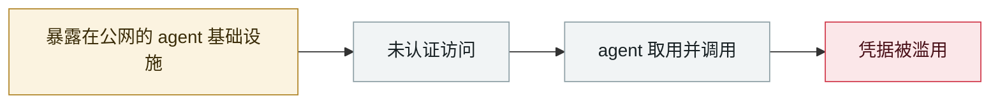

# Langflow CVE-2026-0768：今年第 12 个被在野利用的 Langflow 漏洞

Langflow CVE-2026-0768: the 12th Langflow flaw exploited in the wild this year

      

## 概要

未认证 RCE，**以 root 权限执行**，位于自定义组件编辑器 —— `validate` 端点对用户提供的 `code` 参数未做校验即执行 Python。VulnCheck 的英国蜜罐记录到 **360 次利用尝试，流量主要来自俄罗斯**。攻击者专门找环境变量：Langflow 超级用户凭据、AWS 密钥、**OpenAI API key**，并查询 `/root/.cache/langflow/secret_key`、检查 `.ssh` 与 `.bash_history`。

💡 **这条统计值得单独记**：这是 Langflow **2026 年第 12 个被在野利用的漏洞**；而**在 2026 年之前，该平台历史上只有整整 1 个已知被利用的缺陷**。2026 全年针对其 CVE 组合的利用尝试**已超过 15,000 次**

## 攻击链

## 来源

| # | 来源 | 链接 |
|---|---|---|
| 1 | BleepingComputer | <https://www.bleepingcomputer.com/news/security/critical-langflow-flaw-exploited-to-steal-openai-and-aws-keys/> |
| 2 | Security Affairs | <https://securityaffairs.com/198270/hacking/hackers-target-langflow-in-cve-2026-0768-attacks/> |
| 3 | CSA | <https://labs.cloudsecurityalliance.org/research/csa-research-note-langflow-ai-framework-credential-harvestin/> |

## 元数据

| 字段 | 值 |
|---|---|
| 日期 | `2026-09-02`（原文：2026-09-02，精度 `day`） |
| 性质 | 真实事故 `incident` |
| 类型 | [`INFRA`](../../../../taxonomy/types.md#infra) agent 基础设施暴露 · [`CRED`](../../../../taxonomy/types.md#cred) 凭据滥用 |
| 严重度 | **严重** `critical` |
| 可信度 | **A** — 一手来源（厂商 / 受害方 / 执法 / 官方报告） |
| 真实伤害 | 是 |
| AI 参与 | 已确认 `confirmed` |
| 地区 | [全球](../../../../regions/global.md) |
| 档案编号 | `2026-09-02-langflow-jin-di-ye-li` |

**判定依据**：真实事故，有确认的受害方。 判 `critical`：确认的真实损害达到多组织 / 政府 / 关键基础设施 / 供应链蠕虫级别，或属首次出现且有真实受害方的能力里程碑。 分级口径见 [taxonomy/severity.md](../../../../taxonomy/severity.md) 与 [taxonomy/confidence.md](../../../../taxonomy/confidence.md)。

## 相关

**所属专题**：[agent 基础设施暴露](../../../../topics/agent-infra.md)

**同类条目**：

- `2026-08-04` [CHAINDROP npm 蠕虫](../../../2026-08/2026-08-04-chaindrop-npm-ru-chong.md)   CHAINDROP npm worm
- `2026-08-06` [Langflow 未认证 RCE 进 CISA KEV](../../../2026-08/2026-08-06-langflow-rce-cisa-kev.md)   Unauthenticated Langflow RCE added to CISA KEV
- `2026-08-25` [NemoClaw（CVE-2026-65105）：DNS 重绑定改掉模型的聊天模板](../../../2026-08/2026-08-25-nemoclaw-dns-zhong-bang-ding.md)   NemoClaw (CVE-2026-65105): DNS rebinding rewrites the model's chat template
- `2026-08-01` [Azure SRE Agent 越权（CVE-2026-62830）](../../../2026-08/2026-08-01-azure-sre-agent.md)   Azure SRE Agent privilege escalation (CVE-2026-62830)

---

[← English original](../../../2026-09/2026-09-02-langflow-jin-di-ye-li.md) · [2026-09 index](../../../2026-09/README.md) · [All records](../../../README.md) · [Home](../../../../README.md)

本条目属于 **Orca AI Incident Archive**，按 [CC BY 4.0](../../../../LICENSE) 授权。发现事实错误或缺少来源，请[提 issue 或 PR](../../../../CONTRIBUTING.md)——更正会写进条目的修订记录，不会静默覆盖。
