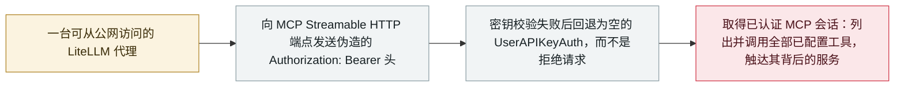

# 任意 Bearer 令牌即可打开 LiteLLM 的 MCP 端点：CVE-2026-59822 进入 CISA KEV

Any bearer token opens LiteLLM's MCP endpoint: CVE-2026-59822 enters CISA KEV

      

## 概要

**CISA 于 9 月 2 日把 CVE-2026-59822 加入已知被利用漏洞（KEV）目录**，条目名为「BerriAI LiteLLM Improper Authentication Vulnerability」，是当天七个漏洞中的一个。缺陷位于 **LiteLLM 的 MCP Streamable HTTP 端点**：当 LiteLLM 密钥校验失败时，OAuth2 passthrough 回退逻辑**不是拒绝请求，而是塞进一个空的 `UserAPIKeyAuth()` 对象**，于是任意伪造的 `Authorization: Bearer` 头都能建立一个已认证的 MCP 会话。由此，未认证攻击者可以**列出并调用全部已配置的 MCP 工具，并触达其背后的服务**——而 LiteLLM 恰恰是持有主密钥与云凭据的那个组件。**1.84.0** 之前的所有版本受影响；**CVSS 4.0 为 8.8**（CVSS 3.1 记 8.2），CWE-287。联邦机构的修复截止日为 **9 月 16 日**。这是 2026 年第二个进入 KEV 的 LiteLLM MCP 漏洞，前一个是 6 月的 CVE-2026-42271

## 攻击链

## 详情

**一个「失败即放行」的回退。** LiteLLM 是一个 AI 网关：在众多模型供应商前面摆一个统一端点——这也正是它最终会持有主密钥与后端全部云凭据的原因。它的 MCP 支持对外暴露一个 Streamable HTTP 端点，好让 agent 发现并调用运维方配置好的 MCP 工具。这个端点本应要求 LiteLLM 密钥。它同时支持 OAuth2 passthrough，而这条路径的处理逻辑犯了典型的 fail-open 错误：密钥校验返回拒绝时，回退分支并没有终止请求，而是把被拒绝的认证上下文**替换成一个空的 `UserAPIKeyAuth()` 对象**然后继续往下走。对下游的一切来说，一个空的认证对象就是一个已通过认证的对象。实际利用只需要一个伪造的头——`Bearer` 后面填什么字符串都行。该缺陷由 Wiz Research 的 **Yaara Shriki** 报告，GitHub 通告中的署名是 `yaaras`。

**这个会话值多少。** MCP 是工具调用协议，所以一个已认证的 MCP 会话不是对某一个 API 的只读访问，而是运维方配置的**整片工具面**：`tools/list` 枚举出接了什么，`tools/call` 则以网关自身的权限去调用它。运维方接进来的任何东西——代码仓库、工单系统、数据库、内部 HTTP 服务——都能从同一个洞里够到。这正是本档案把网关类 CVE 当作 agent 基础设施事故、而不是普通 Web 漏洞来处理的原因：被攻陷的恰恰是那个被特意授予了通往其他一切的凭据的组件。

**规模与暴露面。** BerriAI 在 **1.84.0** 中修复了回退的门控逻辑（[PR #26463](https://github.com/BerriAI/litellm/pull/26463)，提交 `73869f0`），此前的所有版本均受影响。CISA 9 月 2 日的收录为联邦机构设定了 **9 月 16 日**的修复期限。测绘服务 FOFA 在 KEV 收录时报告有超过 8 万个可从公网访问的 LiteLLM 面——这是二手数字，且统计的是可达接口而非存在漏洞的实例，但足以说明基数。

**它不是「首个」，而这恰恰是重点。** 有报道把这条说成首个进入 CISA KEV 的 MCP 漏洞。并不是：**CVE-2026-42271**——LiteLLM *MCP test endpoints* 里的命令注入——已于 [2026 年 6 月 8 日](../../../2026-06/2026-06-08-litellm-mcp-duan-dian-jie.md)进入目录，并与 BadHost（[CVE-2026-48710](../../../2026-05/2026-05-28-badhost.md)）串成未认证 RCE。事实上 9 月 2 日这同一批 KEV 里也带着 CVE-2026-48710。四个月内同一个网关的 MCP 面出现两次被独立利用的认证失效——值得记下来的是这件事，不是什么「首个」。

## 来源

| # | 来源 | 链接 |
|---|---|---|
| 1 | CISA | <https://www.cisa.gov/news-events/alerts/2026/09/02/cisa-adds-seven-known-exploited-vulnerabilities-catalog> |
| 2 | OSV | <https://osv.dev/vulnerability/PYSEC-2026-3479> |
| 3 | GitHub Security Advisory | <https://github.com/BerriAI/litellm/security/advisories/GHSA-7488-6r32-c95q> |
| 4 | GitLab Advisory Database | <https://advisories.gitlab.com/pypi/litellm/CVE-2026-59822/> |
| 5 | The Hacker News | <https://thehackernews.com/2026/09/cisa-adds-seven-exploited-flaws-as.html> |

## 元数据

| 字段 | 值 |
|---|---|
| 日期 | `2026-09-02`（原文：2026-09-02，精度 `day`） |
| 性质 | 漏洞披露 `vulnerability` |
| 类型 | [`INFRA`](../../../../taxonomy/types.md#infra) agent 基础设施暴露 · [`MCP`](../../../../taxonomy/types.md#mcp) MCP / 工具链 |
| 严重度 | **高** `high` |
| 可信度 | **A** —— 一手来源：CISA、上游 GitHub 安全公告与 OSV |
| 真实伤害 | 是 |
| AI 参与 | 已确认 `confirmed` |
| 地区 | [全球](../../../../regions/global.md) |
| 档案编号 | `2026-09-02-litellm-mcp-auth-bypass-kev` |

**判定依据：** 属漏洞披露，但 `real_harm: true`——进入 CISA KEV 意味着该机构已确认在野利用，这是本档案认定一条漏洞披露构成真实损害的门槛。判 `high` 而非 `critical`：缺陷严重且确认被利用，但没有具名的受害组织，也没有归因到具体战役。分级口径见 [taxonomy/severity.md](../../../../taxonomy/severity.md) 与 [taxonomy/confidence.md](../../../../taxonomy/confidence.md)。

## 相关

**所属专题：** [agent 基础设施暴露](../../../../topics/agent-infra.md)

**相关条目：**

- `2026-06-08` [LiteLLM CVE-2026-42271 MCP 端点接管](../../../2026-06/2026-06-08-litellm-mcp-duan-dian-jie.md)   三个月前进入 CISA KEV 的第一个 LiteLLM MCP 漏洞
- `2026-05-28` [BadHost（CVE-2026-48710）](../../../2026-05/2026-05-28-badhost.md)   与 LiteLLM 串链的 Starlette 头部绕过，与本条同在 9 月 2 日那批 KEV 中
- `2026-08-06` [Langflow 未认证 RCE 进入 CISA KEV](../../../2026-08/2026-08-06-langflow-rce-cisa-kev.md)   相邻 agent 平台上的同一种模式
- `2026-09-02` [Langflow CVE-2026-0768：今年第 12 个被在野利用的 Langflow 漏洞](../../../2026-09/2026-09-02-langflow-jin-di-ye-li.md)   同日披露

---

[← 2026-09 索引](../../../2026-09/README.md) · [← 全库索引](../../../../README.md) · [English](../../../2026-09/2026-09-02-litellm-mcp-auth-bypass-kev.md)

本条目属于 **Orca AI Incident Archive**，按 [CC BY 4.0](../../../../LICENSE) 授权。发现事实错误或缺少来源，请[提 issue 或 PR](../../../../CONTRIBUTING.md)——更正会写进条目的修订记录，不会静默覆盖。
