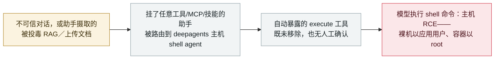

# MaxKB CVE-2026-77521：可被提示注入的 agent 在主机上执行 shell 命令（CVSS 10.0）

MaxKB CVE-2026-77521: a prompt-injectable agent runs shell commands on the host (CVSS 10.0)

      

## 概要

**CVE-2026-77521（CVSS 3.1 **10.0**）：任何挂了工具、MCP 工具、技能或子应用的 MaxKB 助手，其对话都会走一个基于主机 shell 后端（`SandboxShellBackend`）构建的 `deepagents` agent，而该后端会自动暴露一个 `execute` shell 工具，MaxKB 既没移除也没设人工确认。** 公告原文：*「不可信的对话——或经助手摄取的内容（RAG／上传文档）进行的间接提示注入——因此可以驱动模型执行 shell 命令。」* 在裸机部署下 `MAXKB_SANDBOX` 默认关闭，于是 `execute` 直接以应用用户身份在主机上执行命令（远程代码执行）；官方镜像里容器以 root 运行（无 `USER` 指令），且沙箱包装器可被绕过。GHSA-f36j-f34j-h3rx，弱点 **CWE-78 / CWE-250 / CWE-749**，由 **Lasso Security** 报告；影响 `<= 2.10.3-lts`，**v2.10.5-lts** 修复。无在野利用记录。本条记为 `vulnerability` / `IPI` + `INFRA` / `high` / `real_harm: false`——是本次九月这批里第二条 MaxKB 记录，与逐工具授权绕过（`2026-09-02`，CVE-2026-77516）并列。

## 攻击链

## 详情

**公告内容。** MaxKB 的 GitHub 安全公告 **GHSA-f36j-f34j-h3rx**，标题*「Prompt-injectable agent can lead to command execution」*，覆盖 `<= 2.10.3-lts`（维护者指出该易受攻击路径很可能更早就存在，影响所有以 `deepagents` + `SandboxShellBackend` 构建聊天 agent 的版本）。按公告的说法：任何挂了工具、MCP 工具、技能或子应用的助手都会进入 agent 路径（`base_chat_node.py:409`）；agent 以 `SandboxShellBackend` 构建，它*「自动加上 `execute` 与文件系统工具」*；MaxKB 未移除它（`excluded_tools` 未使用），也未对它设人工确认（`interrupt_on` 只覆盖 `write_file` / `read_file` / `edit_file`，**从不覆盖 `execute`**）。于是不可信对话、或**经摄取内容（RAG 或上传文档）的间接提示注入**，都能让模型执行 shell 命令。

**为什么影响会打到主机。** 是否被隔离完全取决于 `MAXKB_SANDBOX`。在源码／裸机部署下它默认**关闭**，因此 `execute`*「直接以应用用户身份在主机上执行（远程代码执行）」*。官方镜像里虽编译了沙箱，但公告写明容器**没有 `USER` 指令、以 root（UID 0）运行**，且沙箱包装器另可被绕过——所以即便是"受隔离"的配置也会越到主机，并因 `S:C`（scope 变更）波及其他租户与可达的内部服务。公开／内嵌匿名助手场景 CVSS 3.1 基础分 **10.0**（`AV:N/AC:L/PR:N/UI:N/S:C/C:H/I:H/A:H`）；弱点 **CWE-78**（OS 命令注入）、**CWE-250**（以不必要权限执行）与 **CWE-749**（暴露危险方法）。致谢 **Lasso Security**。**v2.10.5-lts** 修复。

**为什么收录。** 这是本批另一条 MaxKB 记录同一攻击面的锋利一端：那条里，agent 派发路径是绕过逐工具授权的第二道门（[CVE-2026-77516](2026-09-02-maxkb-tool-permission-bypass.md)）；这条里，agent 路径直接暴露一个可被不可信输入驱动到代码执行的 shell。这是反复出现的 agent 平台失效——一项接进 agent、产品却从未加约束的能力——被一路带到主机 RCE，而且可由间接提示注入触达、不止是登录用户，因此本条同时记 `IPI` 与 `INFRA`。

**定级。** `vulnerability` / `real_harm: false`——维护者披露、v2.10.5-lts 修复、无已知在野利用。按档案阶梯评 **high**：CVSS 9+ 的严重缺陷即使无在野也评 `high`，而 `critical` 留给确认的真实损害或有真实受害者的"首例"里程碑。可信度 **A**：维护者公告加 NVD 记录。

## 来源

| # | 来源 | 链接 |
|---|---|---|
| 1 | MaxKB 安全公告 GHSA-f36j-f34j-h3rx | <https://github.com/1Panel-dev/MaxKB/security/advisories/GHSA-f36j-f34j-h3rx> |
| 2 | NVD——CVE-2026-77521 | <https://nvd.nist.gov/vuln/detail/CVE-2026-77521> |

## 元数据

| 字段 | 值 |
|---|---|
| 日期 | `2026-09-02`（原始：GHSA 2026-09-02 / NVD 2026-09-21，精度 `day`） |
| 性质 | 漏洞披露 `vulnerability` |
| 类型 | [`IPI`](../../../../taxonomy/types.md#ipi) [`INFRA`](../../../../taxonomy/types.md#infra) |
| 评级 | **High** `high` |
| 可信度 | **A**——维护者公告（GHSA）加 NVD 记录 |
| 真实伤害 | 无——v2.10.5-lts 已修复，无已知利用 |
| AI 参与 | 已确认 `confirmed` |
| 地区 | [全球](../../../../regions/global.md) |
| 档案 ID | `2026-09-02-maxkb-prompt-injection-command-execution` |

**分类理由：** agent 自身运行时暴露了一个无人工确认的 shell 工具（`INFRA`），而外部摄取内容可将其驱动到执行（`IPI`，经 RAG／上传文档）。`vulnerability` + `real_harm: false` 因为它在无已知利用的情况下被披露并修复。按档案阶梯评 `high` 而非 `critical`——CVSS 9+ 但无确认损害；`critical` 需要确认伤害或有真实受害者的"首例"里程碑。日期取 GitHub 公告发布日（2026 年 9 月 2 日），NVD 于 9 月 21 日收录。分级标准见 [severity.md](../../../../taxonomy/severity.md) 与 [confidence.md](../../../../taxonomy/confidence.md)。

## 相关条目

**专题：** [Agent 基础设施暴露（INFRA）](../../../../topics/agent-infra.md)

**相关记录：**

- `2026-09-02` [MaxKB：agent 派发路径让被拒绝使用某工具的用户仍能调用它并读取其凭据](2026-09-02-maxkb-tool-permission-bypass.md)   同一批九月 MaxKB 公告——同一 agent 路径的授权一侧
- `2026-08-04` [Zammad：写入 AI Agent 字段的特制文本绕过过滤器并在服务器上执行命令](../2026-08/2026-08-04-zammad-ai-agent-template-rce.md)   另一处 agent 平台缺陷，agent 自身配置一路抵达服务器命令执行
- `2026-09-23` [IBM FTM：未授权 RAG 投毒可操纵支付 agent 的 MCP 工具调用](2026-09-23-ibm-ftm-rag-poisoning.md)   同样经 agent 信任的摄取内容触达

---

[← 2026-09 索引](../../../2026-09/README.md) · [← 全库索引](../../../../README.md) · [English](../../../2026-09/2026-09-02-maxkb-prompt-injection-command-execution.md)

本条目属于 **Orca AI Incident Archive**，按 [CC BY 4.0](../../../../LICENSE) 授权。发现事实错误或缺少来源，请[提 issue 或 PR](../../../../CONTRIBUTING.md)——更正会写进条目的修订记录，不会静默覆盖。
