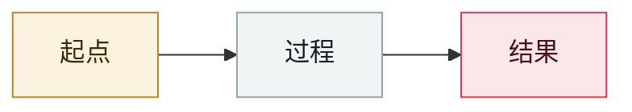

# 日本：影子 AI 致 726 人健康信息泄露

Japan: shadow AI exposes health data on 726 people

     

## 概要

员工把业务数据输入**未经批准的**生成式 AI 服务。涉及地方公务员信用合作社的 **726 人**：姓名、出生日期、**健康状况（高血压、糖尿病、血脂异常）**。事故发生 **2026-08-20**，09-04 披露

## 攻击链

## 来源

| # | 来源 | 链接 |
|---|---|---|
| 1 | RIZAP 公告 / Security NEXT（经转述） | <https://yasashii-cybersecurity.com/ai-three-incidents-2026-09/> |

## 元数据

| 字段 | 值 |
|---|---|
| 日期 | `2026-09-04`（原文：2026-09-04，精度 `day`） |
| 性质 | 真实事故 `incident` |
| 类型 | [`OTHER`](../../../../taxonomy/types.md#other) 其他 |
| 严重度 | **高** `high` |
| 可信度 | **A** — 一手来源（厂商 / 受害方 / 执法 / 官方报告） |
| 真实伤害 | 是 |
| AI 参与 | 已确认 `confirmed` |
| 地区 | [日本](../../../../regions/jp.md) |
| 档案编号 | `2026-09-04-ying-zi-zhi-ren-jian` |

**判定依据**：真实事故，有确认的受害方。 判 `high`：真实损害范围有限，或属 CVSS 9+ 的严重缺陷，或是有重要意义的能力实证。 分级口径见 [taxonomy/severity.md](../../../../taxonomy/severity.md) 与 [taxonomy/confidence.md](../../../../taxonomy/confidence.md)。

---

[← English original](../../../2026-09/2026-09-04-ying-zi-zhi-ren-jian.md) · [2026-09 index](../../../2026-09/README.md) · [All records](../../../README.md) · [Home](../../../../README.md)

本条目属于 **Orca AI Incident Archive**，按 [CC BY 4.0](../../../../LICENSE) 授权。发现事实错误或缺少来源，请[提 issue 或 PR](../../../../CONTRIBUTING.md)——更正会写进条目的修订记录，不会静默覆盖。
