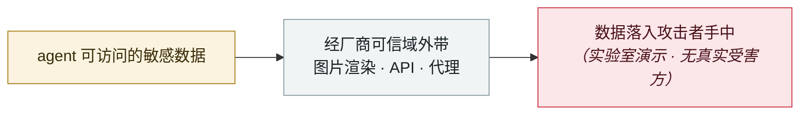

# ChatGPT 沙箱缺陷让受害者的 Gmail 数据流进攻击者账号

ChatGPT sandbox flaw pipes a victim's Gmail data into the attacker's account

     

## 概要

Check Point Research（工作时间标注为 **2026-06**）：ChatGPT **代码执行沙箱**的一个弱点 —— **每个容器都能触达 OpenAI 用于包管理的同一个内部 JFrog Artifactory 实例**，构成隐蔽信道。攻击者把指令埋进共享对话、恶意提示或自定义 GPT 配置中，受害者的会话就会在处理正常请求的同时执行隐藏任务，把已连接应用的数据发给攻击者**且不在聊天输出中显示**，**全程无任何确认提示**。

影响范围不止 Gmail —— 受害者会话已授权的一切（Google Drive、Microsoft Teams、GitHub 连接器）都在内。**唯一可见迹象是一个事后才记录的「Talked to Gmail」小标签**。OpenAI 已修复并下线了涉事内部服务

💡 **注意：JFrog Artifactory 同时也是 2026-07 OpenAI agent 逃逸的出口** —— 同一个组件在半年内两次成为 AI 基础设施的薄弱点

## 攻击链

## 来源

| # | 来源 | 链接 |
|---|---|---|
| 1 | THN | <https://thehackernews.com/2026/09/chatgpt-flaw-let-planted-prompt-send.html> |
| 2 | CSO Online | <https://www.csoonline.com/article/4220203/chatgpt-flaw-lets-attackers-pull-gmail-data-across-accounts-via-a-hidden-channel.html> |

## 元数据

| 字段 | 值 |
|---|---|
| 日期 | `2026-09-08`（原文：2026-09-08，精度 `day`） |
| 性质 | 研究演示 `research` |
| 类型 | [`EXFIL`](../../../../taxonomy/types.md#exfil) 数据外泄 |
| 严重度 | **高** `high` |
| 可信度 | **A** — 一手来源（厂商 / 受害方 / 执法 / 官方报告） |
| 真实伤害 | 是 |
| AI 参与 | 已确认 `confirmed` |
| 地区 | [全球](../../../../regions/global.md) |
| 档案编号 | `2026-09-08-chatgpt-gmail-sha-xiang-que` |

**判定依据**：研究机构或厂商的受控演示，`real_harm: false`；收录是为了标记攻击面何时被公开。 判 `high`：真实损害范围有限，或属 CVSS 9+ 的严重缺陷，或是有重要意义的能力实证。 分级口径见 [taxonomy/severity.md](../../../../taxonomy/severity.md) 与 [taxonomy/confidence.md](../../../../taxonomy/confidence.md)。

## 相关

**所属专题**：[零点击数据外泄链](../../../../topics/zero-click-exfil.md)

**同类条目**：

- `2026-08-19` [Grok「密码学上下文注入」：加密的指令，明文的数据](../../../2026-08/2026-08-19-grok-mi-ma-xue-wen.md)   Grok "cryptographic context injection": encrypted instructions, plaintext data
- `2026-08-18` [CoSnitch（CVE-2026-24301）](../../../2026-08/2026-08-18-cosnitch.md)   CoSnitch (CVE-2026-24301)
- `2026-07-07` [GitLost：GitHub Agentic Workflows 泄露私有仓库](../../../2026-07/2026-07-07-gitlost-github-agentic-workflows.md)   GitLost: GitHub Agentic Workflows leak private repositories
- `2026-06-15` [SearchLeak（CVE-2026-42824）](../../../2026-06/2026-06-15-searchleak.md)   SearchLeak (CVE-2026-42824)

---

[← English original](../../../2026-09/2026-09-08-chatgpt-gmail-sha-xiang-que.md) · [2026-09 index](../../../2026-09/README.md) · [All records](../../../README.md) · [Home](../../../../README.md)

本条目属于 **Orca AI Incident Archive**，按 [CC BY 4.0](../../../../LICENSE) 授权。发现事实错误或缺少来源，请[提 issue 或 PR](../../../../CONTRIBUTING.md)——更正会写进条目的修订记录，不会静默覆盖。
