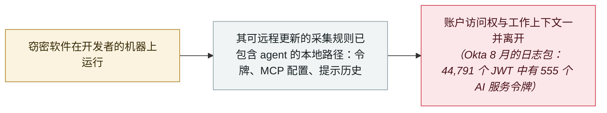

# 窃密软件转向 AI agent 数据：采集规则开始针对 Claude、Cursor 与 Codex

Infostealers turn to AI-agent data: collection rules now target Claude, Cursor and Codex

      

## 概要

**Gen Digital** 对近期窃密软件的采集规则做了分析，发现了一份新的目标清单：属于 AI 编程 agent 与开发工具的本地数据——**Claude、Cline、Codex、Continue、Cursor、OpenCode** 等。这种针对并非实验性质：在三个月的窗口里，其遥测在数万名受保护用户中记录了 **Amatera**（针对 Cline、Continue）与 **Remus**（针对 Claude、Cursor、OpenCode）的检出；**CallbackBeaver** 已把 Cursor 和 Claude 列入采集范围，30 天内出现 **5000 多个样本**；BeeStealer、STG、HydraStealer、APEX、Otter 等家族显示该行为正在扩散，macOS 上的 **Djinn** 也在做同样的事。被采集的不是偏好设置，而是**访问权与上下文**：访问与刷新**令牌**、存放在 **MCP 配置**里的凭据、提示历史、会话数据库，以及开发者做过的项目踪迹。次日，**Okta 威胁情报团队**从买家一侧展示了同一个市场——一份来自 **5,871 台受感染机器**的免费 7GB 日志包，在 44,791 个 JWT 中检出 **555 个与 AI 服务相关的令牌**，以及 24 个仍然有效的 AI API 密钥

## 攻击链

## 详情

**采集规则变了。** Gen Digital 的起点观察很简单：在熟悉的浏览器、钱包与凭据目标之外，窃密软件的规则集现在把*「与 Claude、Cline、Codex、Continue、Cursor、OpenCode 等 AI 辅助开发工具相关的本地数据」*列了进去。证据横跨多个家族与平台：Amatera 采集 Cline 与 Continue 数据；Remus 采集 Claude、Cursor、OpenCode；快速崛起的 CallbackBeaver 把 Cursor 和 Claude 加入范围，30 天窗口内出现 5000 多个样本；低流行度的家族（BeeStealer、STG Stealer、HydraStealer、APEX Stealer、Otter Stealer）说明这不是某一家的专长；macOS 上，Djinn 采集 Claude、Codex、Gemini、Cline、OpenCode 与 Kilo。Gen Digital 对节奏的概括：*「几乎每天都有另一个窃密软件的采集规则里出现 AI agent 数据。」* 规模背景：2026 年上半年，其遥测在 **330 万**名以上受保护用户中记录了窃密软件检出，月度数持续超过 **50 万**——这是全部窃密软件的检出量，并非这些规则造成的感染数。

**访问权与上下文在同一个包子里。** agent 本地目录的具体内容因产品而异，但材料分两类。第一类是**账户访问权**：缓存的有效期内的访问令牌、可延长滥用窗口的刷新令牌，以及嵌在 MCP 配置文件里的凭据——端点、请求头、环境变量、API 密钥。第二类是**上下文**：可能包含专有源代码、内部主机名、粘贴过的密钥、未完成工作轮廓的提示与会话记录，加上刻画用户身份的账户信息与文件历史。Gen Digital 的表述：*「浏览器 cookie 能打开一扇门，但 AI agent 的数据包还会告诉攻击者这是谁的门、门后是哪些项目、同一个工作区还能触达哪些已连接的系统。」* 限定条件也写明了：被盗令牌的价值取决于作用域、有效期与服务自身控制，短时效凭据或受操作系统保护的存储会限制被盗配置的用途。扩充的成本极低——大多数窃密软件接受远程下发的采集规则，新增一个 agent 的路径不需要重新构建恶意软件，只需一次配置更新。

**次日的买家视角。** 9 月 9 日，Okta 威胁情报团队（Jeremy Kirk）分析了一份 8 月 2 日在 Telegram 免费发布的 7GB 窃密日志包，包含 5,871 个文件夹——每个对应一台受感染机器——横跨 162 个国家。借助模式匹配与开源密钥扫描工具 TruffleHog，它在 **44,791 个唯一 JWT** 中识别出 **555 个与 AI 服务认证相关**；数据集中还检出 **24 个仍然有效的 API 密钥**，覆盖 Google Gemini、OpenAI、Groq 与 OpenRouter。Okta 写道，较新的窃密软件*「已加入针对 Anthropic 或 OpenAI 风格 API 密钥、以及已知 AI 工具配置路径的显式正则或 glob 规则」*。动机十分直接：*「被盗的 LLM API 密钥易于变现，买家可以用别人的账单跑推理。」* Okta 对数据的边界保持精确——它描述的是犯罪日志包中存在的令牌及其可重放性，而非已观测到的账户接管；它引用的财务损失数字（约 100 万美元、2.5 万美元与 60 万美元的未授权用量）来自此前分别报道的事件。

**本条怎么读。** 这里没有新的入侵方式——窃密软件本来就在运行；变化在于 AI agent 的凭据成了可预测、有价值的本地文件，而犯罪市场在几周内就做出了调整。两家厂商都声明了各自的边界，本条保留它们：`real_harm: false`，因为这份汇编讲的是能力趋势而非 AI agent 规则下的具名受害者；`medium` 严重度，因为底层数据——可重放的令牌与 MCP 凭据——确实敏感，而且趋势是单向的。

## 来源

| # | 来源 | 链接 |
|---|---|---|
| 1 | Gen Digital | <https://www.gendigital.com/blog/insights/research/infostealers-your-ai-agent> |
| 2 | Okta Threat Intelligence | <https://www.okta.com/blog/threat-intelligence/signing_in_without_actually_signing_in/> |
| 3 | The Hacker News | <https://thehackernews.com/2026/09/infostealer-logs-expose-replayable-ai.html> |
| 4 | Cloud Security Alliance | <https://labs.cloudsecurityalliance.org/research/csa-research-note-infostealer-ai-token-replay-20260911-csa-s/> |

## 元数据

| 字段 | 值 |
|---|---|
| 日期 | `2026-09-08`（原文：2026-09-08，精度 `day`） |
| 性质 | 研究演示 `research` |
| 类型 | [`CRED`](../../../../taxonomy/types.md#cred) 凭据滥用 · [`EXFIL`](../../../../taxonomy/types.md#exfil) 数据外泄 |
| 严重度 | **中** `medium` |
| 可信度 | **A** —— 一手来源：Gen Digital 自家的遥测分析与 Okta 自家的日志包分析，另有 CSA 的独立复核 |
| 真实伤害 | 否 |
| AI 参与 | 已确认 `confirmed` |
| 地区 | [全球](../../../../regions/global.md) |
| 档案编号 | `2026-09-08-gen-digital-infostealers-ai-agent-data` |

**判定依据：** 两个一手来源都是厂商对自家遥测的第一手分析；行为真实且可测量，但没有具名受害者可直接归因于新的 AI agent 采集规则，故 `real_harm: false`、严重度 `medium`。Okta 的交叉数据并入本条而非单列——它用数据量化了同一周的市场（一句关于 AI 工具配置路径的顺带评论不足以独立成条）。日期取 Gen Digital 的博文（2026 年 9 月 8 日）；Okta 于 9 月 9 日跟进。分级口径见 [taxonomy/severity.md](../../../../taxonomy/severity.md) 与 [taxonomy/confidence.md](../../../../taxonomy/confidence.md)。

## 相关

**所属专题：** [Agent 基础设施暴露](../../../../topics/agent-infra.md)

**相关条目：**

- `2026-05-13` [OpenAI 员工设备因 TanStack 事件被攻陷](../../../2026-05/2026-05-13-tanstack-yuan-gong-she-bei.md)   开发者机器上被盗的凭据一路走进了 AI 组织
- `2026-06-24` [Operation Endgame（Europol）停掉 StealC/Amadey](../../../2026-06/2026-06-24-operation-endgame-europol-stealc.md)   这场商品化市场在被清剿后重建的浪潮
- `2026-08-19` [Grok「密码学上下文注入」：加密的指令，明文的数据](../../../2026-08/2026-08-19-grok-mi-ma-xue-wen.md)   从开发者本地上下文到凭据暴露的另一条路径

---

[← 2026-09 索引](../../../2026-09/README.md) · [← 全库索引](../../../../README.md) · [English](../../../2026-09/2026-09-08-gen-digital-infostealers-ai-agent-data.md)

本条目属于 **Orca AI Incident Archive**，按 [CC BY 4.0](../../../../LICENSE) 授权。发现事实错误或缺少来源，请[提 issue 或 PR](../../../../CONTRIBUTING.md)——更正会写进条目的修订记录，不会静默覆盖。
