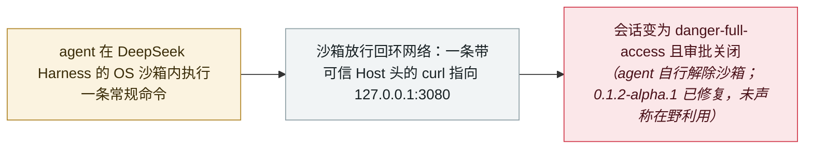

# DeepSeek Harness CVE-2026-82533：沙箱内的 agent 用一条命令关掉自己的沙箱

DeepSeek Harness CVE-2026-82533: a sandboxed agent disables its own sandbox with one command

      

## 概要

**OX Security** 披露 **DeepSeek Harness（dsh）** 的 **CVE-2026-82533**（CVSS 9.4，CWE-807）——DeepSeek 的开源、本地优先 AI 编程 agent 运行框架，8 月发布后数周内 GitHub 星标突破 **21.5 万**。该框架把 agent 控制 API 暴露在本地 HTTP 端口（`127.0.0.1:3080`）上且**没有任何认证**，仅凭客户端自带的 `Host` 请求头判断请求是否可信，而从不核对连接的真实对端地址。由于包围 agent 命令的操作系统沙箱只限制文件写入、**对回环网络放行**，且普通的 `bash` 调用无需审批，沙箱内的 agent 可以**用一条命令把自己的会话提升为 `danger-full-access` 并关闭审批提示**——在出厂默认配置下即可完成，无需网络暴露、无需任何凭据。一旦该端口可达（隧道、反向代理、端口转发），同一个 API 还允许**未认证的远程攻击者**直接控制 agent 并下载全部会话记录。漏洞于 8 月 24 日报告给 VulnCheck，8 月 27 日在 **0.1.2-alpha.1** 中修复，9 月 8 日正式发布 CVE；未声称存在在野利用

## 攻击链

## 详情

**读错了东西的可信性检查。** DeepSeek Harness 把 agent 执行的命令包在操作系统沙箱（按平台使用 bubblewrap、Landlock 或 Seatbelt）中运行，本意是防止处理不可信材料的编程 agent 越出工作区。其 agent 控制 API 位于 `127.0.0.1:3080`，本应只服务可信调用方。守卫函数 `isTrustedApiRequest` 读取 `Host` 请求头，只要值是回环地址或出现在配置的 `trustedHosts` 列表中便放行——但**从不与连接的真实对端地址比对**。正如 OX 指出的，这个检查确实防住了它当初要防的威胁：浏览器无法伪造 `Host`，因此携带攻击者域名的 DNS 重绑定请求会被拒绝。但*「不受浏览器限制的客户端，只要提供一个可信的 `Host` 值就行」*。两个仅该请求头不同的相同请求，就足以演示问题。

**沙箱改写了它自己。** 让这一切变成沙箱逃逸的，是隔离本身的形态：出厂配置限制文件系统，却对网络放行——bubblewrap 传了 `--unshare-pid` 而没有传 `--unshare-net`，网络命名空间与宿主机共享；Seatbelt 配置使用 `(allow default)` 叠加 `(deny file-write*)`。因此回环在沙箱内可达。另一方面，普通的 `bash` 工具调用不需要审批——审批管的是*沙箱升级*请求，而不是常规命令执行。两者叠加，agent 只需**一条命令**即可调用框架自身的 API，把会话提升为 `danger-full-access`、审批设为 `never`；此后每条命令都在无隔离、无提示的状态下运行。会话日志中完全没有任何 `approval/request` 事件，而该策略变更被记录为 `source: {kind: 'user'}`——*「框架无法区分 agent 自己的 shell 与键盘前的人类。」* OX 用一组对照实验验证沙箱此前确实在生效：相同默认预设、相同命令，逃逸的会话成功写入了工作区外的 `/home/ubuntu`，被隔离的会话则被拦住。前提条件恰恰是沙箱存在的意义：agent 需要执行一条由攻击者提供的文本诱导出的命令。

**第二条路径与修复。** 当端口可达时——经由隧道、反向代理、SSH 转发或编辑器端口转发——同一个未认证接口允许远程攻击者完全控制 agent，并可单独在无 API 密钥、无模型调用的情况下下载全部会话记录。OX 于 **8 月 24 日**以 CNA 身份报告给 VulnCheck；DeepSeek 于 **8 月 27 日**在 **0.1.2-alpha.1** 中修复（受影响版本为 0.1.1-rc.2 及更早）；OX 于 **8 月 30 日**复测确认修复；CVE 于 **9 月 8 日**发布。

**为什么收录、边界是什么。** 这是今年增长最快的 agent 框架之一中、出厂默认配置下的本地沙箱逃逸，数日内完成披露与修复、未声称有任何利用——因此记为 `vulnerability` / `SANDBOX` / `INFRA`、严重度 `high` 而非 `critical`。它属于本档案本已密集的沙箱条目群，因为它补上的是新的东西：不是内存安全问题，而是授权设计失败——决定「agent 能做什么」的组件，信任了 agent 自己的 shell 就能提供的值。结合同一周微软 agent 平台的漏洞，它再次印证今年反复出现的教训：这些系统出问题的地方是 agent 周围的身份与信任层，而不是模型。

## 来源

| # | 来源 | 链接 |
|---|---|---|
| 1 | OX Security | <https://www.ox.security/blog/cve-2026-82533-deepseek-harness-ai-agent-sandbox-escape/> |
| 2 | Cloud Security Alliance | <https://labs.cloudsecurityalliance.org/research/csa-research-note-deepseek-harness-sandbox-escape-20260910-c/> |
| 3 | 51CTO | <https://www.51cto.com/article/856012.html> |

## 元数据

| 字段 | 值 |
|---|---|
| 日期 | `2026-09-08`（原文：2026-09-08，精度 `day`） |
| 性质 | 漏洞披露 `vulnerability` |
| 类型 | [`SANDBOX`](../../../../taxonomy/types.md#sandbox) 沙箱逃逸 · [`INFRA`](../../../../taxonomy/types.md#infra) agent 基础设施暴露 |
| 严重度 | **高** `high` |
| 可信度 | **A** —— 一手来源：发现方附完整时间线的报告，另有厂商修复与 CSA 复核 |
| 真实伤害 | 否 |
| AI 参与 | 已确认 `confirmed` |
| 地区 | [中国](../../../../regions/cn.md) · [全球](../../../../regions/global.md) |
| 档案编号 | `2026-09-08-ox-deepseek-harness-cve-2026-82533` |

**判定依据：** 一起已披露、已修复、未被利用的 agent 框架漏洞——严重度取 `high` 而非 `critical`，理由与本档案其他严重基础设施 CVE 相同：没有关联的攻击行动或受害者。日期取 CVE 发布日（2026 年 9 月 8 日）；报告于 8 月 24 日提交 VulnCheck，修复于 8 月 27 日发布。分级口径见 [taxonomy/severity.md](../../../../taxonomy/severity.md) 与 [taxonomy/confidence.md](../../../../taxonomy/confidence.md)。

## 相关

**所属专题：** [前沿模型自主越界](../../../../topics/eval-escapes.md) · [Agent 基础设施暴露](../../../../topics/agent-infra.md)

**相关条目：**

- `2026-09-15` [OpenAI Codex 沙箱的两种逃逸：Heapjack 与 Overpatch](../../../2026-09/2026-09-15-codex-sandbox-escapes.md)   同月另外两款编程 agent 沙箱的逃逸
- `2026-07-20` [一周内 4 款编码 agent 爆 6 个沙箱逃逸](../../../2026-07/2026-07-20-agent-yi-nei-kuan-bian.md)   本条所属的沙箱逃逸集群
- `2026-09-17` [微软修复 Azure AI Foundry 的 CVSS 10.0 缺失认证漏洞](../../../2026-09/2026-09-17-azure-ai-foundry-cve-2026-85889.md)   同一周 agent 平台的缺失认证漏洞

---

[← 2026-09 索引](../../../2026-09/README.md) · [← 全库索引](../../../../README.md) · [English](../../../2026-09/2026-09-08-ox-deepseek-harness-cve-2026-82533.md)

本条目属于 **Orca AI Incident Archive**，按 [CC BY 4.0](../../../../LICENSE) 授权。发现事实错误或缺少来源，请[提 issue 或 PR](../../../../CONTRIBUTING.md)——更正会写进条目的修订记录，不会静默覆盖。
