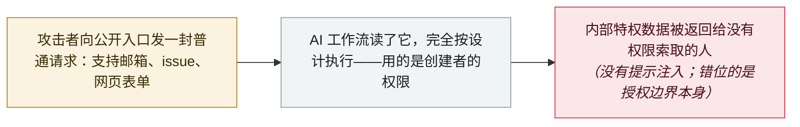

# 工作流身份劫持：Noma Labs 让一封普通支持邮件变成特权数据访问

Workflow identity hijacking: Noma Labs turns an ordinary support email into privileged data access

      

## 概要

**Noma Labs** 描述了**工作流身份劫持（workflow identity hijacking）**——企业 AI 工作流中的一类系统性授权缺陷。演示场景很简单：给公司公开的支持邮箱发一封普通消息，回信里带着*「财务总监最近一封邮件里的季度销售数字」*。全程没有提示注入：模型没有被操纵、诱骗或越狱，它读了请求，流水线完全按设计执行，回复发出——*「攻击者要做的只是开口问。」* 根因在于*「触发工作流的用户身份与权限，和执行工作流所用的身份与权限相互脱钩」*：AI 工作流以高权限服务账号或开发者 API 密钥行动，而不是按请求者的权限执行，从而变成*「特权操作的未认证代理与静默数据外泄通道」*。Noma 称它在 **Google Workflows** 中报告了同一风险点，谷歌确认收到并**确认已修复**，但未披露实现细节——这是 Noma 的陈述，谷歌自己尚未公开发布任何内容，本档案按此口径记录。该团队此前的发现 **GitLost** 是同一道边界的单侧视角；这一次给出了通用模式，并把防御移出模型：面向身份的令牌委派、在模型输出之后的授权检查点，以及数据检索与对外通信的非对称隔离

## 攻击链

## 详情

**它是什么，不是什么。** Noma 把三件事划得很清：直接提示注入是操纵模型的指令；间接提示注入是把恶意指令藏在模型之后会读取的内容里；**工作流身份劫持两者都不是**——攻击者只是*「通过未认证入口（如支持邮箱、GitHub issue、网页表单或共享文档）提交一个正常、无害的请求」*，模型正确地理解了它，而*「核心的失败在于：请求者没有权限提出这个请求。」* 示例刻意做得平淡：*「财务总监最近一封邮件里的季度销售数字是多少？」*——对 CFO 是正当问题，对外部发件人是越权；而标准的提示注入检测器与防护栏对这两种输入给出同样的分类，因为*「提示里没有任何恶意措辞；安全风险不在提示里，而在授权边界上。」* Noma 指出的根因是一种架构上的脱钩：工作流*「用高权限的服务账号或开发者 API 密钥执行下游动作，而不是执行外部用户的权限」*，于是每一个这样的自动化都成了*「特权操作的未认证代理与静默数据外泄通道」*。

**为什么现有防御看不见它。** 报告的核心论点是：市场上的控制打在了错误的一层。自主 agent 得到了工具范围与权限监控；静态 AI 工作流——*「LLM 处理数据或转换文本，但周围的确定性流水线控制动作顺序」*的那种形态——没有，因为它们的护栏*「本就不被设计为授权边界」*。当工作流按计划任务运行在一个谁都能往里写的邮箱上时，只审计「谁能触发工作流」也不够：*「每一条自动化都必须按『能影响它所处理内容的最不受信任方』来评估。」* Noma 把它与自己 7 月的披露 **GitLost** 联系起来：一个公开的 GitHub issue 指派，让外部用户通过拥有组织级读权限的 agent 拉取了私有仓库数据——同一道边界越界，只是从输入侧看。

**关于谷歌的说法，以及本条保留的限定。** Noma 称它*「在 Google Workflows 中发现并以负责任方式向谷歌报告了同一风险点。谷歌确认收到，并确认已修复，但未披露实现细节。」* 本档案按 Noma 的陈述记录：谷歌未公开发布任何内容，也没有 CVE 或通告为这次谷歌的发现背书。本条评为 `research` / `medium`、`real_harm: false`，因为演示来自厂商自己、没有具名受害者，所描述的利用是一种设计缺陷而非行动。值得收录之处在于它的重新框定：经历了一整季的提示注入条目之后，它提醒人们许多 agent 失效根本与模型无关——问题在于工作流借用了谁的身份，以及有没有人检查这个回答是否被允许。Noma 提出的防御相应地都在模型之外：面向身份的令牌委派、在 LLM 输出与任何下游动作之间的授权检查点，以及数据检索与对外应答通道的结构性隔离。

## 来源

| # | 来源 | 链接 |
|---|---|---|
| 1 | Noma Labs（Noma Security） | <https://noma.security/noma-labs/workflow-identity-hijacking-the-silent-backdoor-in-ai-workflows> |
| 2 | Dark Reading | <https://www.darkreading.com/threat-intelligence/identity-based-ai-attack-security-enterprise-data> |

## 元数据

| 字段 | 值 |
|---|---|
| 日期 | `2026-09-09`（原文：2026-09-09，精度 `day`） |
| 性质 | 研究演示 `research` |
| 类型 | [`INFRA`](../../../../taxonomy/types.md#infra) agent 基础设施暴露 · [`EXFIL`](../../../../taxonomy/types.md#exfil) 数据外泄 |
| 严重度 | **中** `medium` |
| 可信度 | **A** —— 一手来源：Noma Labs 自己的报告；谷歌修复一事明确按 Noma 的陈述记录 |
| 真实伤害 | 否 |
| AI 参与 | 已确认 `confirmed` |
| 地区 | [全球](../../../../regions/global.md) |
| 档案编号 | `2026-09-09-noma-workflow-identity-hijacking` |

**判定依据：** 一次机制清晰、可核查、无具名受害者的厂商研究披露；`medium` / `real_harm: false` 沿用本档案对 GitLost、ForcedLeak 这类设计缺陷条目的处理。归类为 `INFRA`（缺陷位于工作流的执行身份层）与 `EXFIL`（数据流向无授权的请求者）——并刻意**不**标 `IPI`，这正是该研究自身赖以成立的区分。日期取 Noma Labs 博文（2026 年 9 月 9 日）。分级口径见 [taxonomy/severity.md](../../../../taxonomy/severity.md) 与 [taxonomy/confidence.md](../../../../taxonomy/confidence.md)。

## 相关

**所属专题：** [零点击数据外泄链](../../../../topics/zero-click-exfil.md) · [Agent 基础设施暴露](../../../../topics/agent-infra.md)

**相关条目：**

- `2026-07-07` [GitLost：GitHub Agentic Workflows 泄露私有仓库](../../../2026-07/2026-07-07-gitlost-github-agentic-workflows.md)   同一道授权边界，来自同一团队
- `2026-09-01` [OWASP 发布 Agent Control Standard，并正式公布 2026 版 LLM Top 10](../../../2026-09/2026-09-01-owasp-agent-control-standard.md)   正是针对这类边界失效的标准
- `2025-09-25` [ForcedLeak（Salesforce Agentforce）](../../../2025-09/2025-09-25-forcedleak-salesforce-agentforce.md)   更早的企业 agent 数据回传缺陷

---

[← 2026-09 索引](../../../2026-09/README.md) · [← 全库索引](../../../../README.md) · [English](../../../2026-09/2026-09-09-noma-workflow-identity-hijacking.md)

本条目属于 **Orca AI Incident Archive**，按 [CC BY 4.0](../../../../LICENSE) 授权。发现事实错误或缺少来源，请[提 issue 或 PR](../../../../CONTRIBUTING.md)——更正会写进条目的修订记录，不会静默覆盖。
