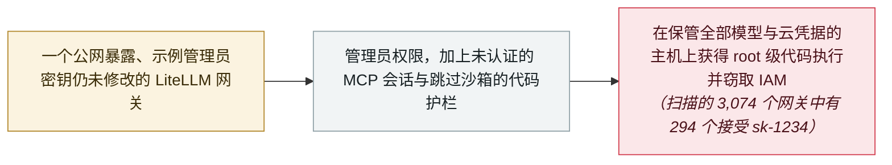

# Wiz：近十分之一的公网 LiteLLM 网关接受示例管理员密钥 sk-1234

Wiz: nearly 1 in 10 exposed LiteLLM gateways accept the example admin key sk-1234

      

## 概要

**Wiz Research** 发布《Off Guard：从认证绕过到云环境沦陷，攻破 LiteLLM》，把三项发现串成一条从中暴露的 AI 网关直到 **root 级代码执行与 IAM 凭据窃取**的完整链条。其扫描了 **3,074 个公网暴露的 LiteLLM 网关**（2026 年 2 月，Shodan），发现其中 **294 个——近十分之一——接受项目文档里的示例管理员密钥 `sk-1234`**：用它登录的人就控制了那个保管着所有模型 API 密钥与云凭据的组件。同一研究把 Wiz 的 **Yaara Shriki** 报告的两个缺陷串了起来：**CVE-2026-59822**，MCP 认证绕过（CVSS 4.0 **8.8**，9 月 2 日进入 KEV）；以及 **CVE-2026-59821**——LiteLLM 的 Custom Code Guardrails 生产端点跳过了测试端点所用的沙箱与校验，因需要特权用户而被评为**低危（2.1）**，但它是通向代码执行链条的一环。Wiz 的结论是：系统性问题出在网关的默认配置，而不是单个漏洞——默认密钥、未认证的 MCP 会话与可执行代码的护栏层层叠加，最终指向云环境沦陷。附带的教训与时间表有关：KEV 条目背后的漏洞 7 月就已报告，到 9 月已在野被利用

## 攻击链

## 详情

**扫描：3,074 中的 294。** Wiz 的起点测量直截了当：2026 年 2 月，它在 Shodan 上发现 **3,074 个公网暴露的 LiteLLM 网关**，并测试了 LiteLLM 官方文档中每个示例都在用的密钥 `sk-1234`。**其中 294 个——9.6%——把它当作可用的管理员密钥接受。** 这个数字的严重性来自 LiteLLM 网关本身是什么：它是横在组织所用全部模型提供商之前的代理，因此会累积下游一切的 API 密钥、额度上限与云凭据。Wiz 的链条并不止步于「读取配置」：拿到网关管理员后，后续步骤——包括 MCP 与护栏表面——就成为在主机上运行代码、并使用其云身份的可达路径。（这是 2026 年 2 月的快照，统计的是接受示例密钥的网关，而非被该密钥攻击过的网关。）

**链条里的两个 CVE。** 该研究把两个分别跟踪的缺陷组合起来，均由 **Yaara Shriki** 报告（GitHub 通告中署名 `yaaras`）。**CVE-2026-59822** 是 MCP 认证绕过：LiteLLM 的 MCP Streamable HTTP 端点可以凭任意 Bearer 令牌建立已认证会话，因为 OAuth2 passthrough 回退逻辑在校验失败时塞入了一个空的 `UserAPIKeyAuth()` 对象——CVSS 4.0 **8.8**，1.84.0 中修复，**9 月 2 日**列入 CISA KEV。**CVE-2026-59821** 更安静：LiteLLM 的 Custom Code Guardrails 生产创建/更新路径*「没有采用测试端点所用的同等沙箱与校验」*，特权用户可以提交在代理环境中执行的 Python 代码——因需要特权用户而评为**低危（2.1）**，但恰恰是「特权到可以执行代码」的那种位置，而默认密钥直接把这种位置送了出去。单独看都不算离奇；叠加在默认配置的网关上，它们就是通向代码执行与凭据窃取的路径。

**为什么与 KEV 条目分开收录。** 本档案已把 9 月 2 日的 KEV 披露单列；本条记录的是测量与组合——公网网关中的暴露比例，以及「失效聚集在网关的认证与信任默认值上，而不在模型或协议设计里」这一分析。时间表本身就是发现的一部分：KEV 条目背后的通告 7 月就已公开，到 9 月初 CISA 已确认被利用。本条保留的限定：294 这个数字是「接受默认密钥」的网关扫描结果，研究本身并未把任何具名网关的失陷归因于 `sk-1234`。

## 来源

| # | 来源 | 链接 |
|---|---|---|
| 1 | Wiz Research | <https://www.wiz.io/blog/off-guard-breaking-litellm-from-authentication-bypass-to-cloud-compromise> |
| 2 | GitHub Security Advisory（CVE-2026-59822） | <https://github.com/BerriAI/litellm/security/advisories/GHSA-7488-6r32-c95q> |
| 3 | GitHub Security Advisory（CVE-2026-59821） | <https://github.com/BerriAI/litellm/security/advisories/GHSA-72m8-9m7m-h278> |
| 4 | Cloud Security Alliance | <https://labs.cloudsecurityalliance.org/research/csa-research-note-litellm-gateway-default-credentials-202609/> |
| 5 | The Hacker News | <https://thehackernews.com/2026/09/nearly-1-in-10-exposed-litellm-gateways.html> |

## 元数据

| 字段 | 值 |
|---|---|
| 日期 | `2026-09-09`（原文：2026-09-09，精度 `day`） |
| 性质 | 研究演示 `research` |
| 类型 | [`INFRA`](../../../../taxonomy/types.md#infra) agent 基础设施暴露 · [`CRED`](../../../../taxonomy/types.md#cred) 凭据滥用 |
| 严重度 | **高** `high` |
| 可信度 | **A** —— 一手来源：发现方的报告，附两份上游通告与 CSA 复核 |
| 真实伤害 | 否 |
| AI 参与 | 已确认 `confirmed` |
| 地区 | [全球](../../../../regions/global.md) |
| 档案编号 | `2026-09-09-wiz-litellm-default-key-off-guard` |

**判定依据：** 一份测量暴露面并组合已知缺陷的研究报告；`real_harm: false`，因为研究没有把任何网关的失陷归因于默认密钥；严重度取 `high`，因为测得的暴露——对持有凭据的网关的管理员控制——在规模上十分严重，且链条中有一个缺陷已进入 KEV。日期取 Wiz 博文（2026 年 9 月 9 日）；扫描数据来自 2026 年 2 月。分级口径见 [taxonomy/severity.md](../../../../taxonomy/severity.md) 与 [taxonomy/confidence.md](../../../../taxonomy/confidence.md)。

## 相关

**所属专题：** [Agent 基础设施暴露](../../../../topics/agent-infra.md)

**相关条目：**

- `2026-09-02` [任意 Bearer 令牌即可打开 LiteLLM 的 MCP 端点：CVE-2026-59822 进入 CISA KEV](../../../2026-09/2026-09-02-litellm-mcp-auth-bypass-kev.md)   被本条测量并组合进链条的 KEV 漏洞
- `2026-06-08` [LiteLLM CVE-2026-42271 MCP 端点接管](../../../2026-06/2026-06-08-litellm-mcp-duan-dian-jie.md)   更早的在野被利用 LiteLLM MCP 缺陷
- `2026-05-28` [BadHost（CVE-2026-48710）](../../../2026-05/2026-05-28-badhost.md)   与 LiteLLM 串联成免认证 RCE 的请求头信任缺陷

---

[← 2026-09 索引](../../../2026-09/README.md) · [← 全库索引](../../../../README.md) · [English](../../../2026-09/2026-09-09-wiz-litellm-default-key-off-guard.md)

本条目属于 **Orca AI Incident Archive**，按 [CC BY 4.0](../../../../LICENSE) 授权。发现事实错误或缺少来源，请[提 issue 或 PR](../../../../CONTRIBUTING.md)——更正会写进条目的修订记录，不会静默覆盖。
