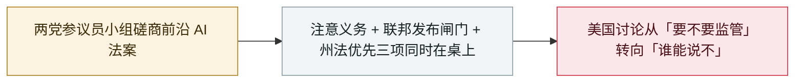

# 美参议员起草前沿 AI「注意义务」法案：联邦政府可阻止模型发布

Senators draft a frontier-AI "duty of care" bill with power to block releases

     

## 概要

一个两党小组——参院多数党领袖 **Thune**、商务委员会主席 **Cruz** 与民主党人 **Klobuchar**、**Cantwell**——正起草前沿 AI 法案：把自愿安全承诺换成**有约束力的法律「注意义务」**，覆盖灾难性风险（生物/核武器辅助、复杂网络攻击、恶意滥用）；赋予**联邦政府阻止或延迟不安全模型发布**的权力（开发者可诉诸联邦法院）；并在其覆盖的风险范围内**优先于各州 AI 安全法**。截至 9 月 12 日仍为草案，无最终文本与表决安排

## 攻击链

## 详情

**草案内容。** 把自愿安全承诺变成对最强模型开发者的可执行**注意义务**，针对灾难性风险——生物或核武器辅助、实施**复杂网络攻击**的能力、以及恶意行为者的滥用；在发布前设置**联邦闸门**，政府可阻止或延迟其判定为不安全的模型发布，**开发者可向联邦法院起诉**；并**优先于各州法律**（直接针对动作更快的加州 AI 立法）。

**争点在哪。** 注意义务本身分歧不大，真正的引线是**州法优先**与由谁做测试。两位民主党谈判者主张应由联邦机构而非公司决定模型能否发布：「联邦政府——包括国家实验室以及网络安全、生物防御乃至核安全专家——必须在前沿 AI 模型测试中牵头」（Cantwell，参院商务委员会资深成员）。消费者倡导者与部分州官员则认为，州法优先是华盛顿替更强的州保护「扫清障碍」。

**状态。** 截至 **9 月 12 日**，法案仍是**磋商中的草案**——无最终文本、无表决安排。它发生在 agent 事故频发的一个夏天之后（OpenAI 的 Hugging Face 事件、DseWiki 留言板等），与更早的 **Ban Artificial Superintelligence Act** 以及 7 月的 **Kill Switch Act** 是不同提案。

## 来源

| # | 来源 | 链接 |
|---|---|---|
| 1 | TechTimes | <https://www.techtimes.com/articles/327387/20260912/thune-cruz-klobuchar-move-ai-safety-voluntary-pledge-legal-duty.htm> |
| 2 | Santage | <https://santageai.com/news/2026/09/12/senate-ai-duty-of-care-bill> |
| 3 | AIBARS | <https://aibars.net/en/news/886927740790640640> |

## 元数据

| 字段 | 值 |
|---|---|
| 日期 | `2026-09-12`（原文：2026-09-12，精度 `day`） |
| 性质 | 政策 / 监管 `policy` |
| 类型 | [`GOV`](../../../../taxonomy/types.md#gov) 治理 / 监管 |
| 严重度 | **信息** `info` |
| 可信度 | **B** — 研究机构或主流媒体，细节可核查 |
| 真实伤害 | 不适用 |
| AI 参与 | 已确认 `confirmed` |
| 地区 | [美国](../../../../regions/us.md) |
| 档案编号 | `2026-09-12-ai-duty-of-care-bill` |

**判定依据**：政策 / 监管动作，不计入事故统计，`severity` 记为 `info`。 分级口径见 [taxonomy/severity.md](../../../../taxonomy/severity.md) 与 [taxonomy/confidence.md](../../../../taxonomy/confidence.md)。

## 相关

**所属专题**：[防御侧进展](../../../../topics/defense.md)

**同类条目**：

- `2026-09-03` [美参议员提出「Ban Artificial Superintelligence Act」](../../../2026-09/2026-09-03-ban-artificial-superintelligence-act.md)   US senators introduce the Ban Artificial Superintelligence Act
- `2026-09-16` [欧盟国情咨文：冯德莱恩点名 agent 越界并召集前沿实验室](../../../2026-09/2026-09-16-von-der-leyen-soteu-agents.md)   EU State of the Union: von der Leyen cites agent escapes and convenes frontier labs
- `2026-07-23` [美国众议员提出「AI Kill Switch Act」](../../../2026-07/2026-07-23-kill-switch-act.md)   US senators introduce the Kill Switch Act

---

[← English original](../../../2026-09/2026-09-12-ai-duty-of-care-bill.md) · [2026-09 index](../../../2026-09/README.md) · [All records](../../../README.md) · [Home](../../../../README.md)

本条目属于 **Orca AI Incident Archive**，按 [CC BY 4.0](../../../../LICENSE) 授权。发现事实错误或缺少来源，请[提 issue 或 PR](../../../../CONTRIBUTING.md)——更正会写进条目的修订记录，不会静默覆盖。
