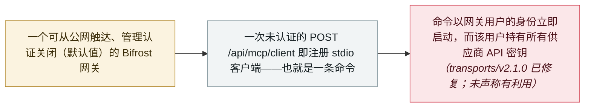

# Bifrost AI 网关：一个未认证的 MCP 注册即可以网关用户身份执行命令

Bifrost AI gateway: one unauthenticated MCP registration runs commands as the gateway user

      

## 概要

**JFrog Security Research** 披露 **Bifrost** 的 **CVE-2026-90898**（CVSS 9.8）——Bifrost 是一个把请求路由到 20 多家 LLM 供应商的开源 AI 网关。一个**未认证**的 `POST /api/mcp/client` 即可注册一个 **stdio 型 MCP 客户端**——它本质上就是「一条命令加参数」——而 Bifrost 会**在任何 MCP 握手之前立即启动该程序**，且以网关进程的用户身份运行。由于网关上保存着所有已连接供应商的 API 密钥，在其上执行代码等于把这些凭据交给攻击者。根因是一个默认值：管理接口的认证**默认关闭**（`governance.auth_config.is_enabled=false`），于是任何调用者都是本地管理员。标准二进制把管理 API 绑定在 localhost，但**官方 Docker 镜像绑定 0.0.0.0**——只要端口发布到外部，容器外即可触达。漏洞在 **transports/v2.1.0** 中修复（未认证的 stdio 注册现在返回 403）。同一团队发现的第二个缺陷 **CVE-2026-86242**（8.1，9 月 6 日披露）允许注册路径为 HTTP URL 的插件——在动态链接构建上可实现代码执行、在静态构建上退化为 SSRF；修复于 v2.0.0。JFrog 对已暴露实例的建议：**视为已失陷**，并**轮换虚拟密钥与各供应商 API 密钥**

## 攻击链

## 详情

**缺陷本身。** Bifrost 正是本档案视为「agent 基础设施」的那类组件：一个置于众多供应商之前的网关，这也正是它最终保管着下游一切密钥的原因。它的管理 API 负责注册 MCP 客户端，而 **stdio** 客户端的定义就是一条命令加参数。JFrog 的公告把后果写得很直白：*「客户端一旦被添加，Bifrost 会立刻在网关中启动该程序。不需要任何 MCP 握手。」* 在出厂默认值下——**管理认证处于关闭状态**——*「每个调用者都是本地管理员」*，因此*「一次未认证的 POST /api/mcp/client 就足以以 Bifrost 进程用户（官方镜像上为 appuser）的身份运行程序」*。HTTP 请求甚至可能超时；但进程已经在运行了。暴露面取决于部署方式：标准二进制的管理监听默认在 localhost，而**官方 Docker 镜像绑定 0.0.0.0**——端口一旦发布，端点即可从容器外触达。修复位于 **transports/v2.1.0**：未认证的 stdio 注册返回 403；2.0.0 系列仍放行；1.6.x 至 1.6.11 两个修复都不包含。

**相关缺陷与模式。** 同一研究团队在 **9 月 6 日**披露了第二条路径：**CVE-2026-86242**（CVSS 8.1）允许未认证调用者注册路径为 HTTP URL 的自定义插件——Bifrost 会下载该文件、写成临时共享对象，并通过 Go 的 `plugin.Open` 加载。在自定义 Go 插件所需的动态链接构建上，这意味着以网关进程用户身份执行代码；在静态链接构建（包括官方 Docker 镜像）上，加载失败，结果退化为服务端请求伪造（SSRF）。修复于 **transports/v2.0.0**。JFrog 指出，两个缺陷**共享同一个根因：管理 API 出厂时默认关闭认证**；并指出它们是一个月内该项目被披露的第二、第三个安全问题——此前是 8 月底修复的一个无关 SSRF 缺陷（CVE-2026-55245）。

**本条怎么读，以及如何缓解。** 未声称存在利用，两个 CVE 也不在 CISA KEV 目录中，且这一缺陷类别对本档案的读者并不陌生——本档案 LiteLLM 系列记录的就是「AI 网关的控制面过度信任调用者」——因此记为 `vulnerability` / `high` 而非 `critical`。缓解建议务实：升级到 `transports/v2.1.0`（若停留在 2.0.0，至少启用 `governance.auth_config.is_enabled`、设置强凭据、并让管理监听远离不受信任的网络）；对于任何在认证关闭且 API 暴露状态下运行过的实例，按 JFrog 的建议处理——**视为已失陷，并轮换网关持有的虚拟密钥与各供应商 API 密钥**。

## 来源

| # | 来源 | 链接 |
|---|---|---|
| 1 | JFrog Security Research（CVE-2026-90898） | <https://research.jfrog.com/vulnerabilities/bifrost-is-vulnerable-to-unauthenticated-remote-code-execution-via-mcp-stdio-client-registration-cve-2026-90898/> |
| 2 | JFrog Security Research（CVE-2026-86242） | <https://research.jfrog.com/vulnerabilities/bifrost-is-vulnerable-to-unauthenticated-remote-code-execution-via-a-custom-plugin-http-path-on-dynamically-linked-builds-cve-2026-86242-jfsa-2026-001684572/> |
| 3 | The Hacker News | <https://thehackernews.com/2026/09/critical-bifrost-ai-gateway-flaw-lets.html> |
| 4 | Alibaba Cloud AVD | <https://avd.aliyun.com/detail?id=AVD-2026-90898> |

## 元数据

| 字段 | 值 |
|---|---|
| 日期 | `2026-09-14`（原文：2026-09-14，精度 `day`） |
| 性质 | 漏洞披露 `vulnerability` |
| 类型 | [`INFRA`](../../../../taxonomy/types.md#infra) agent 基础设施暴露 · [`MCP`](../../../../taxonomy/types.md#mcp) MCP 与工具链 |
| 严重度 | **高** `high` |
| 可信度 | **A** —— 一手来源：发现方的公告，与 CVE 记录一致 |
| 真实伤害 | 否 |
| AI 参与 | 已确认 `confirmed` |
| 地区 | [全球](../../../../regions/global.md) |
| 档案编号 | `2026-09-14-bifrost-ai-gateway-cve-2026-90898` |

**判定依据：** 已披露且已修复、未声称被利用的缺陷——一个 CVSS 9.8 的未认证 RCE，可直接拿到网关持有的供应商凭据，故取 `high`，与本档案对 Azure AI Foundry、LiteLLM 网关 CVE 的处理一致。日期取 JFrog 公告与 CVE 发布日（2026 年 9 月 14 日）；The Hacker News 于 9 月 22 日一并报道了两个缺陷。分级口径见 [taxonomy/severity.md](../../../../taxonomy/severity.md) 与 [taxonomy/confidence.md](../../../../taxonomy/confidence.md)。

## 相关

**所属专题：** [Agent 基础设施暴露](../../../../topics/agent-infra.md)

**相关条目：**

- `2026-09-08` [DeepSeek Harness CVE-2026-82533：沙箱内的 agent 用一条命令关掉自己的沙箱](../../../2026-09/2026-09-08-ox-deepseek-harness-cve-2026-82533.md)   同月曝出的未认证 agent 控制 API，来自系统内部
- `2026-09-02` [任意 Bearer 令牌即可打开 LiteLLM 的 MCP 端点：CVE-2026-59822 进入 CISA KEV](../../../2026-09/2026-09-02-litellm-mcp-auth-bypass-kev.md)   已被在野利用的 AI 网关 MCP 缺陷先例
- `2026-06-08` [LiteLLM CVE-2026-42271 MCP 端点接管](../../../2026-06/2026-06-08-litellm-mcp-duan-dian-jie.md)   相邻网关在 6 月的命令注入缺陷

---

[← 2026-09 索引](../../../2026-09/README.md) · [← 全库索引](../../../../README.md) · [English](../../../2026-09/2026-09-14-bifrost-ai-gateway-cve-2026-90898.md)

本条目属于 **Orca AI Incident Archive**，按 [CC BY 4.0](../../../../LICENSE) 授权。发现事实错误或缺少来源，请[提 issue 或 PR](../../../../CONTRIBUTING.md)——更正会写进条目的修订记录，不会静默覆盖。
