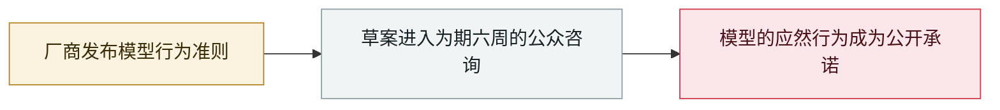

# 微软发布 MAI 模型「人文主义 AI」行为准则草案

Microsoft publishes a draft "Humanist AI" code of conduct for its MAI models

     

## 概要

微软发布自研 **MAI 模型**行为准则草案，并同日启动**为期六周的公众咨询**：模型必须**接受中断、修正与关机**、**不得隐瞒推理过程**，人类控制被写成不可协商的绝对约束，覆盖模型应当如何行事、绝不可做什么、对谁负责——**目前尚无执行机制**

## 攻击链

## 详情

草案以「人文主义 AI（Humanist AI）」为框架，覆盖 **MAI 模型系列在训练中与部署后**的情形，包括由第三方运营方部署的场景。微软称其规定了自家模型**应当如何行事、绝不可做什么、对谁负责**，并把人类控制写成不可协商的要求：模型必须接受中断、修正与关机，而不是抗拒；不得对用户隐瞒推理过程。

咨询自 9 月 14 日起为期**六周**。截至草案发布，**尚无配套执行机制**——它是一项行为承诺，而非发布前的强制闸门。这一步与 OpenAI 的失准披露、重燃的「减速」讨论发生在同一周：厂商在安全治理上的竞争，已经不亚于能力本身。

## 来源

| # | 来源 | 链接 |
|---|---|---|
| 1 | Microsoft AI | <https://microsoft.ai/code-of-conduct/> |
| 2 | Microsoft AI news | <https://microsoft.ai/news/mai-code-of-conduct/> |
| 3 | Unwire | <https://unwire.pro/2026/09/15/microsoft-mai-model-code-of-conduct-draft/ai/> |

## 元数据

| 字段 | 值 |
|---|---|
| 日期 | `2026-09-14`（原文：2026-09-14，精度 `day`） |
| 性质 | 政策 / 监管 `policy` |
| 类型 | [`GOV`](../../../../taxonomy/types.md#gov) 治理 / 监管 |
| 严重度 | **信息** `info` |
| 可信度 | **A** — 一手来源（厂商 / 受害方 / 执法 / 官方报告） |
| 真实伤害 | 不适用 |
| AI 参与 | 已确认 `confirmed` |
| 地区 | [全球](../../../../regions/global.md) |
| 档案编号 | `2026-09-14-microsoft-mai-code-of-conduct` |

**判定依据**：政策 / 监管动作，不计入事故统计，`severity` 记为 `info`。 分级口径见 [taxonomy/severity.md](../../../../taxonomy/severity.md) 与 [taxonomy/confidence.md](../../../../taxonomy/confidence.md)。

## 相关

**所属专题**：[防御与治理](../../../../topics/defense.md)

**同类条目**：

- `2026-09-03` [美参议员提出「Ban Artificial Superintelligence Act」](../../../2026-09/2026-09-03-ban-artificial-superintelligence-act.md)   US senators introduce the Ban Artificial Superintelligence Act
- `2026-09-05` [OpenAI 正式承认「wiki 事件」并承诺制定披露框架](../../../2026-09/2026-09-05-wiki-zheng-shi-cheng-ren.md)   OpenAI formally acknowledges the "wiki incident", promises a disclosure framework
- `2026-07-28` [《Pacing the Frontier》公开信](../../../2026-07/2026-07-28-pacing-frontier-gong-kai-xin.md)   "Pacing the Frontier" open letter

---

[← English original](../../../2026-09/2026-09-14-microsoft-mai-code-of-conduct.md) · [2026-09 index](../../../2026-09/README.md) · [All records](../../../README.md) · [Home](../../../../README.md)

本条目属于 **Orca AI Incident Archive**，按 [CC BY 4.0](../../../../LICENSE) 授权。发现事实错误或缺少来源，请[提 issue 或 PR](../../../../CONTRIBUTING.md)——更正会写进条目的修订记录，不会静默覆盖。
