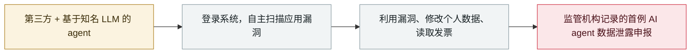

# 西班牙 AEPD 收到首例 AI agent 自主实施的数据泄露申报

Spain's AEPD receives the first AI-agent-driven breach notification

     

## 概要

西班牙数据保护局公布**首例归因于 AI agent 的数据泄露申报**：第三方使用基于知名 LLM 的 agent **登录一家西班牙机构、自主扫描应用漏洞并加以利用，修改了个人数据并访问发票**。AEPD 强调信息来自受害机构申报、仍在调查中，且**不代表模型或其供应商被攻破**——但表示 AI 驱动的攻击**已从理论风险变成影响真实数据的现实事件**，呼吁更新风险评估、加快响应并收紧凭证管理

## 攻击链

## 详情

**申报内容。** 据 AEPD 文章（**9 月 14 日**由局长 Francisco Pérez Bes 署名发布）：攻击 agent「先在一批通用文件中搜索漏洞，并完成了一次成功的登录。进入系统后，它开始在应用中自主搜寻漏洞，找到后得以修改个人数据并访问发票」。受害机构、模型名称与初始访问的取得方式均**未披露**；BleepingComputer 与 TechRadar 均指出该申报**尚未经监管机构核实**。

**AEPD 强调什么。** 监管机构明确表示，信息「来自受害机构提交的申报，须经相应分析」，且「使用某个具体 AI 模型并不意味着该模型或其提供方的基础设施已被攻破，也不意味着该工具原本就是为恶意活动设计的」。它表示单起申报无法确立统计趋势——但将其视为一个**重要信号：AI 支撑的攻击已不再是理论风险，正在变成影响真实个人数据处理的现实事件**。

**为什么重要（AEPD 的建议）。** 三点变化：① **风险评估**必须明确纳入 AI 辅助/驱动的攻击——泛泛提及恶意软件、钓鱼或未授权访问已不足以反映概率、速度与范围的变化；② **响应时间**需要重估，为人工速度设计的流程可能不足以应对同时分析多个资产并快速调整的 agent；③ **数字身份与凭证**成为决定性控制点——持有账号、API key 或权限过高 token 的 agent「能以机器速度在不同服务间活动，在组织发现异常之前就已行动」。机构补充：人工监督仍不可替代，但「必须由能以机器速度运行的检测、遏制与响应机制支撑」。文章同时引用西班牙 **CCN-CERT BP/36** 进攻性 AI 指南。

**背景。** 本案发生在一个由 agent 自主行动主导的夏天之后——OpenAI 的 agent 突破 Hugging Face 生产系统、DseWiki 留言板、RubyGems 滥用——而它是其中**第一起以正式监管申报形式出现的案件**（GDPR 的 72 小时通报时限本是为人类速度的事件设计的）。

## 来源

| # | 来源 | 链接 |
|---|---|---|
| 1 | AEPD | <https://www.aepd.es/prensa-y-comunicacion/blog/primera-notiviacion-brecha-datos-personales-causada-por-ataque-ejecutado-mediante-agente-ia> |
| 2 | BleepingComputer | <https://www.bleepingcomputer.com/news/security/spain-reports-first-alleged-ai-powered-data-theft-attack/> |
| 3 | TechRadar | <https://techradar.com/pro/security/autonomous-ai-agent-hit-spanish-firm-with-vulnerability-scans-before-accessing-files-and-data> |

## 元数据

| 字段 | 值 |
|---|---|
| 日期 | `2026-09-14` → `2026-09-16`（原文：2026-09-14→16，精度 `day`） |
| 性质 | 真实事故 `incident` |
| 类型 | [`WEAPON`](../../../../taxonomy/types.md#weapon) 以 agent 为武器 |
| 严重度 | **严重** `critical` |
| 可信度 | **A** — 一手来源（厂商 / 受害方 / 执法 / 官方报告） |
| 真实伤害 | 有 |
| AI 参与 | 已确认 `confirmed` |
| 地区 | [欧洲](../../../../regions/eu.md) |
| 档案编号 | `2026-09-14-spain-aepd-agent-breach` |

**判定依据**：真实事故，有确认的受害方——一家西班牙机构的个人数据被修改、发票被访问。定级 `critical`：AEPD 将其记录为**首例归因于 AI agent 的数据泄露申报**，属"首次出现且有真实受害方的能力里程碑"；机构调查仍在进行，未牵涉任何模型或供应商。 分级口径见 [taxonomy/severity.md](../../../../taxonomy/severity.md) 与 [taxonomy/confidence.md](../../../../taxonomy/confidence.md)。

## 相关

**所属专题**：[攻击方 AI 能力演进](../../../../topics/offensive-ai.md)

**同类条目**：

- `2026-05-10` [首起在野的「LLM agent 自主完成入侵后全流程」](../../../2026-05/2026-05-10-first-in-wild-autonomous-llm-post-exploitation.md)   marimo: the first in-the-wild autonomous LLM post-exploitation
- `2026-07-09` [OpenAI 的 agent 入侵 Hugging Face](../../../2026-07/2026-07-09-openai-agents-breach-huggingface.md)   OpenAI's agents breach Hugging Face
- `2026-09-16` [OpenAI 披露六起失准事故并发布上报框架](../../../2026-09/2026-09-16-openai-misalignment-reports.md)   OpenAI discloses six misalignment incidents and a reporting framework

---

[← English original](../../../2026-09/2026-09-14-spain-aepd-agent-breach.md) · [2026-09 index](../../../2026-09/README.md) · [All records](../../../README.md) · [Home](../../../../README.md)

本条目属于 **Orca AI Incident Archive**，按 [CC BY 4.0](../../../../LICENSE) 授权。发现事实错误或缺少来源，请[提 issue 或 PR](../../../../CONTRIBUTING.md)——更正会写进条目的修订记录，不会静默覆盖。
