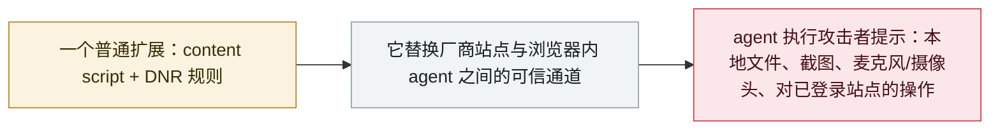

# BragJack：一个浏览器扩展即可劫持五款主流浏览器的内置 AI agent

BragJack: one browser extension hijacks the AI agents in five major browsers

      

## 概要

Forever Security 研究员 **Gal Weizman** 披露 **BragJack**：**一个普通浏览器扩展**——仅使用正常的 content script 与 **declarativeNetRequest** 权限——即可劫持**五款 Chromium 浏览器的内置 AI agent**：**Chrome 的 Gemini Live、Edge 的 Copilot、Opera Neon、Perplexity Comet 与 Claude in Chrome**。它不在内容里藏指令，而是**夺取厂商站点与浏览器内 agent 之间的可信指令通道**——研究者称之为**「prompt forcing」（提示强塞）**——使模型层的安全过滤根本来不及起作用。Google 记为 **CVE-2026-0628**（CVSS 8.8，Chrome 143.0.7499.192/.193 修复）、微软记为 **CVE-2026-55945**（中危，Edge 150.0.4078.48 之前版本）；Comet 受影响面最广，Anthropic 也为 Claude in Chrome 一案支付赏金。该攻击为概念验证、**无在野利用**——但恶意扩展只需被安装、无需点击

## 攻击链

## 详情

**手法。** BragJack 利用的是浏览器 agent 的架构：其「大脑」（托管在**厂商控制的网站**上的模型）与浏览器内的「身体」（可读取页面、操作站点）相连。每个浏览器 agent 都信任某些来源可以投递指令；扩展**无需击破模型护栏，只需通过 agent 本就信任的通道说话**。Weizman 仅凭 content script 加上 **declarativeNetRequest**（广告拦截器每天都会申请的权限）替换或注入这些可信来源上的资源，随后发出自己的提示——并掌控其时机与后续指令。他把结果称为 **「prompt forcing」**，这一区分很重要：**提示注入**是把指令藏在模型读取的内容里，而这里是攻击者**直接控制提示本身**，在模型评估意图之前滥用授权与消息通道信任——因此模型层的安全过滤无从纠正这一隔离失效。

**各浏览器实际允许了什么。** 在 **Chrome** 中，Google 阻止了向 Gemini 内嵌 Web 应用注入 content script——但 DNR 规则仍能拦截特权 WebView 内加载的资源；研究者替换一个合法 JavaScript 资源，便在 Gemini 的可信上下文中执行代码：读取本地文件、截图、读取个人资料，并可**开启摄像头与麦克风**（Google：**CVE-2026-0628**，8.8，Chrome **143.0.7499.192/.193** 已修复）。**Perplexity Comet** 受影响面最广：其 agent 信任多个 Perplexity 来源（含一个未受保护的测试域名），攻击者可获取**浏览历史、截图、个人资料泄露、本地文件读取，并在已登录网站上自主操作**——Weizman 演示了迫使 agent 总结受害者的邮件并把结果发送到另一个地址。**Opera Neon** 上，在 opera.com 运行的代码可直接向 agent 发送任意提示。**Microsoft Edge** 需要更复杂的链路：一个微软营销页面可向 Copilot 投放提示，加之其「Think」与「Do」两种模式间的竞态条件（**CVE-2026-55945**，中危，**150.0.4078.48** 之前版本已修复）。**Claude in Chrome** 属扩展对扩展：一个被允许向侧边栏投递提示的 Claude 营销页面，配合点击式调试器权限，使一个扩展得以驱动另一个；Anthropic 确认收到报告并支付了赏金。

**现状与意义。** 该攻击为概念验证：**未见在野利用**，各厂商合计支付**逾 2 万美元**赏金（单笔从 600 到 7,000 美元不等），且恶意扩展必须**先被安装**——所谓「零点击」描述的是安装之后的过程，而非无交互的纯网络入侵。但 BragJack 首次系统性地证明：**浏览器内 agent 的指令通道本身就是攻击面**——任何持有用户随手授予权限的扩展，都能僭取厂商对其 agent 的控制权。实用建议是扩展卫生：白名单、收紧 host 与 DNR 权限、审查调试器访问、移除多余扩展，并把 agent 活动作为独立遥测源，与文件、麦克风、摄像头及账户访问日志关联分析。

## 来源

| # | 来源 | 链接 |
|---|---|---|
| 1 | Forever Security | <https://forever.security/blog/bragjack-hijacking-5-browsers-via-built-in-ai-assistants> |
| 2 | Forever Security（技术篇） | <https://forever.security/blog/bragjack-attack-hijacks-every-browser-agent> |
| 3 | BleepingComputer | <https://www.bleepingcomputer.com/news/security/bragjack-attacks-hijack-ai-browser-agents-through-malicious-extensions/> |
| 4 | Cybersecurity News | <https://cybersecuritynews.com/bragjack-ai-agent-hijacking/> |

## 元数据

| 字段 | 值 |
|---|---|
| 日期 | `2026-09-16`（原文：2026-09-16，精度 `day`） |
| 性质 | 漏洞披露 `vulnerability` |
| 类型 | [`SUPPLY`](../../../../taxonomy/types.md#supply) 供应链投毒 · [`IPI`](../../../../taxonomy/types.md#ipi) 间接提示注入 |
| 严重度 | **高** `high` |
| 可信度 | **B** — 研究机构或主流媒体，细节可核查 |
| 真实伤害 | 无 |
| AI 参与 | 已确认 `confirmed` |
| 地区 | [全球](../../../../regions/global.md) |
| 档案编号 | `2026-09-16-bragjack-browser-agents` |

**判定依据**：研究机构协调披露；无在野利用与真实伤害，因此 `real_harm: false`。定级 `high`：具有标志性的能力实证——仅凭普通扩展权限劫持五款浏览器的 agent，Chrome 缺陷 CVSS 8.8。 分级口径见 [taxonomy/severity.md](../../../../taxonomy/severity.md) 与 [taxonomy/confidence.md](../../../../taxonomy/confidence.md)。

## 相关

**所属专题**：[Agent 供应链投毒](../../../../topics/agent-supply-chain.md)

**同类条目**：

- `2026-09-17` [Plugin4Shell：零点击 RCE 链打击四款 AI 编码 agent](../../../2026-09/2026-09-17-plugin4shell-coding-agents.md)   Plugin4Shell: a zero-click RCE chain hits four AI coding agents
- `2026-02-09` [Clinejection](../../../2026-02/2026-02-09-clinejection.md)   Clinejection
- `2026-03-01` [Hades：把 AI 编码助手变成攻击面的持续战役](../../../2026-03/2026-03-01-hades-campaign-ai-coding-assistants.md)   Hades: a sustained campaign turning AI coding assistants into the attack surface

---

[← English original](../../../2026-09/2026-09-16-bragjack-browser-agents.md) · [2026-09 index](../../../2026-09/README.md) · [All records](../../../README.md) · [Home](../../../../README.md)

本条目属于 **Orca AI Incident Archive**，按 [CC BY 4.0](../../../../LICENSE) 授权。发现事实错误或缺少来源，请[提 issue 或 PR](../../../../CONTRIBUTING.md)——更正会写进条目的修订记录，不会静默覆盖。
