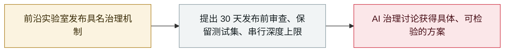

# Google DeepMind 成立 DeepMind Institute，聚焦 AGI 治理

Google DeepMind launches the DeepMind Institute for AGI governance

     

## 概要

Google DeepMind 成立 **DeepMind Institute**（由 **Hassabis、Shane Legg 与 James Manyika** 领导），开局发布一篇创始文章与四篇后续文章，提出**具体的 AI 政策机制**：Hassabis 建议设立**美国主导的前沿 AI 标准机构，在模型发布前最多 30 天进行审查**（先自愿、后作为在美国部署的前提，转向**保留测试集**，并可能在风险升级时**协调减速**）；安全研究者 **Rohin Shah 与 Anca Dragan** 主张给**「不透明串行深度」**设上限——即模型在不输出可读推理轨迹的情况下可进行的计算量

## 攻击链

## 详情

**成立。** Google 与 DeepMind 于 **9 月 16 日**成立 **DeepMind Institute**，开局发布**由 Shane Legg、James Manyika 与 Demis Hassabis 署名的创始文章，以及四篇后续文章**，聚焦 AGI 时代政策；TechCrunch 于 9 月 17 日报道。其负责人为 DeepMind 联合创始人 **Shane Legg**（兼任执行主编）、Google 高管 **James Manyika** 与 DeepMind 主席 **Demis Hassabis**。

**两项主张。** 在《A framework for frontier AI and the dawning of a new age》中——这是他 7 月首次提出的框架——Hassabis 提议设立**美国主导的前沿 AI 标准机构**，在模型**发布前最多 30 天**进行审查（先自愿，之后作为在美国部署的前置要求），进而转向不公开的**「保留（held-out）」测试**，并可能在风险升级时启动**协调减速**。在《The case for reasoning transparency》中，安全研究者 **Rohin Shah** 与 **Anca Dragan** 主张限制**「不透明串行深度」**：模型在**不产生可读推理轨迹**的情况下可执行的计算量。

**为什么重要。** 一家主要实验室从宽泛的担忧表述转向了**具名机制与时间表**——这正是 AI 治理开始变成实际政策的节点。创始文章自带免责声明——贡献者「不会总是意见一致……并可能改变看法」，「DMI 文章……不应被解读为谷歌的官方观点」——而发布恰逢 9 月减速辩论的核心时段（Amodei 的「pace the frontier」文章、冯德莱恩国情咨文与消费者反垄断诉讼），为辩论提供了具体、可检验的设计。

## 来源

| # | 来源 | 链接 |
|---|---|---|
| 1 | DeepMind Institute | <https://institute.deepmind.com/essays/introducing-the-deepmind-institute/> |
| 2 | DeepMind Institute（站点） | <https://institute.deepmind.com/> |
| 3 | TechCrunch | <https://techcrunch.com/2026/09/17/google-deepmind-launches-institute-to-widen-the-agi-debate/> |
| 4 | AI Weekly | <https://aiweekly.co/alerts/deepmind-opens-institute-to-publish-essays-on-agi-safety> |

## 元数据

| 字段 | 值 |
|---|---|
| 日期 | `2026-09-16`（原文：2026-09-16，精度 `day`） |
| 性质 | 政策 / 监管 `policy` |
| 类型 | [`GOV`](../../../../taxonomy/types.md#gov) 治理 / 监管 |
| 严重度 | **信息** `info` |
| 可信度 | **A** — 一手来源（厂商 / 受害方 / 执法 / 官方报告） |
| 真实伤害 | 不适用 |
| AI 参与 | 已确认 `confirmed` |
| 地区 | [全球](../../../../regions/global.md) |
| 档案编号 | `2026-09-16-deepmind-institute` |

**判定依据**：厂商政策发布物，并非事故，`severity` 记为 `info`。 分级口径见 [taxonomy/severity.md](../../../../taxonomy/severity.md) 与 [taxonomy/confidence.md](../../../../taxonomy/confidence.md)。

## 相关

**所属专题**：[防御侧进展](../../../../topics/defense.md)

**同类条目**：

- `2026-09-16` [欧盟国情咨文：冯德莱恩点名 agent 越界并召集前沿实验室](../../../2026-09/2026-09-16-von-der-leyen-soteu-agents.md)   EU State of the Union: von der Leyen cites agent escapes and convenes frontier labs
- `2026-09-18` [消费者起诉 Anthropic、OpenAI、SpaceXAI 与谷歌：指控其达成 AI 减速合谋](../../../2026-09/2026-09-18-ai-slowdown-antitrust-lawsuit.md)   Consumers sue Anthropic, OpenAI, SpaceXAI and Google over an alleged AI slowdown pact
- `2026-07-28` [《Pacing the Frontier》公开信](../../../2026-07/2026-07-28-pacing-frontier-gong-kai-xin.md)   "Pacing the Frontier" open letter

---

[← English original](../../../2026-09/2026-09-16-deepmind-institute.md) · [2026-09 index](../../../2026-09/README.md) · [All records](../../../README.md) · [Home](../../../../README.md)

本条目属于 **Orca AI Incident Archive**，按 [CC BY 4.0](../../../../LICENSE) 授权。发现事实错误或缺少来源，请[提 issue 或 PR](../../../../CONTRIBUTING.md)——更正会写进条目的修订记录，不会静默覆盖。
