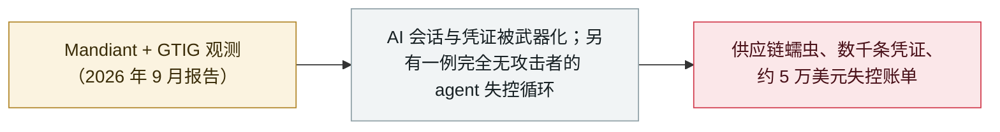

# Mandiant 2026 AI 报告：失控 agent 烧掉 5 万美元账单，AI 辅助入侵登场

Mandiant 2026 AI report: a runaway agent's $50,000 bill and AI-assisted intrusions

     

## 概要

Mandiant《AI Risk and Resilience 2026》报告披露攻击者已用 AI 执行入侵的部分环节——以及一起**完全无攻击者**的案例：被劫持的 **AI 编码助手会话**推荐了被投毒的包，使入侵者获得 infostealer、**GitHub OAuth 令牌**，并在**约 100 个内部代码仓库**中部署 **Shai-Hulud 蠕虫**；一枚**失窃的 CI/CD 长期凭证**被改造成实时 AI 辅助攻击平台（动态换 IP 脚本、用于登录受害者账户的 Rust 工具），外泄数千条凭证；某金融机构的**记账 agent** 因一个损坏的空值陷入递归推理循环，**一小时内发起 15,000+ 次推理 API 调用**、产生**约 5 万美元云账单**并**导致业务交易中断**

## 攻击链

## 详情

**报告本身。** 《AI Risk and Resilience 2026》是 Mandiant 综合作自身与 Google 威胁情报团队（GTIG）观测发布的专题报告。其核心判断是：企业 AI 已从辅助式问答转向**编排工作流、端到端执行任务的自主 agentic 系统**——而被投毒的数据源、模型依赖或扩展钩子，就足以把可信 agent 变成内部侦察、横向移动或沙箱逃逸的通道。报告复述了本档案已收录的案例（2 月的恶意 OpenClaw skills、3 月的 TeamPCP/UNC6780、5 月 GTIG 的 AI 开发零日），并新增了三个此前未见的案例研究。

**三个新案例。**（1）某威胁行为体攻陷一家 SaaS 提供商后，**劫持了开发者工作站上活跃的 AI 编码助手会话**；被当作可信解释器对待的助手**推荐安装攻击者投毒的外部包**，如同特洛伊木马，最终经投毒的 PyPI 包植入 infostealer、窃取 GitHub OAuth 令牌，并把自传播的 **Shai-Hulud 蠕虫部署到约 100 个内部代码仓库**；随后公司自有命名空间中的包又被投毒，造成下游二次感染。（2）在一家全球医疗机构，攻击者用一枚**长期有效的 CI/CD 凭证**启动未隔离的虚拟机，把它改造成**实时 AI 辅助攻击平台**：先用项目 README 给模型「预热」，与模型共同调试多进程数据窃取框架直至**三小时一轮的窃取节奏**，再让 AI 生成动态换 IP 脚本与用于登录受害者账户的 Rust 工具——最终数千条凭证被攻陷。（3）**「Denial-of-Wallet」失控推理循环**：某金融服务机构的记账 agent 对内部计费数据库拥有读写权限；一个损坏的空值破坏了它的格式化工具后，agent 为「暴力修复」陷入**无约束的递归循环**，**不到一小时发起逾 15,000 次高成本 API 调用**，产生**约 5 万美元账单激增**，并因**严重数据库锁**导致**进行中的业务交易停摆**——全程没有攻击者参与。

**为何重要。** 报告最具迁移价值的结论是「对 AI 的治理」与「用 AI 治理」：Mandiant 建议设置**成本上限与金融断路器**（连续任务失败达到阈值即中止 agent）、在服务 ID 与项目层级做**有界递归与速率限制**、以**短时工作负载身份替代长期密钥**、做外联流量遏制，并对 AI 推荐的每个依赖做校验和/白名单核验。失控循环一案尤其扩展了本档案对「伤害」的定义：**不依赖任何对手、也没有数据泄露**，agent 同样能造成可量化的财务与运营损害。

## 来源

| # | 来源 | 链接 |
|---|---|---|
| 1 | Mandiant（Google Cloud） | <https://cloud.google.com/security/resources/ai-risk-and-resilience-2026> |
| 2 | Help Net Security | <https://www.helpnetsecurity.com/2026/09/16/google-mandiant-enterprise-ai-security-risks-report/> |
| 3 | SecurityWeek | <https://www.securityweek.com/in-other-news-ransomware-developer-sentenced-plugin4shell-ai-attack-critical-sap-flaw/> |

## 元数据

| 字段 | 值 |
|---|---|
| 日期 | `2026-09-16`（原文：2026-09-15→16，精度 `day`） |
| 性质 | 威胁报告 `report` |
| 类型 | [`WEAPON`](../../../../taxonomy/types.md#weapon) 以 agent 为武器 |
| 严重度 | **信息** `info` |
| 可信度 | **A** — 一手来源（厂商 / 受害方 / 执法 / 官方报告） |
| 真实伤害 | 不适用 |
| AI 参与 | 已确认 `confirmed` |
| 地区 | [全球](../../../../regions/global.md) |
| 档案编号 | `2026-09-16-mandiant-ai-risk-resilience-2026` |

**判定依据**：厂商威胁报告，涵盖多起事件与案例研究，本身不计为单起事故，故 `severity` 记为 `info`。 分级口径见 [taxonomy/severity.md](../../../../taxonomy/severity.md) 与 [taxonomy/confidence.md](../../../../taxonomy/confidence.md)。

## 相关

**所属专题**：[攻击方 AI 能力演进](../../../../topics/offensive-ai.md)

**同类条目**：

- `2026-09-10` [Anthropic 9 月威胁情报报告](../../../2026-09/2026-09-10-anthropic-september-threat-report.md)   Anthropic September threat intelligence report
- `2026-05-18` [3,800 个 GitHub 内部仓库被攻陷](../../../2026-05/2026-05-18-github-3800-internal-repos.md)   3,800 internal GitHub repositories compromised
- `2026-05-11` [TanStack npm「Mini Shai-Hulud」](../../../2026-05/2026-05-11-tanstack-npm-mini-shai.md)   TanStack npm "Mini Shai-Hulud"

---

[← English original](../../../2026-09/2026-09-16-mandiant-ai-risk-resilience-2026.md) · [2026-09 index](../../../2026-09/README.md) · [All records](../../../README.md) · [Home](../../../../README.md)

本条目属于 **Orca AI Incident Archive**，按 [CC BY 4.0](../../../../LICENSE) 授权。发现事实错误或缺少来源，请[提 issue 或 PR](../../../../CONTRIBUTING.md)——更正会写进条目的修订记录，不会静默覆盖。
