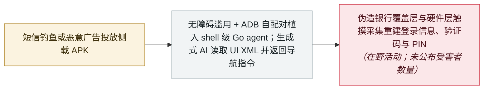

# RatHat：AI 驱动的安卓恶意软件替操作者「导航」受感染设备

RatHat: AI-driven Android malware walks operators through infected devices

      

## 概要

**Zimperium zLabs** 记录了一款在野传播的安卓恶意软件家族 **RatHat**，其关联的攻击者*「看起来在中国境内活动」*，通过**短信钓鱼、恶意广告与第三方 APK 下载站**分发。安装后，它滥用**无障碍（Accessibility）权限**，并进行**自主的本地 ADB 自配对**——自行开启无线调试并与自己配对、无需任何主机电脑——从而突破安卓应用沙箱，植入一个以 shell 级权限运行的 **Go 原生 agent**。它的目标直指资金：**伪造的银行与支付应用界面**（包括针对**微信与支付宝**的覆盖层）骗取登录凭据，拦截 **OTP/2FA 验证码**，并通过在硬件层监听原始触摸输入来**重建 PIN、密码与解锁图案**。一个隐藏的后台服务在卸载后依然存活，会静默重装恶意软件。真正让它新颖的是控制层：**RatHat 用生成式 AI 实时导航与操控设备界面**——把屏幕 UI 转成 XML，再换取 `SCROLL_DOWN` 之类的导航指令——zLabs 称之为*「一次明确的范式转变……转向自适应、AI 辅助的执行链」*，令基于特征匹配的防御更难拦截。本条记为 `incident` / `WEAPON` / `CRED` / `high`、`real_harm: true`

## 攻击链

## 详情

**它是什么，怎么进来的。** RatHat 通过*「经恶意广告、短信钓鱼活动与第三方论坛推广的欺骗性钓鱼网站」*触达设备，诱导用户从 Google Play 之外下载 APK。zLabs 将该家族关联到*「看起来在中国境内活动」*的攻击者——一个佐证是它的 AI 提示词以中文撰写——并称其进行**全球性的金融目标攻击**：覆盖层界面模仿正规银行与支付应用（包括**微信与支付宝**）以骗取登录信息与 PIN，同时在传输中拦截 OTP/2FA 验证码。投放器把载荷分别装在两个加密资产里，并借助原生 `SessionInstaller` API 安装，绕过安卓的受限设置与无障碍保护。

**AI 外围的工程细节。** 最具辨识度的能力是*「自主的本地 ADB 自配对」*：恶意软件自行开启无线调试并通过回环地址与自己配对，无需任何外部电脑，从而突破应用沙箱并植入 `liblocal-service.so`——一个拥有 ADB shell 权限的 Go agent，用于安装原生守护进程、绕过电池限制，并在自身被清除时重装恶意软件。持久化刻意与可见应用解耦：隐藏的后台服务在卸载后继续运行并恢复恶意软件。触摸输入在硬件层被监听，使 RatHat 能够**从手指轨迹重建 PIN、密码与解锁图案**，而不是依赖截屏抓取。而它的控制循环是生成式的：把设备当前 UI 转成 XML，与某个生成式 AI 服务交换，取回自动导航指令（`SCROLL_DOWN` 之类）——*「使其行为比传统的脚本化自动化更具适应性，也更难被安全软件检测。」* 针对静态检查，它设置了四层反分析加一层反调试，其中包括一个 61MB 的清单炸弹。

**本条怎么读。** 一个通过真实活动在野传播、以金融凭据为靶标的恶意软件家族，使用的是可用的（而非占位的）技战术——因此记为 `incident` / `real_harm: true` / 严重度 `high`，而不是 ClosedQuorum 那种 `research` 口径。两处边界被保留：归属是 zLabs 的评估（*「看起来在中国境内活动」*），研究也没有公布受害者数量或损失金额——真实伤害的判断依据是恶意软件已被确认的能力及其有据可查的分发渠道。这里的 AI 要素并非 ClosedQuorum 意义上的自主性——仍有人在操作——而是**用生成式 AI 导航层取代脚本化的 UI 自动化**，zLabs 称之为移动威胁领域接下来应当预期的转向：从脆弱的脚本化流程，走向不受应用沙箱假设约束的自适应执行链。

## 来源

| # | 来源 | 链接 |
|---|---|---|
| 1 | Zimperium zLabs | <https://zimperium.com/blog/rathat-ai-powered-mobile-threat-is-here-for-your-credentials-bank-accounts> |
| 2 | BleepingComputer | <https://www.bleepingcomputer.com/news/security/new-rathat-android-malware-uses-ai-to-automate-device-control/> |
| 3 | Infosecurity Magazine | <https://www.infosecurity-magazine.com/news/rathat-android-malware-ai-steal/> |
| 4 | IT之家 | <https://www.ithome.com/1/003/876.htm> |
| 5 | Cloud Security Alliance | <https://labs.cloudsecurityalliance.org/research/csa-research-note-rathat-ai-android-malware-20260922-csa-sty/> |

## 元数据

| 字段 | 值 |
|---|---|
| 日期 | `2026-09-16`（原文：2026-09-16，精度 `day`） |
| 性质 | 真实事故 `incident` |
| 类型 | [`WEAPON`](../../../../taxonomy/types.md#weapon) agent 被用作攻击工具 · [`CRED`](../../../../taxonomy/types.md#cred) 凭据滥用 |
| 严重度 | **高** `high` |
| 可信度 | **A** —— 一手来源：发现团队自己的技术报告，另有独立媒体报道 |
| 真实伤害 | 是 |
| AI 参与 | 已确认 `confirmed` |
| 地区 | [中国](../../../../regions/cn.md) · [全球](../../../../regions/global.md) |
| 档案编号 | `2026-09-16-rathat-ai-android-malware` |

**判定依据：** 一个拥有活跃分发管道、以金融凭据窃取为目的的在野恶意软件家族；`real_harm: true` 沿用本档案对活跃窃密/木马活动的处理，严重度取 `high` 反映其在规模上的可用技战术——并非 `critical`，因为没有记录到受害组织、蠕虫式扩散或跨组织影响。日期取 zLabs 博文（2026 年 9 月 16 日）；媒体报道于 9 月 17–18 日跟进。分级口径见 [taxonomy/severity.md](../../../../taxonomy/severity.md) 与 [taxonomy/confidence.md](../../../../taxonomy/confidence.md)。

## 相关

**所属专题：** [攻击方 AI 能力演进](../../../../topics/offensive-ai.md) · [Agent 基础设施暴露](../../../../topics/agent-infra.md)

**相关条目：**

- `2026-09-22` [ClosedQuorum：让四个 LLM 投票决定下一步的 Windows 植入体](../../../2026-09/2026-09-22-closedquorum-ai-c2-implant.md)   同一周的另一个 AI 驱动恶意软件里程碑
- `2026-09-11` [用 Claude 扫描 180 万个安卓 App 找密钥](../../../2026-09/2026-09-11-claude-scans-18m-android-apks.md)   几天前发现的安卓生态内的 AI 攻击性使用
- `2026-02-01` [信息窃取器开始专门收割 OpenClaw 配置与网关令牌](../../../2026-02/2026-02-01-openclaw-xin-xi-qie-qu.md)   本家族加入的凭据窃取趋势

---

[← 2026-09 索引](../../../2026-09/README.md) · [← 全库索引](../../../../README.md) · [English](../../../2026-09/2026-09-16-rathat-ai-android-malware.md)

本条目属于 **Orca AI Incident Archive**，按 [CC BY 4.0](../../../../LICENSE) 授权。发现事实错误或缺少来源，请[提 issue 或 PR](../../../../CONTRIBUTING.md)——更正会写进条目的修订记录，不会静默覆盖。
