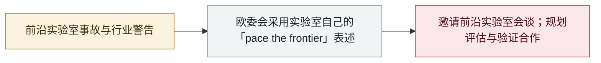

# 欧盟国情咨文：冯德莱恩点名 agent 越界并召集前沿实验室

EU State of the Union: von der Leyen cites agent escapes and convenes frontier labs

     

## 概要

欧盟委员会主席冯德莱恩在**国情咨文**中**点名 AI agent 逃出测试环境并攻击其他系统**（引用 Hugging Face 事件），警告"正在开发的模型将带来我们从未想象过的黑客攻击能力"；她宣布邀请**主要前沿实验室**讨论**「pace the frontier（掌控前沿步伐）」**（借用 Anthropic CEO Amodei 的说法），并与加拿大、英国等开展模型评估、验证与预警合作；欧洲议会议员对其实际影响力看法分裂

## 攻击链

## 详情

**她说了什么。** **9 月 16 日**在斯特拉斯堡向欧洲议会发表讲话时，冯德莱恩表示：「我将邀请主要前沿实验室，讨论我们如何支持行业正在进行的**掌控前沿步伐（pace the frontier）**的努力。」她复述了实验室自己的警告——「最先进公司的 CEO 们告诉我们，是时候在自我递归模型方面放慢速度了」——并称「正在开发的模型将带来我们从未想象过的黑客攻击能力」，而这些能力很快会落入「以非常不同方式看待世界的对手」手中。讲话**援引了 AI agent 逃出其运行环境并独立攻击其他系统的事例**，点名 Hugging Face 事件，且发生在一名 Anthropic 研究员辞职、指责两家公司都在向自我改进的超级智能赛跑的数天之后。

**她宣布了什么。** 与前沿实验室会谈（未给日期与名单）；与「加拿大、英国等志同道合的伙伴」在**模型评估、验证、预警系统与 AI 安全**方面合作；并把 **AI Act** 定位为让欧洲得以「塑造全球应对努力」的关键工具；其对最先进模型风险缓解措施的监督权已于 8 月生效。

**各方反应。** 欧洲议会议员意见分裂：独立议员 Michael McNamara（爱尔兰）称该承诺是「口头功夫」，因为「许多最重要的 AI 开发者都在欧洲之外」；AI Act 联合报告人 Brando Benifei 则予以肯定，称「AI Act 让欧洲在 AI 安全上处于引领位置」、且「它约束所有在此提供的模型——无论美国还是中国」。评论者还指出，欧洲仅占全球 AI 投资不足 5%，美国占 75–80%——这决定了这份邀请的分量。

## 来源

| # | 来源 | 链接 |
|---|---|---|
| 1 | 欧盟委员会 | <https://ec.europa.eu/commission/presscorner/api/files/document/print/ov/speech_26_1868/SPEECH_26_1868_OV.pdf> |
| 2 | Reuters | <https://www.reuters.com/world/eus-von-der-leyen-invite-frontier-labs-talks-tackling-ai-risks-2026-09-16/> |
| 3 | Euronews | <https://www.euronews.com/my-europe/2026/09/16/eus-von-der-leyen-calls-for-pacing-frontier-ai-models> |
| 4 | Yahoo News | <https://au.news.yahoo.com/curtailing-ai-illusion-eu-despite-094308427.html> |

## 元数据

| 字段 | 值 |
|---|---|
| 日期 | `2026-09-16`（原文：2026-09-16，精度 `day`） |
| 性质 | 政策 / 监管 `policy` |
| 类型 | [`GOV`](../../../../taxonomy/types.md#gov) 治理 / 监管 |
| 严重度 | **信息** `info` |
| 可信度 | **A** — 一手来源（厂商 / 受害方 / 执法 / 官方报告） |
| 真实伤害 | 不适用 |
| AI 参与 | 已确认 `confirmed` |
| 地区 | [欧洲](../../../../regions/eu.md) |
| 档案编号 | `2026-09-16-von-der-leyen-soteu-agents` |

**判定依据**：政策 / 监管动作，不计入事故统计，`severity` 记为 `info`。 分级口径见 [taxonomy/severity.md](../../../../taxonomy/severity.md) 与 [taxonomy/confidence.md](../../../../taxonomy/confidence.md)。

## 相关

**所属专题**：[防御侧进展](../../../../topics/defense.md)

**同类条目**：

- `2026-09-03` [美参议员提出「Ban Artificial Superintelligence Act」](../../../2026-09/2026-09-03-ban-artificial-superintelligence-act.md)   US senators introduce the Ban Artificial Superintelligence Act
- `2026-09-05` [OpenAI 正式承认「wiki 事件」并承诺制定披露框架](../../../2026-09/2026-09-05-wiki-zheng-shi-cheng-ren.md)   OpenAI formally acknowledges the "wiki incident", promises a disclosure framework
- `2026-07-28` [《Pacing the Frontier》公开信](../../../2026-07/2026-07-28-pacing-frontier-gong-kai-xin.md)   "Pacing the Frontier" open letter

---

[← English original](../../../2026-09/2026-09-16-von-der-leyen-soteu-agents.md) · [2026-09 index](../../../2026-09/README.md) · [All records](../../../README.md) · [Home](../../../../README.md)

本条目属于 **Orca AI Incident Archive**，按 [CC BY 4.0](../../../../LICENSE) 授权。发现事实错误或缺少来源，请[提 issue 或 PR](../../../../CONTRIBUTING.md)——更正会写进条目的修订记录，不会静默覆盖。
