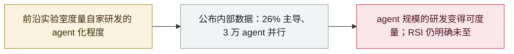

# Anthropic：Claude 已「主导」26% 的 AI 研发，3 万个 agent 并行工作

Anthropic: Claude "leads" 26% of its AI R&D with 30,000 agents running in parallel

     

## 概要

Anthropic 发布**研发自动化指数（R&D Automation Index）**，量化 agent 在其 AI 研发中的参与度：截至 8 月，Claude **「主导」（AL4）约 26% 的 AI 研发任务——2 月还不足 1%**；**90% 以上达到 AL3「协作」及以上**；其最常用的内部平台上约有 **3 万个 agent 并行工作**。公司把该指数与 **RSI**（模型完全自主构建继任者）直接关联，但明确**完整的 RSI 尚未到来**，并介绍了让 agent 群可审计的两项设计：独立身份与开放消息总线

## 攻击链

## 详情

**指数口径。** Anthropic 的**研发自动化指数**借用 Epoch AI 的六级自主度标准（AL0–AL5）：**AL3（「协作」）**指 AI 在人类密切指导下承担大块工作；**AL4（「主导」）**指工程师只给高层目标、AI 在人类监督下完成大部分端到端执行；只有 **AL5** 才是无人介入的完全自主。截至 **2026 年 8 月**，Claude「主导」约 **26%** 的任务——**2 月还不足 1%**——**90% 以上**至少达到 AL3。方法：7 月每周随机抽取相关部门 20% 的员工，由 Claude Research Agent 阅读其 Slack 与内部文档，整理出约 **1.5 万项细粒度研发任务**，组织为 **542 个节点的任务树**（378 个叶节点），覆盖预训练、强化学习、评测平台故障诊断、RL 沙箱网络策略与推理服务事故复盘，并按人工耗时加权。

**度量的局限。** 判定自动化等级的「裁判」**同样是 Claude**；与人类员工相比，完全一致率 59%（人类评估者之间只有 35%；相差一级以内 97%）。Anthropic 承认「协作」与「主导」之间存在主观判断空间。

**如何管理 agent 群。** 两项内部设计支撑约 3 万个并发 agent：**每个 agent 拥有独立身份**（数据与行为都与身份绑定，身份可跨越模型升级存续）；**开放通信系统**（消息绑定发送者身份并链接原始资料，与完整运行轨迹交叉关联，使监控能追踪跨 agent 协同）。

**为什么重要。** 这是 Anthropic 试图度量「建前沿模型还剩多少必须由人做的工作」，并定位行业在通往**递归自我改进（RSI）**之路上的位置。Anthropic 明确说完整 RSI**尚未到来**、也并非必然。作为背景：OpenAI 设有专门的 RSI 团队并称已达到「自动化 AI 研究实习生」里程碑；Google 披露了用于 Gemini 3.8 研发的 agent 循环与 9 月 14 日的「Dream-RSI」论文；初创公司 Recursive 把自动化 AI 研究作为目标；METR 指出研究者对 RSI 的定义仍差异很大。

## 来源

| # | 来源 | 链接 |
|---|---|---|
| 1 | Anthropic | <https://www.anthropic.com/institute/measuring-pace-of-ai-development> |
| 2 | Anthropic（RSI） | <https://www.anthropic.com/institute/recursive-self-improvement> |
| 3 | InfoQ | <https://www.infoq.cn/article/CEphwKjzAe7LzbOriLcq> |

## 元数据

| 字段 | 值 |
|---|---|
| 日期 | `2026-09-17`（原文：2026-09-17，精度 `day`） |
| 性质 | 情报报告 `report` |
| 类型 | [`GOV`](../../../../taxonomy/types.md#gov) 治理 / 监管 |
| 严重度 | **信息** `info` |
| 可信度 | **A** — 一手来源（厂商 / 受害方 / 执法 / 官方报告） |
| 真实伤害 | 不适用 |
| AI 参与 | 已确认 `confirmed` |
| 地区 | [全球](../../../../regions/global.md) |
| 档案编号 | `2026-09-17-anthropic-rd-indicators` |

**判定依据**：厂商发布物、并非事故；收录用于记录 agent 自动化趋势线与 RSI 议题，`severity` 记为 `info`、`real_harm` 不适用。 分级口径见 [taxonomy/severity.md](../../../../taxonomy/severity.md) 与 [taxonomy/confidence.md](../../../../taxonomy/confidence.md)。

## 相关

**所属专题**：[防御侧进展](../../../../topics/defense.md) · [前沿模型自主越界](../../../../topics/eval-escapes.md)

**同类条目**：

- `2026-09-10` [Anthropic 九月威胁情报报告](../../../2026-09/2026-09-10-anthropic-september-threat-report.md)   Anthropic September threat intelligence report
- `2026-07-30` [Anthropic 披露三起评测越界事故](../../../2026-07/2026-07-30-anthropic-three-eval-incidents.md)   Anthropic discloses three evaluation-breakout incidents
- `2026-09-16` [OpenAI 披露六起失准事故并发布上报框架](../../../2026-09/2026-09-16-openai-misalignment-reports.md)   OpenAI discloses six misalignment incidents and a reporting framework

---

[← English original](../../../2026-09/2026-09-17-anthropic-rd-indicators.md) · [2026-09 index](../../../2026-09/README.md) · [All records](../../../README.md) · [Home](../../../../README.md)

本条目属于 **Orca AI Incident Archive**，按 [CC BY 4.0](../../../../LICENSE) 授权。发现事实错误或缺少来源，请[提 issue 或 PR](../../../../CONTRIBUTING.md)——更正会写进条目的修订记录，不会静默覆盖。
