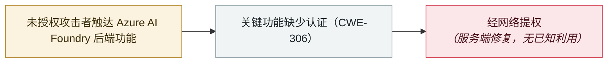

# 微软修复 Azure AI Foundry 的 CVSS 10.0 缺失认证漏洞

Microsoft patches a CVSS 10.0 missing-authentication flaw in Azure AI Foundry

     

## 概要

微软修复 **CVE-2026-85889**：**Azure AI Foundry**（用于构建、部署与管理生成式 AI 应用及 agent 的企业平台）中一个 **CVSS 10.0** 的缺失认证缺陷（CWE-306）——未授权攻击者无需凭证、无需用户交互即可触达后端功能并**经网络提权**。由于是云托管服务，**客户无需打补丁**——云安全联盟（CSA）指出客户也**无从得知暴露窗口，无法独立判断自己的租户是否被探测**。微软称**未发现利用证据**；同批非常规更新还修复了 **CVE-2026-85885**（Microsoft 365 Copilot 命令注入，9.9）及若干 Azure 缺陷

## 攻击链

## 详情

**缺陷本身。** CVE-2026-85889 是 **Azure AI Foundry**（微软亦以 Microsoft Foundry 之名销售）中的**关键功能缺失认证**（CWE-306）——该平台用于构建、微调、评测与运营生成式 AI 模型及自主 agent。微软的原话是：「Azure AI Foundry 中关键功能的认证缺失，使未授权攻击者得以经网络提升权限。」NVD 评分 **10.0**（CVSS:3.1/AV:N/AC:L/PR:N/UI:N/S:C/C:H/I:H/A:H）：网络向量、低复杂度、无需权限、无需用户交互、范围变更。安全研究者 **Rémy Marot** 因发现并上报该缺陷获得致谢。

**修复——以及客户看不到的部分。** 微软于 **9 月 17 日**发布公告，因平台为云托管，修复完全在其自有基础设施上完成：**客户无需任何操作**，公司称**未发现利用证据**。CSA 的分析指出了这一保证的边界：租户没有补丁可打，也**没有独立途径得知脆弱端点是否在修复前被探测过**；微软**尚未说明是否存在跨租户访问的可能**——而这正是判断其他客户的模型、数据与 agent 配置（而非仅攻击者自己的项目）是否可达的关键问题。同批非常规更新（9 月 17–18 日）还修复了 **CVE-2026-85885**（**Microsoft 365 Copilot** 命令注入，评分 9.9）等 Azure 缺陷。

**为何重要。** AI 平台控制面上的 10.0 与普通服务上的 10.0 属于不同的风险类别：该控制面掌管模型部署、训练与推理数据，以及把模型接向下游系统的 **agent 编排**。这也是本档案**不到两个月**内第二起 Azure AI 控制面提权——此前是 **Azure SRE Agent** 缺陷（CVE-2026-62830，CVSS 9.9）；它落在九月的 agent 基础设施发现集群之中（Plugin4Shell 的 pin 绕过、被在野利用的 Langflow 家族），反复出现的教训是：**围绕 agent 的身份与授权层**——而非模型本身——才是损害发生之处。

## 来源

| # | 来源 | 链接 |
|---|---|---|
| 1 | Microsoft MSRC | <https://msrc.microsoft.com/update-guide/vulnerability/CVE-2026-85889> |
| 2 | NVD | <https://nvd.nist.gov/vuln/detail/CVE-2026-85889> |
| 3 | The Hacker News | <https://thehackernews.com/2026/09/microsoft-patches-cvss-100-azure-ai.html> |
| 4 | Cloud Security Alliance | <https://labs.cloudsecurityalliance.org/research/csa-research-note-azure-ai-foundry-privilege-escalation-2026/> |

## 元数据

| 字段 | 值 |
|---|---|
| 日期 | `2026-09-17`（原文：2026-09-17→18，精度 `day`） |
| 性质 | 漏洞披露 `vulnerability` |
| 类型 | [`INFRA`](../../../../taxonomy/types.md#infra) Agent 基础设施暴露 |
| 严重度 | **高** `high` |
| 可信度 | **A** — 一手来源（厂商 / 受害方 / 执法 / 官方报告） |
| 真实伤害 | 无 |
| AI 参与 | 已确认 `confirmed` |
| 地区 | [全球](../../../../regions/global.md) |
| 档案编号 | `2026-09-17-azure-ai-foundry-cve-2026-85889` |

**判定依据**：漏洞披露；无利用证据且修复在服务端完成，因此 `real_harm: false`。定级 `high`：agent 平台控制面的 CVSS 10.0 缺陷，但已完全缓解、无已知在野利用。 分级口径见 [taxonomy/severity.md](../../../../taxonomy/severity.md) 与 [taxonomy/confidence.md](../../../../taxonomy/confidence.md)。

## 相关

**所属专题**：[Agent 基础设施暴露](../../../../topics/agent-infra.md)

**同类条目**：

- `2026-08-01` [Azure SRE Agent 越权（CVE-2026-62830）](../../../2026-08/2026-08-01-azure-sre-agent.md)   Azure SRE Agent privilege escalation (CVE-2026-62830)
- `2026-09-02` [Langflow CVE-2026-0768：年内第 12 个被在野利用的 Langflow 缺陷](../../../2026-09/2026-09-02-langflow-jin-di-ye-li.md)   Langflow CVE-2026-0768: the 12th Langflow flaw exploited in the wild this year
- `2026-06-08` [LiteLLM CVE-2026-42271 MCP 端点接管](../../../2026-06/2026-06-08-litellm-mcp-duan-dian-jie.md)   LiteLLM CVE-2026-42271 MCP endpoint takeover

---

[← English original](../../../2026-09/2026-09-17-azure-ai-foundry-cve-2026-85889.md) · [2026-09 index](../../../2026-09/README.md) · [All records](../../../README.md) · [Home](../../../../README.md)

本条目属于 **Orca AI Incident Archive**，按 [CC BY 4.0](../../../../LICENSE) 授权。发现事实错误或缺少来源，请[提 issue 或 PR](../../../../CONTRIBUTING.md)——更正会写进条目的修订记录，不会静默覆盖。
