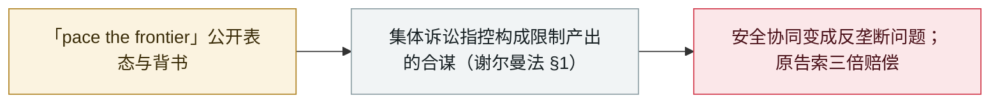

# 消费者起诉 Anthropic、OpenAI、SpaceXAI 与谷歌：指控其达成 AI 减速合谋

Consumers sue Anthropic, OpenAI, SpaceXAI and Google over an alleged AI slowdown pact

     

## 概要

四名消费者在**旧金山联邦法院提起集体诉讼**，指控 **Anthropic、OpenAI、SpaceXAI 与谷歌**违反**《谢尔曼法》第 1 条**，达成**放缓前沿 AI 产品改进速度**的非法合谋：起诉书引用 7 月的标准机构工作组、OpenAI 向国会寻求反垄断指引、以及 9 月 12 日 Amodei 文章发表后各家的公开背书；原告寻求**三倍损害赔偿与禁令**，并声明**不挑战**各公司独立的安全措施

## 攻击链

## 详情

**起诉书。** 于 **9 月 18 日**提交至加州北区联邦地方法院（旧金山分院），原告来自佛罗里达与加州，以个人及拟议全国集体名义起诉 **Anthropic PBC、OpenAI OpCo、SpaceXAI LLC 与 Google LLC**。其理论是：竞争者之间**降低产品质量与改进速度的合谋构成产出限制**，按本身违法（per se）主张，并以快速审查与合理原则为备选。起诉书声明原告**重视 AI 安全**，但认为护栏应由公众通过监管与陪审团设定，并**明确不挑战**各公司单方面的安全、测试与减速决定，也不挑战其对政府的游说。

**起诉书所述时间线。** 7 月，Anthropic、OpenAI 与谷歌代表组成标准机构工作组并定期会面；7 月 14 日 Hassabis 公开提出标准机构构想；9 月 6 日 OpenAI 发表首席科学家 Pachocki 的《An Alien Mind》；9 月 10 日 WIRED 报道 OpenAI 向国会议员就「协调减速是否触犯反垄断」寻求指引；9 月 11 日 Altman 在《财富》采访中称行业共同计划会出现；**9 月 12 日** Amodei 发表《We Must Pace the Frontier》，据称**约一小时内**获马斯克、Altman、Hassabis 公开背书；9 月 14 日 Altman 表示不会等待反垄断豁免；9 月 15 日 OpenAI 政策负责人 Chris Lehane 确认已与 Anthropic、Google DeepMind 合作数周。起诉书还追溯到 7 月的 **「Pacing the Frontier」**声明（1,386 位署名者，含 Amodei 等实验室高层）。

**市场与诉求。** 起诉书界定「付费消费者订阅的通用前沿助手」市场（ChatGPT、Claude、Grok、Gemini），主张四家合计占**至少 80%**；损害理论是改进变慢压低了订阅者所付价格对应的质量。原告依据《克莱顿法》寻求**三倍赔偿**，并请求**禁令**禁止在开发节奏、训练算力、发布时间、能力检查点等方面的横向合谋——同时明确不寻求禁止独立安全措施。涉事公司未立即回应；相关指控尚未经审理。

## 来源

| # | 来源 | 链接 |
|---|---|---|
| 1 | Politico | <https://www.politico.com/news/2026/09/18/anthropic-openai-spacexai-google-sued-over-calls-to-pace-ai-development-01085023> |
| 2 | Los Angeles Times | <https://www.latimes.com/world-nation/story/2026-09-19/lawsuit-says-anthropic-openai-spacexai-google-made-illegal-agreement-on-ai-slowdown> |
| 3 | Unite.AI | <https://www.unite.ai/consumers-sue-anthropic-openai-spacexai-and-google-over-alleged-ai-pact/> |

## 元数据

| 字段 | 值 |
|---|---|
| 日期 | `2026-09-18`（原文：2026-09-18，精度 `day`） |
| 性质 | 政策 / 监管 `policy` |
| 类型 | [`GOV`](../../../../taxonomy/types.md#gov) 治理 / 监管 |
| 严重度 | **信息** `info` |
| 可信度 | **B** — 研究机构或主流媒体，细节可核查 |
| 真实伤害 | 不适用 |
| AI 参与 | 已确认 `confirmed` |
| 地区 | [美国](../../../../regions/us.md) |
| 档案编号 | `2026-09-18-ai-slowdown-antitrust-lawsuit` |

**判定依据**：围绕前沿 AI 开发节奏的法律 / 监管动作，并非事故；`severity` 记为 `info`，且指控尚未经审理。 分级口径见 [taxonomy/severity.md](../../../../taxonomy/severity.md) 与 [taxonomy/confidence.md](../../../../taxonomy/confidence.md)。

## 相关

**所属专题**：[防御侧进展](../../../../topics/defense.md)

**同类条目**：

- `2026-09-16` [欧盟国情咨文：冯德莱恩点名 agent 越界并召集前沿实验室](../../../2026-09/2026-09-16-von-der-leyen-soteu-agents.md)   EU State of the Union: von der Leyen cites agent escapes and convenes frontier labs
- `2026-07-28` [《Pacing the Frontier》公开信](../../../2026-07/2026-07-28-pacing-frontier-gong-kai-xin.md)   "Pacing the Frontier" open letter
- `2026-09-16` [Google DeepMind 成立 DeepMind Institute，聚焦 AGI 治理](../../../2026-09/2026-09-16-deepmind-institute.md)   Google DeepMind launches the DeepMind Institute for AGI governance

---

[← English original](../../../2026-09/2026-09-18-ai-slowdown-antitrust-lawsuit.md) · [2026-09 index](../../../2026-09/README.md) · [All records](../../../README.md) · [Home](../../../../README.md)

本条目属于 **Orca AI Incident Archive**，按 [CC BY 4.0](../../../../LICENSE) 授权。发现事实错误或缺少来源，请[提 issue 或 PR](../../../../CONTRIBUTING.md)——更正会写进条目的修订记录，不会静默覆盖。
