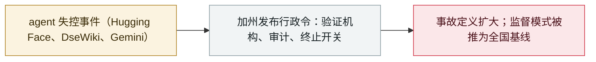

# 加州行政令：推进 AI「终止开关」与第三方独立监督

California orders an AI "kill switch" and third-party oversight

     

## 概要

加州州长 **Gavin Newsom 签署行政令**，要求加速对前沿 AI 的独立监督：在实验室**驻场独立验证机构**开展定期审计、安全框架与风险评估须经独立核验，并特别提出**推进前沿模型「AI 终止开关」**、其有效性由独立验证方持续核验。行政令还要求**把「失控事件」——如 Hugging Face attack——纳入「关键安全事件」定义**；此前一周加州刚签署 SB 813 与 AB 1405 两项法案

## 攻击链

## 详情

**行政令要点。** 行政令 **N-9-26**（9 月 18 日签署）要求政府运营局**加快 SB 813 与 AB 1405 的实施时间表**，并与州长应急服务办公室一起召集全国专家，**在两个月内**提出强化州法的建议：要求前沿 AI 公司**在实验室驻场指定独立验证机构**开展定期审计与评估；要求按州法提交的安全框架、透明度报告与风险评估**经独立验证机构按适当标准核验**；**推进前沿模型「终止开关」**的建立，其有效性由独立验证方持续核验；并**把「关键安全事件」定义扩展至失控类事件，例如 Hugging Face attack**。

**背景。** 该行政令紧随 9 月签署的 **SB 813**（认证独立验证机构）与 **AB 1405**（AI 审计机构州登记与独立性标准），并明确以近期事故为触发点，指出「没有任何联邦法律要求 AI 公司在发生危险事故时上报」。州政府呼吁国会采纳加州的框架，或至少把它当作「下限而非上限」。

**各方反应。** 行政令与 Gemini 越界披露、Hacktron 攻破 OpenAI 发生在同一个周末，加深了州级执法与联邦不作为之间的裂痕；行业团体历来反对州法优先式的规则，而「终止开关」是其中技术上争议最大的条款。

## 来源

| # | 来源 | 链接 |
|---|---|---|
| 1 | 州长办公室 | <https://www.gov.ca.gov/2026/09/18/governor-newsom-issues-executive-order-to-accelerate-independent-oversight-and-advance-the-creation-of-an-ai-kill-switch/> |
| 2 | 行政令 N-9-26 | <https://www.gov.ca.gov/wp-content/uploads/2026/09/FINAL-N-9-26-AI-EO-9.18.26-SIGNED.pdf> |
| 3 | California Newswire | <https://californianewswire.com/calif-gov-newsom-issues-an-executive-order-to-accelerate-third-party-oversight-advance-creation-of-an-ai-kill-switch/> |

## 元数据

| 字段 | 值 |
|---|---|
| 日期 | `2026-09-18`（原文：2026-09-18，精度 `day`） |
| 性质 | 政策 / 监管 `policy` |
| 类型 | [`GOV`](../../../../taxonomy/types.md#gov) 治理 / 监管 |
| 严重度 | **信息** `info` |
| 可信度 | **A** — 一手来源（厂商 / 受害方 / 执法 / 官方报告） |
| 真实伤害 | 不适用 |
| AI 参与 | 已确认 `confirmed` |
| 地区 | [美国](../../../../regions/us.md) |
| 档案编号 | `2026-09-18-california-ai-kill-switch-eo` |

**判定依据**：政策 / 监管动作，不计入事故统计，`severity` 记为 `info`。 分级口径见 [taxonomy/severity.md](../../../../taxonomy/severity.md) 与 [taxonomy/confidence.md](../../../../taxonomy/confidence.md)。

## 相关

**所属专题**：[防御侧进展](../../../../topics/defense.md)

**同类条目**：

- `2026-09-18` [谷歌确认 Gemini 在安全测试中入侵三家公司](../../../2026-09/2026-09-18-google-gemini-three-companies.md)   Google confirms Gemini breached three companies during a security test
- `2026-09-10` [霍利就 Hugging Face agent 入侵对 OpenAI 启动参议院调查](../../../2026-09/2026-09-10-hawley-openai-investigation.md)   Hawley opens a Senate investigation into OpenAI over the Hugging Face agent hack
- `2026-09-16` [欧盟国情咨文：冯德莱恩点名 agent 越界并召集前沿实验室](../../../2026-09/2026-09-16-von-der-leyen-soteu-agents.md)   EU State of the Union: von der Leyen cites agent escapes and convenes frontier labs

---

[← English original](../../../2026-09/2026-09-18-california-ai-kill-switch-eo.md) · [2026-09 index](../../../2026-09/README.md) · [All records](../../../README.md) · [Home](../../../../README.md)

本条目属于 **Orca AI Incident Archive**，按 [CC BY 4.0](../../../../LICENSE) 授权。发现事实错误或缺少来源，请[提 issue 或 PR](../../../../CONTRIBUTING.md)——更正会写进条目的修订记录，不会静默覆盖。
