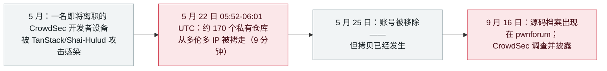

# CrowdSec：一次九分钟的仓库转储——缺口出在离职流程

CrowdSec: a nine-minute repository dump, enabled by an offboarding gap

      

## 概要

**约 170 个私有 GitHub 仓库从法国安全公司 CrowdSec 被拷走——整个过程只持续九分钟，缺口是一名刚离职开发者的账号：该账号被 TanStack/Shai-Hulud 供应链攻击感染，而其凭据仍保留私有仓库读取权限。** CrowdSec 把外泄追踪至 **5 月 22 日 05:52–06:01 UTC**、来自多伦多 IP；拷贝行为关联到 BreachForum 创始人与化名 "diencracked" 的成员。公司**直到 9 月 16 日才发现**——其源代码档案出现在犯罪市场 pwnforum 上（Fuites Info 团队通知了公司）；账号在 5 月 25 日被移除——即入侵发生三天后，但为时已晚。CEO Philippe Humeau 的说法：泄漏*「限于 CrowdSecurity 的源代码，包括 130+ 个公共仓库和许多私有仓库」*；基础设施与数据库未被访问、代码未被篡改——但**公司最初「无用户数据受影响」的声明随后被更正：泄漏数据中出现 83 名用户的邮箱与 51 名投资人的信息**。这是本档案中 5 月 TanStack npm 事件（继 OpenAI 员工设备之后）的第二个下游受害方——失效点并不复杂：一套没有及时回收读取权限的离职流程。本条记为 `incident` / `SUPPLY` + `CRED` / `high` / `real_harm: true`

## 时间线

## 详情

**一次九分钟的作业。** 按 CrowdSec 自己的说明，攻击者使用**从一名前员工机器上取得、且仍保留公司私有仓库读取权限的 GitHub API token**，*「仅用几分钟」*下载了仓库内容。公司调查将行动定在 **5 月 22 日 05:52–06:01 UTC**，来自多伦多 IP，并关联到 BreachForum 创始人与用户 "diencracked"；该 token 已不在 GitHub 的审计记录中，CrowdSec 遂借助 GitHub 把访问追溯到账号——一名*「刚离开公司、但出于正当理由仍在 GitHub 组织内」*的前开发者。Humeau 写道，该前员工的机器*「被 TanStack 供应链攻击感染，方法论吻合」*。账号于 5 月 25 日被移除。

**如何浮出水面——以及那处更正。** CrowdSec **直到 9 月 16 日**才发现入侵：一名用户在**地下市场 pwnforum** 上发布了包含公司 GitHub 源代码的档案；**Fuites Info** 团队随后直接联系了公司。首份公开声明称泄漏限于源码（130+ 公共仓库与许多私有仓库）、无基础设施或数据库访问、无篡改；随后该披露**被更正为承认泄漏数据包含 83 名用户的邮箱与 51 名投资人的信息**——这一「两版声明」序列按本档案对自我更正披露的规则并列保留。

**为什么归于本档案。** TanStack npm 事件（TeamPCP 的「Mini Shai-Hulud」）在档案中已出现两次——蠕虫本体与 OpenAI 员工设备的后续。CrowdSec 是第二个下游受害方，其记录价值恰恰在于**这里没有任何高超之处**：没有零日、没有新工具——一个拥有读取权限的合法 token，因一套「收回了成员身份、但没收回复制能力」的离职流程而存活，而基础设施对 token 的使用没有留下记录。攻击者在被窃材料中寻找可用凭据收获甚微；但拷贝本身，已经完成。

## 来源

| # | 来源 | 链接 |
|---|---|---|
| 1 | Dark Reading | <https://www.darkreading.com/cyberattacks-data-breaches/shai-hulud-attack-cyber-firm-crowdsec-github-data> |
| 2 | The Hacker News | <https://thehackernews.com/2026/09/crowdsec-says-tanstack-npm-attack-led.html> |
| 3 | Cloud Security Alliance | <https://labs.cloudsecurityalliance.org/wp-content/uploads/2026/09/CSA_research_note_crowdsec_tanstack_offboarding_breach_20260920-csa-styled.pdf> |
| 4 | DevOps.com | <https://devops.com/teampcp-supply-chain-attack-leads-to-crowdsec-source-code-being-stolen/> |

## 元数据

| 字段 | 值 |
|---|---|
| 日期 | `2026-09-18`（原始：2026-09-18，精度 `day`） |
| 性质 | 事故 `incident` |
| 类型 | [`SUPPLY`](../../../../taxonomy/types.md#supply) [`CRED`](../../../../taxonomy/types.md#cred) |
| 评级 | **High** `high` |
| 可信度 | **A**——受害公司自己的说明（CEO 声明）加上独立分析与媒体报道 |
| 真实伤害 | 有 |
| AI 参与 | 已确认 `confirmed` |
| 地区 | [全球](../../../../regions/global.md) |
| 档案 ID | `2026-09-18-crowdsec-tanstack-offboarding-breach` |

**分类理由：** 入侵的入口与载荷都走 AI 工具链供应链——TanStack npm 攻击的受感染机器孕育出转储私有仓库的 token：`SUPPLY` + `CRED`，与档案对 Mini Shai-Hulud 系记录的处理一致。评为 `high`：确认的实质损害（130+ 公共仓库与许多私有仓库的源码，加有限个人数据），且受害方本身就是安全公司；不评 `critical`，因基础设施与客户系统未受影响、公司自身影响评估止于源码层面。日期取附更正影响声明的披露日（2026-09-18）。分级标准见 [severity.md](../../../../taxonomy/severity.md) 与 [confidence.md](../../../../taxonomy/confidence.md)。

## 相关条目

**专题：** [Agent 供应链](../../../../topics/agent-supply-chain.md)

**相关记录：**

- `2026-05-11` [TanStack npm「Mini Shai-Hulud」蠕虫](../2026-05/2026-05-11-tanstack-npm-mini-shai.md)   本次外泄所源自的上游供应链攻击
- `2026-05-13` [OpenAI 员工设备经 TanStack 事件被入侵](../2026-05/2026-05-13-tanstack-yuan-gong-she-bei.md)   另一名下游受害方——同一条蠕虫、同一个月

---

[← 2026-09 索引](../../../2026-09/README.md) · [← 全库索引](../../../../README.md) · [English](../../../2026-09/2026-09-18-crowdsec-tanstack-offboarding-breach.md)

本条目属于 **Orca AI Incident Archive**，按 [CC BY 4.0](../../../../LICENSE) 授权。发现事实错误或缺少来源，请[提 issue 或 PR](../../../../CONTRIBUTING.md)——更正会写进条目的修订记录，不会静默覆盖。
